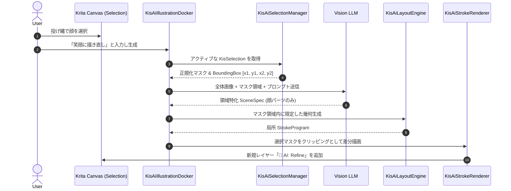
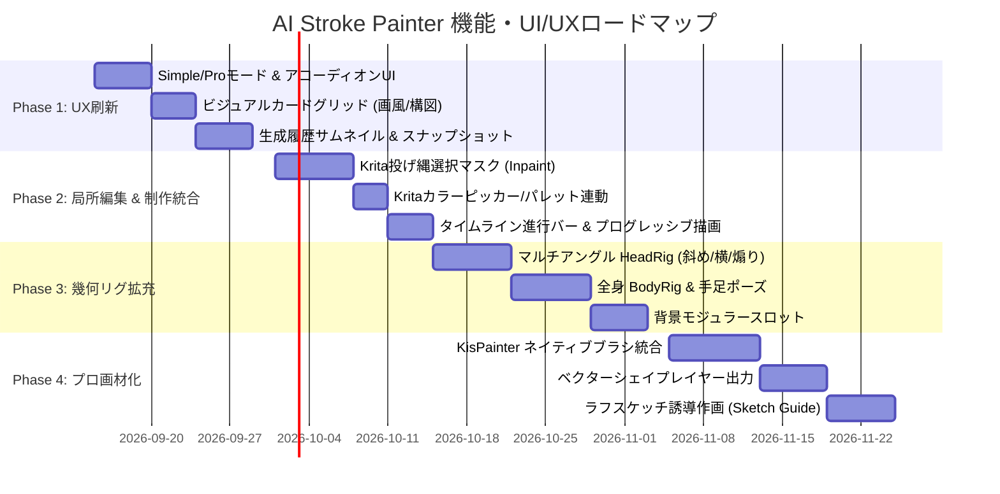

# AI Stroke Painter 機能強化・UI/UX改善計画案 (Enhancement & Modernization Roadmap)

- **作成日**: 2026-09-13
- **対象**: `libs/ui/aiillustration`、UIドッカー、描画エンジン、幾何リグ、Krita連携全般
- **関連計画**: `plans/AI_QUALITY_REVOLUTION_PLAN_V3.md` (V3 画質刷新・SceneSpec導入) の上位・拡張展開
- **位置づけ**: アニメ顔の品質安定（V3達成）を次のステージへと引き上げ、**「実用的なプロ向けイラスト制作統合環境」**へと昇華させるための機能・UI/UX刷新ロードマップ

---

## 0. エグゼクティブサマリー

### 現状の到達点
本プロジェクトは、LLMに細かな座標を描かせず「意味・監督」に専念させ、決定論的な幾何エンジン（`KisAiLayoutEngine`）と光の単一真実源（`KisAiLightRig`）によって高品質なアニメ顔・バストアップを破綻なく描画する**「監督と画家（SceneSpec/LayoutEngine）アーキテクチャ」**の確立に成功しました。

### 次の飛躍に向けた課題
しかし、実際のイラスト制作ツールとして日常的に使い倒すためには、以下の**4つの壁**が存在します。

| 課題領域 | 現状のボトルネック | 目指すべき姿 |
| :--- | :--- | :--- |
| **局所編集の欠如** | 全体の一発生成しかできず、気に入らない部位（目、髪、背景）だけを直す手段がない | Kritaの**投げ縄選択範囲を用いた局所再生成（Inpainting / Region Refine）** |
| **表現の多様性** | バストアップ・正面〜やや斜めの女の子に特化しており、全身や構図・アングルの幅が狭い | **全身・複数アングル（煽り/俯瞰/横顔）・多様なポーズ・背景モジュール** |
| **画材・ペイント連携** | `QPainter` によるベタ塗りが中心で、Kritaが誇る多彩なブラシの筆致が生かされていない | **Kritaネイティブブラシ（`KisPainter`）連携 & ベクターパス出力** |
| **UI/UXの情報過多** | 縦長ドッカーに専門的なパラメータが並び、視覚的直感性や履歴管理が不足 | **Simple / Pro 2モードUI、ビジュアルプリセットカード、履歴スナップショット** |

本書は、これらの課題を体系的に解消し、AI Stroke Painterを「実験的プロトタイプ」から**「プロ・同人作家が手放せなくなる次世代ハイブリッド制作ツール」**へと進化させるための具体的な計画案です。

---

## 1. UI/UX 改善計画 (User Experience Redesign)

現在のドッカーUIは機能追加に伴い縦長化し、スクロール量が多く、専門知識（Temperature, トラッピング, JSONモード等）がないと扱いづらい状態になっています。これを**「直感的で迷わない、創作者ファーストのUI」**へと再構築します。

```
┌────────────────────────────────────────────────────────┐
│  🎨 AI Stroke Painter                [Simple | Pro]  ⚙ │
├────────────────────────────────────────────────────────┤
│ [プロンプト入力欄: 例「黄昏の路地裏、黒髪ツインテール」]      │
│  [✨ AIで詳しく拡張]                                  │
├────────────────────────────────────────────────────────┤
│ 【ビジュアル・スタイル選択】                                  │
│  ┌──────────┐ ┌──────────┐ ┌──────────┐ ┌──────────┐  │
│  │ 🌸 アニメ │ │ 💧 水彩  │ │ 🖌️ 厚塗り│ │ ⚡サイバー│  │
│  └──────────┘ └──────────┘ └──────────┘ └──────────┘  │
├────────────────────────────────────────────────────────┤
│ 【構図・アングル】                                            │
│  [👤 顔アップ]  [👚 バストアップ]  [👗 全身]  [📐 煽り/俯瞰]   │
├────────────────────────────────────────────────────────┤
│ 【キャンバス & 配置】                                         │
│  比率: [1:1] [16:9] [9:16] [4:3]  |  [＋ 新規キャンバス]      │
│  範囲: (○) 全体描画    (●) 選択範囲内のみ加筆 (Inpaint)        │
├────────────────────────────────────────────────────────┤
│  [   🎨 生成してレイヤーに追加 (Ctrl+Enter)   ]          │
│  ━━━━━━━━━━━━━━━━━ 進行度: 下塗り中 (45%) ━━━━━━━━   │
├────────────────────────────────────────────────────────┤
│ 【履歴ギャラリー (最近の生成)】                               │
│  [ 🖼️ #12 ]  [ 🖼️ #11 ]  [ 🖼️ #10 ]  [ 🖼️ #09 ]        │
└────────────────────────────────────────────────────────┘
```

### 1.1 Simple（かんたん）/ Pro（プロ・詳細）2モード切替
- **Simple モード（既定）**:
  - プロンプト入力、ビジュアルカード選択（画風・構図・照明）、キャンバスサイズ、生成ボタンのみを表示。
  - トラッピング、推論エフォート、サンプリング温度などは最適な既定値を内部適用。
  - 初心者やスケッチ段階でテンポよくアイデア出ししたいクリエイターに最適。
- **Pro モード**:
  - タブまたはトグルで切り替え可能。
  - 光源ベクトル調整（3D風球体ギミック）、Flatsトラッピング幅、Temperature/Top-P、推論エフォート、カスタムシステム指示、JSONモード、デバッグログをフル露出。

### 1.2 ビジュアル・プリセットギャラリー (Card Grid)
- テキストだけのドロップダウンを廃止し、**視覚的なアイコン・サムネイル付きカードグリッド**を導入：
  1. **画風カード**: 「アニメセル画」「透明水彩」「厚塗り油彩」「サイバーネオン」「マンガインク」「レトロポップ」
  2. **アングル・構図カード**: 「クローズアップ」「バストアップ」「全身立ち絵」「ローアングル（煽り）」「ハイアングル（俯瞰）」
  3. **照明・時間帯カード**: 「柔らかな昼光」「夕暮れゴールデンアワー」「ネオン夜景」「ドラマチック逆光」
  4. **表情カード**: 「微笑み」「クール・無表情」「ウィンク」「驚き・照れ」
- カードをクリックすると、プロンプト欄を汚すことなく `SceneSpec` の対応パラメータが裏側で即座に切り替わります。

### 1.3 リアルタイム・タイムラインHUD & プログレッシブプレビュー
- 生成中の待ち時間を退屈させず、AIが今何をしているかを明確に可視化：
  - **タイムライン進行バー**: `[構図計画] → [下塗り Flats] → [陰影 Shading] → [線画 Lineart] → [仕上げ FX/Bloom]` の各フェーズをランプ点灯で表示。
  - **プログレッシブ・キャンバス描画**: 完成まで真っ白で待たせるのではなく、下塗りができた瞬間に下塗りレイヤーをキャンバスに反映し、徐々に線画やハイライトが重なっていくアニメーション的体験を提供。

### 1.4 生成履歴（Snapshot History）& 比較ビュー
- **履歴サムネイルリール**: 生成したイラストのサムネイル、プロンプト、設定スナップショットを最大30件ローカルに自動保持。
  - サムネイルをクリックするだけで過去のプロンプトと設定が復元。
  - 「現在のキャンバスに別レイヤーとして再配置」も可能。
- **Before / After 比較スライダー**:
  - 手動加筆前後の比較や、直前のStepとの変化を、スプリットバーをドラッグして見比べられるプレビュー機能。

### 1.5 キャンバス統合型クイックメニュー (Canvas HUD)
- ドッカーに視線を移すことなく、キャンバス上で `Ctrl+Shift+A` またはペンボタン長押しで**小型フローティングHUD**を呼び出し。
- 「投げ縄で囲む → クイックHUDで『ここを笑顔にして』と入力 → 即座に部分加筆」というシームレスな体験を実現。

---

## 2. 機能強化計画 (Feature Enhancements)

```
┌────────────────────────────────────────────────────────┐
│                 新機能アーキテクチャ全体像             │
├────────────────────────────────────────────────────────┤
│  [ユーザー入力]                                        │
│   ・プロンプト ＋ スタイルカード                       │
│   ・Krita 投げ縄選択マスク (Inpainting)                │
│   ・Krita ラフスケッチ / 線画レイヤー (Sketch Guide)   │
│   ・Krita 前景色 / パレットドッカー (Palette Sync)     │
│                         │                              │
│                         ▼                              │
│  [KisAiSceneSpec v5] (意図・意味・制約の統合)          │
│                         │                              │
│        ┌────────────────┴────────────────┐             │
│        ▼                                 ▼             │
│  [Layout Engine] (幾何生成)       [Light Rig] (光/色) │
│   ・HeadRig (多アングル/表情)      ・光源ベクトル伝播  │
│   ・BodyRig (全身/ポーズ)          ・パレット整合性    │
│   ・BackgroundRig (モジュール)                         │
│        └────────────────┬────────────────┘             │
│                         │                              │
│                         ▼                              │
│  [Stroke Program v4] (正規ストローク定義)              │
│                         │                              │
│        ┌────────────────┴────────────────┐             │
│        ▼                                 ▼             │
│  [KisAiStrokeRenderer]           [KisAiVectorExporter] │
│   (QPainter / KisPainter)         (SVG / Vector Layer) │
│   ・ラスターレイヤー出力          ・アンカーポイント   │
│   ・水彩/鉛筆ネイティブブラシ       微調整可能         │
└────────────────────────────────────────────────────────┘
```

### 2.1 局所選択・領域再生成 (Canvas Selection Inpainting) ★最重要
イラスト制作で最も多い要求は**「全体は良いが、顔だけ直したい」「髪の色と形を変えたい」「衣装だけ描き直したい」**という修正作業です。

- **仕様**:
  1. ユーザーがKritaの「投げ縄選択ツール」「矩形選択ツール」でキャンバスの一部を選択。
  2. ドッカー上で「選択範囲のみ適用 (Inpaint)」に自動でチェックが入る。
  3. LLMにはキャンバス全体の縮小画像と「選択領域のバウンディングボックス + マスク」を送信。
  4. 生成エンジンは選択範囲外を保護し、選択範囲内のみを自然にブレンドする差分ストロークを生成。
  5. 結果は新しい差分レイヤー（例: `🎨 AI: Refine (Face)`）として追加され、元画像を壊さない。

### 2.2 幾何リグ（Rig）の多角化・拡充
V3で導入された `KisAiLayoutEngine` をバストアップ女性キャラ専用から、多様なイラストレーションに対応できるよう拡張します。

1. **ポーズ & 全身リグ (`BodyRig`)**:
   - 立ち絵、座りポーズ、歩き、振り返りポーズの骨格定義。
   - 手のプリミティブ（開き手、グー、ピース、顎に添える手など）を幾何ライブラリ化。
2. **マルチアングル HeadRig**:
   - 正面だけでなく、斜め45度（クォータービュー）、完全横顔（プロファイル）、煽り（ローアングル）、俯瞰（ハイアングル）の頭部・輪郭・目鼻口の比率マトリクス。
3. **キャラクターバリエーション**:
   - 男性キャラリグ（シャープな輪郭、直線的な目元、広い肩幅）。
   - SD・ちびキャラリグ（2頭身〜3頭身、大きな瞳、デフォルメされた手足）。
4. **背景モジュラー生成 (`BackgroundRig`)**:
   - 単なるグラデーションだけでなく、「青空と入道雲」「夕焼けと電柱・電線」「室内・カフェ窓辺」「ネオン街」などの背景ジオメトリテンプレートをスロット式に配置。

### 2.3 Krita ネイティブブラシエンジン (`KisPainter`) 連携
現在の描画は `QPainter` によるベタ塗り・グラデーションが中心ですが、Krita本体の強力なブラシエンジンを活用することで質感をプロ水準に引き上げます。

- **仕様**:
  - `brush.profile`（`pencil`, `ink`, `watercolor`, `airbrush` 等）に応じて、Krita標準の `KisPaintOpPreset` を割り当て。
  - `KisPainter` を用いて、筆圧カーブ（Pressure Tapering）とブラシテクスチャ（紙目、毛先テクスチャ、混色）を効かせた打鍵パスを実行。
  - **効果**: 水彩のリアルなフチの溜まり、鉛筆のざらつき、インクの抜きが本物の手描き同様にレンダリングされる。

### 2.4 ベクターシェイプレイヤー出力 (Vector Shapes Layer)
- ラスター画像として塗るだけでなく、Kritaの「ベクターレイヤー」としてストロークを出力するオプション。
- 線画や塗りがベジェ曲線として保持されるため、**解像度を後から自由に変更**でき、Kritaの「形状編集ツール」で**線の曲がりや太さを手動で自在に微調整**可能になります。

### 2.5 ラフスケッチ・下描き誘導作画 (Sketch-to-Stroke)
- ユーザーが手描きしたラフスケッチレイヤーを指定すると、Vision LLMとエッジ検出（Sobel/Canny）がその構図・ポーズ・頭部位置を推定。
- 推定された位置・比率を `SceneSpec` の `composition` や `headCenter` に自動代入し、**「ユーザーの下描きにピタリと合わせた清書ストローク」**をAIが生成。

### 2.6 Krita カラーセレクター & パレットドッカー完全連動
- Kritaで現在選択されている前景色（描画色）や、ユーザーが開いているパレットの主要色を、ボタン一つで `SceneSpec` の `hairColor`, `eyeColor`, `palette.keyColor` に反映。
- 「このキャラはこのカラーコード」という設定をパレット経由で直感的にAIへ指示可能。

### 2.7 プロンプト AI 推敲・アシスタント (Prompt Expander)
- プロンプト欄の横に「✨ AI推敲」ボタンを設置。
- 短い入力（例: 「夜の魔女」）から、アニメ・イラストの専門用語（「三日月、紫のグラデーションローブ、星屑のエフェクト、ドラマチックなリムライト、深い群青色の夜空」）を含んだ豊かな情景描写へワンクリックで自動展開。

---

## 3. 技術アーキテクチャと実装詳細

### 3.1 クラス構成と責務分担

```
libs/ui/aiillustration/
├── KisAiIllustrationDocker.{h,cpp}      # UIドッカー (Simple/Pro切替, プリセットカード, 履歴UI)
├── KisAiSceneSpec.{h,cpp}               # 意味記述構造体 (Inpaintマスク, ポーズ, アングル拡張)
├── KisAiLayoutEngine.{h,cpp}            # 幾何決定論エンジン (HeadRig, BodyRig, BackgroundRig)
├── KisAiCanonicalRigs.{h,cpp}           # 規範幾何リグ (黄金比, アングルマトリクス, 手足)
├── KisAiLightRig.{h,cpp}                # 光源・陰影・パレット一元管理
├── KisAiStrokeProgram.{h,cpp}           # ストローク操作リスト (ベクター/ラスター両用)
├── KisAiStrokeRenderer.{h,cpp}          # レンダラー (QPainter/KisPainterハイブリッド)
├── KisAiSelectionManager.{h,cpp}        # [NEW] Krita選択範囲・マスク処理・Inpainting統合
├── KisAiHistoryManager.{h,cpp}          # [NEW] 生成履歴・サムネイル・スナップショット永続化
├── KisAiVectorExporter.{h,cpp}          # [NEW] StrokeProgram → Krita Vector Shapes 変換
└── KisAiNativeBrushBridge.{h,cpp}       # [NEW] KisPainter / KisPaintOpPreset 打鍵ブリッジ
```

### 3.2 局所再生成 (Inpainting) のデータフロー



---

## 4. 段階的実装ロードマップ (Phasing)

実用性と開発負荷のバランスを考慮し、4つのフェーズに分けて段階的に実装します。



### Phase 1: UI/UX革新 & ビジュアルプリセット（即効性重視 / 約2週間）
- **目的**: 毎日の使用感を劇的に向上させ、迷わず直感的に操作できる環境を作る。
- **タスク**:
  1. ドッカーUIのSimple/Pro 2モード制への再構成（スクロールの解消）。
  2. ビジュアルプリセットカード（画風・アングル・表情・照明）の導入。
  3. 最近の生成履歴ギャラリー（サムネイル表示・1クリック復元）。
  4. プロンプト AI 推敲（Prompt Expander）ボタンの実装。

### Phase 2: 局所領域再生成 (Inpainting) & 制作フロー統合（実用性重視 / 約2週間）
- **目的**: 「一発生成」から「描き直しながら仕上げる」プロのワークフローへ転換。
- **タスク**:
  1. `KisAiSelectionManager`: 投げ縄選択範囲のマスク抽出とバウンディングボックス計算。
  2. 選択領域マスクを用いた差分生成・局所レンダリング（Inpainting）。
  3. Krita前景色・パレットドッカーとの双方向カラー同期。
  4. 生成プロセスのタイムラインHUD（進行フェーズの視覚的表示）。

### Phase 3: 幾何リグの多角化・全身・背景展開（表現力重視 / 約2.5週間）
- **目的**: バストアップ女性キャラ以外の作画バリエーションを解禁する。
- **タスク**:
  1. マルチアングル HeadRig（斜め45度、横顔、煽り、俯瞰）。
  2. 全身ポーズリグ（`BodyRig`）および代表的な手のポーズプリミティブ。
  3. 男性キャラリグおよびSD・ちびキャラリグの追加。
  4. モジュラー背景生成（青空・夕暮れ・室内・サイバー都市スロット）。

### Phase 4: プロフェッショナル画材化 & ベクター出力（完成度重視 / 約2.5週間）
- **目的**: Kritaならではの画材表現とベクター編集の柔軟性を完全融合。
- **タスク**:
  1. `KisNativeBrushBridge`: Kritaネイティブブラシプリセットによるストロークレンダリング。
  2. `KisAiVectorExporter`: ストロークプログラムのベクターレイヤー（SVGパス）出力。
  3. 下描き・ラフスケッチからのストローク清書（Sketch-to-Stroke）。
  4. キャンバスフローティングHUD（右クリック/ショートカットで開くミニメニュー）。

---

## 5. 成功指標 (KPIs & 評価基準)

| 指標 | 現状 | 計画達成後目標 | 測定方法 |
| :--- | :--- | :--- | :--- |
| **初回生成までのクリック数** | 約 8〜12 クリック | **3 クリック以内** | Simpleモードでのプリセット選択→生成 |
| **ドッカースクロール依存度** | 必須 (画面外に項目多数) | **スクロール不要** | 1080pモニタで主要機能が1画面に収まる |
| **局所修正の成功率** | 0% (手動塗り直しのみ) | **≥ 85%** | 選択範囲内での破綻のない部位描き直し率 |
| **作画バリエーション網羅** | バストアップ正面のみ | **全身・4アングル・背景対応** | 自動ゴールデンテストセット（24種） |
| **質感・画材の再現度** | QPainterベタ塗りのみ | **水彩/鉛筆/テクスチャ反映** | ネイティブブラシパスによる出力 |

---

## 6. まとめ

本計画案は、V3で確立された「SceneSpecによる品質フロア保証」という強固な土台の上に、**「局所編集（Inpainting）」「リグの多様化」「Krita本来のブラシ連携」「洗練されたUI/UX」**を積み上げるものです。

これにより、AI Stroke Painter は単なる「AIの自動お絵描き実験ツール」を超え、**イラストレーターが自分の筆とAIの協調作業によって、最高品質の作品を爆速で創り出すための真のクリエイティブ・パートナー**へと進化します。
