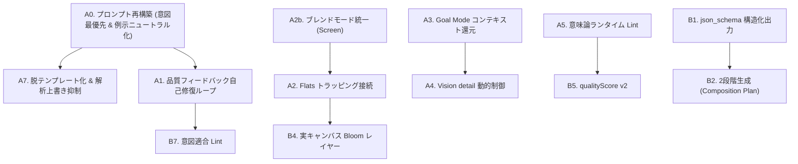

# LLM描画機能 描画クオリティ改善計画案

- ステータス: 案 v3 (2026-09-11)
- 対象: `libs/ui/aiillustration` の LLM 座標ストローク描画パイプライン
  (Docker → StrokeProgramCodec → StrokeRenderer + PromptAnalyzer / QualityUtils)

> **v3 の主な更新**:
> 実コード再調査に基づき、以下の重大なボトルネックの特定と施策の精緻化を実施:
> 1. **プロンプト内スキーマ例のモチーフ汚染**: `buildSystemPrompt()` 内の `OUTPUT SCHEMA EXAMPLE` が特定モチーフ (夜空・地面・一本の木・星) を含んでおり、LLMが主題に関わらずこれらの要素に引っ張られる現象を特定し、スキーマ例のニュートラル化を追加 (A0/A7)。
> 2. **プレビューと実キャンバスの合成モード不一致**: Highlights レイヤーがプレビューで `Screen`、実キャンバスで `COMPOSITE_DODGE` (Color Dodge) となっており、白飛びや発色消失の原因となっていた問題を特定し統一施策を追加 (A2b)。
> 3. **品質レポート伝達経路の欠落**: `parseResponse()` 内部で `KisAiStrokeQualityReport` が破棄されている事実を特定し、API シグネチャ拡張による A1 自己修復ループの完全接続経路を定義 (A1)。
> 4. **qualityScore の数式歪みの是正**: 不要なプリミティブ追加で点数が上がる問題やバウンディングボックスによるカバレッジ偽陽性を分析し、算出式を再定義 (B5)。
> 5. **Goal Mode のコンテキスト還元フォーマット**: 蓄積プログラムのダイジェスト構造、直前ステップ批評の還元、原プロンプト再提示の具体プロンプト設計を策定 (A3)。

---

## 1. 目的

LLM が生成する StrokeProgram v2 の構造品質と、最終的なラスタライズ結果の画質を一段引き上げる。
特に **意図追従性 (intent adherence)** —— ユーザープロンプトの主題・様式・指定事項が最終画に正確に反映されること —— を最優先の品質軸とし、既存の強み (堅牢な JSON パース/修復、Goal Mode の視覚フィードバックループ、レイヤー階層、Undo/Redo 対応) を活かしたまま、実効性の高い改善を段階的に適用する。すべての効果は KPI と定量的テストで測定可能にする。

---

## 2. 現状のボトルネック (コード再調査に基づく事実)

### 2.1 意図追従性の問題 (最優先課題)

| # | 課題 | 現状 (コード上の根拠) | 影響 |
| --- | --- | --- | --- |
| 1 | システムプロンプトが単一巨大で優先順位が不在 | `buildSystemPrompt()` (KisAiStrokeProgram.cpp:373〜) が 6 セクション (JSON 契約 / 座標系 / レイヤー / ワークフロー / 作画ガイド / 操作種別) + ドメイン別アートディレクション (`%4`) を 1 つの system メッセージに連結。ほぼ全規則が `CRITICAL` / `STRICT` / `NEVER` / `ZERO TOLERANCE` 付きで、ハード制約と様式ガイドの区別がモデル側から不能。指示同士が希釈し合う | モデルは「重要そうな定型」を均等に拾い、ユーザー意図との優先順位を判断できない。出力がテンプレート画に収束する最大の要因 |
| 2 | ユーザー意図の配置が弱く、規則より前に来ない | 単発モード: ユーザープロンプトは user メッセージ JSON の `prompt` 1 行のみで、budget/directive に埋もれる。Goal Mode: 追加指示・自己修復フィードバックが `buildGoalStepPayload()` → `buildSystemPrompt(customInstructions)` 経由で **system メッセージ末尾** に `[USER ADDITIONAL FEEDBACK]` として結合される (KisAiStrokeProgram.cpp:3637-3641)。また user 側 directive に "You are acting as an Autonomous Master Illustration Agent..." (3687) があり system の "You are an autonomous AI master digital painter" (379) とペルソナが二重 | 「後ろの巨大な規則群」よりユーザー文が注意を引けない。ステップを重ねるほどフェーズ指示が目標を圧迫し、目標の再提示もない |
| 3 | スキーマ出力例 (`OUTPUT SCHEMA EXAMPLE`) によるモチーフ汚染 ★v3新規 | `buildSystemPrompt()` (KisAiStrokeProgram.cpp:443-503) の JSON 例に `sky`, `ground`, `ground_shade`, `main_tree`, `branch_lines`, `stars` がハードコードされている | モデルが例示のモチーフ (夜空、地面、木、枝、星) に強烈なアンカーバイアスを受け、ユーザーが指定していないのに木や星空が頻繁に描画される |
| 4 | 解析結果がユーザー意図をサイレント書き換え | (a) artStyle コンボ (1-5) は `buildSystemPrompt()` / `buildGoalStepPayload()` 内で `analyze()` の推定を **無条件** に上書き (KisAiStrokeProgram.cpp:376-379, 3626-3629)。(b) ドメイン別 `generateArtDirection()` (KisAiPromptAnalyzer.cpp:257-451) が内容そのものを規定: 具体色 (#fff1e8, #d89a8c, #ff9fb2...)、ランドマーク座標 (y=0.30-0.45)、描画要素の列挙 (Back Hair Mass, Angel Halo, Sakura Blossom Canopies...) | プロンプトに様式キーワードがあってもコンボ設定で握り潰される。ドメイン指示の「お手本」をモデルが verbatim で模倣し、主題が何であれ似た絵になる (テンプレートコピー) |

### 2.2 構造・レンダリング品質の問題

| # | 課題 | 現状 (コード上の根拠) | 影響 |
| --- | --- | --- | --- |
| 5 | 自己修復ループが JSON 構文エラー限定 & レポート破棄 ★v3精緻化 | `parseResponse()` (KisAiStrokeProgram.cpp:1412, 1481) 内で `refineForRendering()` を呼び出して `KisAiStrokeQualityReport` を生成しているが、Docker 側には返されずローカル変数として破棄される。結果、Docker の `scheduleRetry()` は JSON 構文エラー時しか発火できない | 構文は通ったが Flats 欠落や score < 0.55 の粗悪な出力がそのままキャンバスへ投入される |
| 6 | プレビューと実キャンバスのブレンドモード不一致 ★v3新規 | プレビュー (`renderProgramToImage`, KisAiStrokeRenderer.cpp:337) では Highlights が `CompositionMode_Screen`。実キャンバス (`renderProgramToLayers`, KisAiStrokeRenderer.cpp:547) では `COMPOSITE_DODGE` (Color Dodge) | Color Dodge は下地色に依存し、白飛びやハイライト消失を起こす。プレビューと実キャンバスで見た目が大きく乖離する |
| 7 | トラッピング未接続 | `KisAiStrokeQualityUtils::applyTrapping()` (841行〜) が実装・テスト済みなのに `KisAiStrokeRenderer.cpp` から一度も呼ばれていない | Flats と Lineart の境界に白い隙間 (underfill seam) が残る |
| 8 | Goal Mode の継続性情報が不足 | `buildGoalStepPayload()` はスクリーンショット + フェーズ指示のみ。蓄積プログラムの幾何ダイジェスト未送信。`agentCritique` / `readinessScore` は UI 表示のみ、`recommendedAction` はパースされるが次ステップに未還元 | ステップ間の重複描画・競合、エージェント判断の断絶 |
| 9 | 構造化出力 (json_schema) 未使用 | `strokeProgramJsonSchema()` (KisAiStrokeProgram.cpp:246) が存在するが payload は `response_format: json_object` のみ | 型崩れ・欠損フィールドの発生源になり再試行コスト増 |
| 10 | 単発プロンプトで幾何を直接生成 | キーワード解析 + 1 回の Chat Completions で完成プログラムを要求 | 構図破綻・座標散漫が起きやすい |
| 11 | Vision の detail が固定 low | `detail: low` 固定 (KisAiStrokeProgram.cpp:3721) | 仕上げ段階の細部批評・微細ノイズ検出精度が上がらない |
| 12 | 仕上げポストプロセスがプレビュー専用 | `applyFinishingPostProcess` は `renderProgramToImage` (351行) のみ。`renderProgramToLayers` では Bloom レイヤー等が生成されない | プレビューと実キャンバスの仕上がり差 |
| 13 | 意味論ガードの実行時検査なし | 「顔に hatch 禁止」「無関係な manga_lines 禁止」はプロンプト上の約束のみ | ガイドライン違反出力がそのまま画になる |
| 14 | qualityScore の数式上の歪み ★v3精緻化 | `primitiveScore` が操作種別数依存のため不要な particles/manga_lines を足すとスコアが上昇。`coverageScore` がバウンディングボックス面積のため、隅に2点あればカバレッジ 100% と誤判定される (2698-2722行) | 「見た目の質」を捉えられず、スコア稼ぎのゴミ操作を促す |

---

## 3. 改善施策詳細

### P0: 即効施策 (最優先・高費用対効果)

#### A0. プロンプト再構築: 指示ヒエラルキーと意図の最優先化 ★本版の核
- **原則**: 「ユーザー要求 > JSON 契約 > レイヤ意味論 > 幾何作法 > 様式ガイド > 品質のコツ」の順に階層化し、ユーザー意図を先頭かつ最優先ブロックに配置する。
- **内容**:
  1. `buildSystemPrompt()` をセクション生成関数に分割:
     - `buildJsonContractSection()`: RFC 8259 構文規則、型制約
     - `buildLayerSemanticsSection()`: 6 レイヤーの役割とクリッピング規則
     - `buildOperationKindsSection()`: 各 operation kind の幾何仕様
     - `buildDrawingWorkflowSection()`: 描画順序 (大から小へ)
     - `buildStyleGuideSection(spec)`: ドメインディレクション (A7 で改定)
  2. **最優先意図ブロックの設置**:
     プロンプト先頭に以下を配置:
     ```text
     === USER REQUEST (ABSOLUTE HIGHEST PRIORITY) ===
     "%1"
     PRIORITY RULE: If any artistic guideline, example, or default suggestion below conflicts with the USER REQUEST, you MUST follow the USER REQUEST.
     ```
  3. **スキーマ例 (`OUTPUT SCHEMA EXAMPLE`) のニュートラル化**:
     木 (`main_tree`) や星 (`stars`) や夜空といった具体的モチーフを全廃。
     幾何構造のみを示す抽象的 ID とニュートラルな形状に置換:
     - `bg_wash` (Background: gradient_fill)
     - `subject_silhouette` (Flats: fill)
     - `core_shadow` (Shading: fill, style: wash)
     - `primary_contour` (Lineart: path)
     - `specular_point` (Highlights: path / fill)
  4. **トーンと強調語の適正化**:
     `CRITICAL` / `NEVER` / `ZERO TOLERANCE` の乱用を是正。JSON 構文破壊とシステム例外 (顔への hatch 等の致命的バグ) のみに限定し、様式ガイドは通常の説明文に改める。
  5. **ペルソナ二重定義の解消**:
     Goal Mode directive ("You are acting as...") をタスク指示文へ変更。
- **対象**: `KisAiStrokeProgram.cpp` (`buildSystemPrompt`, `buildChatCompletionsPayload`, `buildGoalStepPayload`)
- **検証**: 既存テスト `testBuildChatCompletionsPayload` のアサーション追従。ゴールデンプロンプト 3 本による A/B 比較。

#### A1. 品質フィードバック自己修復ループ (Quality Feedback Self-Correction)
- **内容**:
  1. `KisAiStrokeProgramCodec::parseResponse()` の引数に `KisAiStrokeQualityReport *qualityReport = nullptr` を追加し、パース時に計算した品質レポートを呼び出し元へ戻す。
  2. `KisAiIllustrationDocker` の通常生成および Goal Mode 完了ハンドラにおいて、パース成功後でも以下を満たす場合に「品質自己修復再試行」をトリガー:
     - `report.score < 0.55`、または
     - `Flats` レイヤー操作数が 0 (シルエット不在)、または
     - `droppedOperations > inputOperations * 0.5`
  3. **フィードバック文の構成 (user メッセージ側に注入)**:
     ```text
     [QUALITY CORRECTION REQUEST]
     Your previous output parsed as valid JSON, but had structural quality issues:
     - Missing Flats layer: Please generate silhouette base color fills on 'Flats' first.
     - Low geometric coverage: Ensure major subjects are filled with solid color masses.
     - Specific warnings: %1
     Please regenerate the StrokeProgram correcting these issues while strictly preserving the original user prompt.
     ```
  4. 再試行予算は既存の `m_maxRetriesSpin` (既定2回) を共有し、無限ループを防止。
- **対象**: `KisAiStrokeProgram.{h,cpp}`, `KisAiIllustrationDocker.{h,cpp}`
- **検証**: Flats 欠落 JSON を入力した際に修復フィードバックが生成され、再試行が実行される単体テスト。

#### A2. Flats トラッピングの接続 & レイヤー描画統合
- **内容**:
  1. `KisAiStrokeRenderer::renderProgramToLayers()` および `renderProgramToImage()` において、Flats 操作の描画直前に `KisAiStrokeQualityUtils::applyTrapping(program, trappingPx)` を適用。
  2. 既定のトラッピング幅は `1.5px` (キャンバス解像度 2048px 基準で動的スケーリング: `qMax(1.0, minDim / 1000.0 * 1.5)` )。
  3. トラッピングされた Flats 画像を Shading および Highlights のクリッピングマスク (`CompositionMode_DestinationIn`) に利用。
  4. 詳細設定 UI (`KisAiIllustrationDocker`) に「トラッピング幅 (px)」のスピンボックスを追加。
- **対象**: `KisAiStrokeRenderer.cpp`, `KisAiIllustrationDocker.{h,cpp}`
- **効果**: 線画と塗りの境界に生じる「白い隙間 (アンダーフィル)」の恒久解消。

#### A2b. プレビューと実キャンバスのブレンドモード統一 ★v3新規
- **内容**:
  1. 実キャンバス (`KisAiStrokeRenderer.cpp:547`) で Highlights レイヤーの合成モードを `COMPOSITE_DODGE` から `COMPOSITE_SCREEN` (または `COMPOSITE_ADD`) へ変更し、プレビュー (`renderProgramToImage`, 337行) と一致させる。
  2. どうしても Color Dodge 特有の発光感が欲しい場合のために、レイヤー作成時のオプション (または FX レイヤーのみ Dodge) に局所化する。
- **対象**: `KisAiStrokeRenderer.cpp`
- **効果**: プレビューで確認した階調・光彩が、キャンバス展開時にもそのまま再現される。

#### A3. Goal Mode のコンテキスト還元 & 目標維持
- **内容**:
  `KisAiStrokeProgramCodec::buildGoalStepPayload()` の user メッセージに以下のコンテキストを構造的に注入:
  1. **RESTATED GOAL**:
     `RESTATED GOAL: "%1"` を毎ステップ user メッセージ先頭に再提示。フェーズ進行による意図希釈を完全に阻止。
  2. **直前ステップ批評の還元**:
     前ステップの `agentCritique`、`targetFocusArea`、`recommendedAction` を user directive に含める。
  3. **蓄積プログラム幾何ダイジェスト (Accumulated Geometry Digest)**:
     全文 JSON は送らず、トークンを節約したサマリを生成して注入:
     ```json
     "accumulated_context": {
       "Flats_coverage_percent": 68,
       "existing_elements": [
         {"layer": "Flats", "id": "skin_base", "bbox": [0.35, 0.20, 0.65, 0.55], "color": "#fef0e6"},
         {"layer": "Lineart", "id": "face_contour", "point_count": 14}
       ]
     }
     ```
- **対象**: `KisAiStrokeProgram.{h,cpp}`, `KisAiIllustrationDocker.cpp`
- **効果**: 前ステップで描いたストロークと同一位置への無駄な重複描画や、不整合な上書きを防止。

#### A4. Vision detail の動的制御
- **内容**:
  1. `buildGoalStepPayload()` の `detail` パラメータを引数化。
  2. 中間ステップ (Step 1 〜 N-1) は高速性とトークン節約のため `detail: "low"` を維持。
  3. 最終仕上げステップ (Step N) では `detail: "high"` を自動適用し、解像度も 768px → 1024px に拡大して微細な描写の過不足を検知。
  4. UI の詳細設定に「Vision 品質 (中間/最終)」のセレクタを設置。
- **対象**: `KisAiStrokeProgram.cpp`, `KisAiIllustrationDocker.cpp`

#### A5. 意味論ランタイム Lint (意図保護・自動救済型)
- **内容**: `refineForRendering()` 内に安全な自動変換ルールを追加:
  - **肌・顔領域のハッチング自動救済**: 顔・肌バウンディングボックス内にある Shading の `hatch` 操作を、強制的に `fill` (brush: `watercolor`, opacity: 0.3) に自動変換 (警告ログ付き)。バーコード状の顔面崩壊を 100% 回避。
  - **manga_lines の意図判定ガード**: プロンプト解析 (`KisAiPromptAnalyzer`) で `spec.hasMangaFx == false` かつプロンプトにアクション関連語がない場合、出力された `manga_lines` を警告付きで drop。
  - **極小縮退ポリゴンの除去**: 面積 < 0.0001 (正規化座標) の極小ゴミポリゴンを drop。
- **対象**: `KisAiStrokeProgram.cpp`, `KisAiPromptAnalyzer.{h,cpp}`
- **効果**: モデルのうっかりミスによる致命的な描画破綻を水際で救済。

#### A6. サンプリング既定値の見直し
- **内容**:
  - 単発モード既定 temperature を 0.7 → 0.5 に変更 (幾何座標の安定化)。
  - 自己修復時の temperature を ≤ 0.20 に強制。
  - `seed` パラメータを payload に含め、OpenAI / 互換サーバーでの決定論的再現性を担保。
- **対象**: `KisAiIllustrationDocker.cpp`, `KisAiStrokeProgram.cpp`

#### A7. アートディレクションの脱テンプレート化 + 解析上書き抑制
- **内容**:
  1. **artStyle コンボによる強制上書きの廃止**:
     プロンプト解析で明確なスタイルが推定された場合 (`spec.style != ArtStyle::General`) はプロンプトを最優先し、UI のコンボボックスは「自動 (プロンプト優先)」を既定とする。
  2. **`generateArtDirection()` の「拘束 + アンカー」型への刷新**:
     - 具体的色コード (`#fff1e8`, `#ff9fb2`, `#d89a8c` 等) の強制指定を削除。代わりに `e.g. skin tone derived from subject` のように例示であることを明示。
     - 特定パーツの列挙 (`Back Hair Mass`, `Angel Halo`, `Sakura Blossom Canopies` 等) を削除。
     - `"Derive all character and scenic elements strictly from the USER REQUEST."` を原則として宣言。
- **対象**: `KisAiPromptAnalyzer.cpp`, `KisAiStrokeProgram.cpp`
- **効果**: 「何を描かせても同じアニメ顔・天使の輪・桜になる」問題の根本解決。

---

### P1: 構造改善 (中期的・品質飛躍施策)

#### B1. json_schema 構造化出力 (Structured Outputs) 対応
- **内容**:
  1. `supportsJsonFormat(endpoint)` を拡張し、OpenAI / OpenRouter / vLLM 等の主要プロバイダで `response_format: { type: "json_schema", json_schema: { strict: true, schema: strokeProgramJsonSchema() } }` を選択可能にする。
  2. 非対応プロバイダ (ローカル LLM 等) では従来の `json_object` またはプロンプト指示へフォールバック。
  3. schema 内の型定義を厳格化 (配列の最小・最大要素数、必須プロパティの整合)。
- **対象**: `KisAiStrokeProgram.{h,cpp}`, `KisAiIllustrationDocker.cpp`

#### B2. 2段階生成 (Composition Plan → StrokeProgram)
- **内容**:
  複雑なプロンプトや高解像度描画向けに「構図設計 → 実作画」の 2 コールパイプラインをオプトインで提供:
  1. **Step 1: Composition Plan (軽量 JSON)**:
     - 焦点位置 (`focal_point: [x, y]`)
     - 主要パレット 5〜7 色 (`palette: ["#...", ...]`)
     - 主要要素のバウンディングボックスとレイヤー割り当て
     - **必須フィールド**: `user_intent_summary` (ユーザー要求の解釈要約)
  2. **Step 2: StrokeProgram 生成**:
     Step 1 で確定した構図プランとパレットを system/user context に注入して実幾何を生成。
- **対象**: `KisAiStrokeProgram.{h,cpp}`, `KisAiIllustrationDocker.cpp`
- **効果**: 人物と背景のスケール比の狂いや、構図の散漫さを根本から解消。

#### B3. 色彩ハーモニー正規化パス
- **内容**:
  - `refineForRendering()` または描画直前に、Shading や Highlights の色が Flats の下地色と極端に乖離している場合、`KisAiStrokeQualityUtils::calculateHueShiftedShadow` / `Highlight` を用いて色相を整えるポストプロセス。
  - プロンプトで意図的にサイバーパンク等の対比色が指定されている場合はスキップする判定を保持。
- **対象**: `KisAiStrokeQualityUtils.{h,cpp}`, `KisAiStrokeRenderer.cpp`

#### B4. 実キャンバスへの非破壊仕上げレイヤー (Bloom / Atmosphere)
- **内容**:
  1. `renderProgramToLayers()` において、完成時 (単発モード完了または Goal Mode 最終ステップ) に仕上げポストプロセスを非破壊レイヤーとして追加。
  2. Highlights および FX レイヤーのラスタライズ結果から高輝度部を抽出 → ガウシアンブラー拡散 → 新規レイヤー `🎨 AI: Bloom FX` (合成モード: `Screen`、不透明度: 40%) としてグループ最上位に挿入。
  3. ユーザーが Krita 上でいつでも不透明度調整や削除が可能。
- **対象**: `KisAiStrokeRenderer.cpp`
- **効果**: プレビューと同等のみずみずしい光彩効果が実キャンバス上でも得られる。

#### B5. qualityScore v2 (数理的精緻化) ★v3精緻化
- **内容**:
  既存の `qualityScore()` (KisAiStrokeProgram.cpp:2656) の歪みを解消:
  1. `primitiveScore` を廃止し、**レイヤー構成の論理的整合度** (Flats が基底にあり Shading/Lineart がその上にあるか) に置き換える。不要な particles 乱造による加点を根絶。
  2. `coverageScore` を単純なバウンディングボックスの矩形積から、**ポリゴンの実際の面積和 (重なり除去推定)** へ変更。
  3. **ストローク連続性スコア**: 2点のみの孤立微小パス (ゴミ線) の比率が高い場合にペナルティ。
  4. **色彩多様度スコア**: 使用されているユニーク色相 (Hue) の分散度を評価。
- **対象**: `KisAiStrokeProgram.cpp` (`qualityScore`), 単体テスト

#### B6. 操作予算のインテリジェント・トリミング
- **内容**:
  - トークン枯渇等で操作数が多すぎる場合、重要度の低い操作 (FXの微小パーティクルや背景の細かなパス) から安全にトリミングし、主要シルエット (Flats) と輪郭 (Lineart) を最優先で保護。
- **対象**: `KisAiStrokeProgram.cpp`

#### B7. 意図適合 Lint (Intent Adherence Check)
- **内容**:
  パース・refine 完了後に、`KisAiPromptAnalyzer` の解析結果とプログラムを照合し、警告を A1 の再試行ループに連携:
  - **時間帯不整合**: `spec.timeOfDay == Night` なのに背景色が明度の高い水色/昼色。
  - **色彩指定不整合**: プロンプトに「blonde」「gold」とあるのに Flats/Lineart に黄色系が皆無。
  - **様式指定不整合**: 「watercolor」「suibokuga」とあるのに gpen / hatch のみで構成。
- **対象**: `KisAiStrokeProgram.{h,cpp}`, `KisAiPromptAnalyzer.{h,cpp}`

---

### P2: 中長期施策 (基盤・保守性)

#### C1. 回帰防止ゴールデンセット & CI ハーネス
- 代表プロンプト 18 本 (Character / Landscape / Cyberpunk / Creature / Botanical / MangaFx 各 3 本) の入出力フィクスチャを整備。
- `ctest` 上でパース・品質スコア・意図適合判定がリグレッションしないことを自動検証。
- A/B 比較実行モード (旧プロンプト vs 新プロンプト) を環境変数で切り替え可能にする。

#### C2. PromptAnalyzer v2
- 多言語キーワード解析の強化 (日本語特有の画風・ニュアンス語の拡充)。
- 空間配置語 (「左側に〜」「中央奥に〜」) の構図アンカー化。

#### C3. テレメトリ & デバッグロギング強化
- `logDebug` にシステムプロンプトのトークン消費量、修復適用件数、B7 意図警告種別の集計を出力 (APIキーや秘密情報は完全除外)。

#### C4. グラデーション・ディザリング
- `drawGradientFillOperation` において 1〜2% の微小ディザノイズを付加し、8bit 描画時のマッハバンド (バンディング) を抑制。

---

## 4. ロードマップ & 着手順序

依存関係と効果に基づき、以下の順序で実装を展開する:



| フェーズ | 施策 | 工数目安 | 主な成果 |
| --- | --- | --- | --- |
| **Phase 1 (最優先・即効)** | **A0** → **A7** → **A2b** → **A2** → **A1** | 3〜5人日 | プロンプト意図追従性の劇的向上、テンプレート絵の脱却、白抜け・ブレンド不整合の根絶、品質エラー自己修復の開通 |
| **Phase 2 (エージェント強化)** | **A3** → **A4** → **A5** → **A6** | 2〜3人日 | Goal Mode の多段階連続性向上、仕上げ批評精度アップ、顔面ハッチング等の事故完全防止 |
| **Phase 3 (構造化・品質洗練)** | **B5** → **B7** → **B4** → **B1** | 4〜6人日 | qualityScore 数式是正、意図適合自動検査、実キャンバス Bloom 生成、json_schema 対応 |
| **Phase 4 (構図革新・基盤)** | **B2** → **B3** → **B6** → **C1〜C4** | 5〜8人日 | 2段階構図生成による破綻低減、回帰テストハーネス完成 |

---

## 5. 定量 KPI と測定基準

以下のメトリクスをゴールデンセット (18プロンプト) にて計測し、改善を定量検証する:

### 5.1 意図追従性 KPI (v2/v3 の最重要指標)
- **テンプレートカラー一致率**: `generateArtDirection()` の旧固定色コード (#fff1e8, #ff9fb2 等) が出力に現れる割合を **50% 以下に半減**。
- **意図要素反映率**: プロンプト内の明示キーワード (髪色、時間帯、特定モチーフ) の出力反映率 **≥ 90%** (B7 Lint で自動計測)。
- **無関係モチーフ発生率**: プロンプトで要求していない「星空」「木」「桜」「manga_lines」の発生率 **< 2%**。
- **様式一致率**: 水彩・厚塗り・アニメ等の指定と出力ブラシプロファイルの整合率 **≥ 85%**。

### 5.2 構造・レンダリング品質 KPI
- **JSON 第一パース成功率**: ≥ 98% (構文エラーによる無駄な再試行の抑制)。
- **アンダーフィル・シーム画素数**: Flats と Lineart 境界の白抜け画素 **0 (ゼロ)** (A2 トラッピングにより達成)。
- **プレビュー / キャンバス忠実度**: プレビュー画像とキャンバス統合画像の PSNR / 差分画素を大幅低減 (A2b ブレンド統一による)。
- **平均 qualityScore (v2)**: ≥ 0.75 / 縮退・破棄操作率 < 3%。
- **自己修復回復率**: 構造警告を受けた再試行でスコアが基準値以上に回復する率 **≥ 80%**。

---

## 6. 検証方針 & テスト戦略

1. **スタンドアロン単体テスト (`AI_STROKE_STANDALONE_TESTS`)**:
   - `build-test` 環境で 1 秒以内で全件パスする健全性を常に維持。
   - A0 適用に伴い、既存 `testBuildChatCompletionsPayload` のアサーションを「セクション存在確認」「最優先ブロックの存在確認」へ安全に更新。
   - 新規追加テスト:
     - `testPromptHierarchyAndUserPriority()`: ユーザープロンプトが最優先ブロックに配置されていることの検証。
     - `testNeutralSchemaExample()`: スキーマ例に木や星などの特定モチーフが含まれていないことの検証。
     - `testQualityReportReturnedFromParseResponse()`: `parseResponse` から品質レポートが漏れなく取得できることの検証。
     - `testTrappingExpandsFlatsPolygons()`: `applyTrapping` で Flats が拡大されシームが消えることの検証。
     - `testIntentAdherenceLinter()`: 時間帯や色の乖離が正しく警告されることの検証。
2. **実行コマンド**:
   - 全体テスト: `ctest --test-dir build-ai -L AIStroke --output-on-failure --no-tests=error`
   - スタンドアロン: `cmake -B build-test -G Ninja -DAI_STROKE_STANDALONE_TESTS=ON ... && ninja -C build-test && ctest --test-dir build-test`
3. **実機・目視確認シナリオ**:
   - **対比プロンプト検証**: 「銀髪の冷徹な女剣士」と「筋骨隆々のオーク戦士」を描画させ、両者に同一のアニメ顔・前髪影・チークが出ないことを確認。
   - **Goal Mode 4 ステップ通し確認**: 各ステップで前の描画を踏まえた加筆が行われ、最終ステップで高精度批評と Bloom レイヤーが正常に機能することを確認。
   - **Undo/Redo 検証**: 実キャンバス展開後のグループレイヤーが一発で Undo 可能であることの確認。

---

## 7. 実装上の厳格ルール

- **AI_STROKE_PAINTER_APP 条件分岐の維持**: Krita 本体コードへの影響を遮断するため、AI 固有処理は必ずガードする (DEVELOPMENT.md §8)。
- **セキュリティ・プライバシーの完全防御**:
  - API キーやエンドポイント URL は一切デバッグログに出力しない。
  - メモリ内の API キーは使用直後に `clearInFlightApiKey()` でゼロクリア。
  - ローカル / HTTPS 以外の安全でない接続は遮断。
- **SPDX ライセンスヘッダー**: すべての新規ファイルに `SPDX-FileCopyrightText: 2026 AI Stroke Painter contributors` および `SPDX-License-Identifier: GPL-2.0-or-later` を付与。
- **i18n 対応**: UI 上の新規文言・ステータスメッセージは `i18n()` を通し、日本語翻訳を提供する (LLM 向けシステムプロンプトのみ英語固定)。
- **既存の堅牢な JSON 修復機構の尊重**: `repairJsonSyntax()`, `repairTruncatedJson()`, `extractOperationsFromRawText()` 等の既存の回復レイヤーは維持し、その上位に品質ガードを重ねる設計とする。
