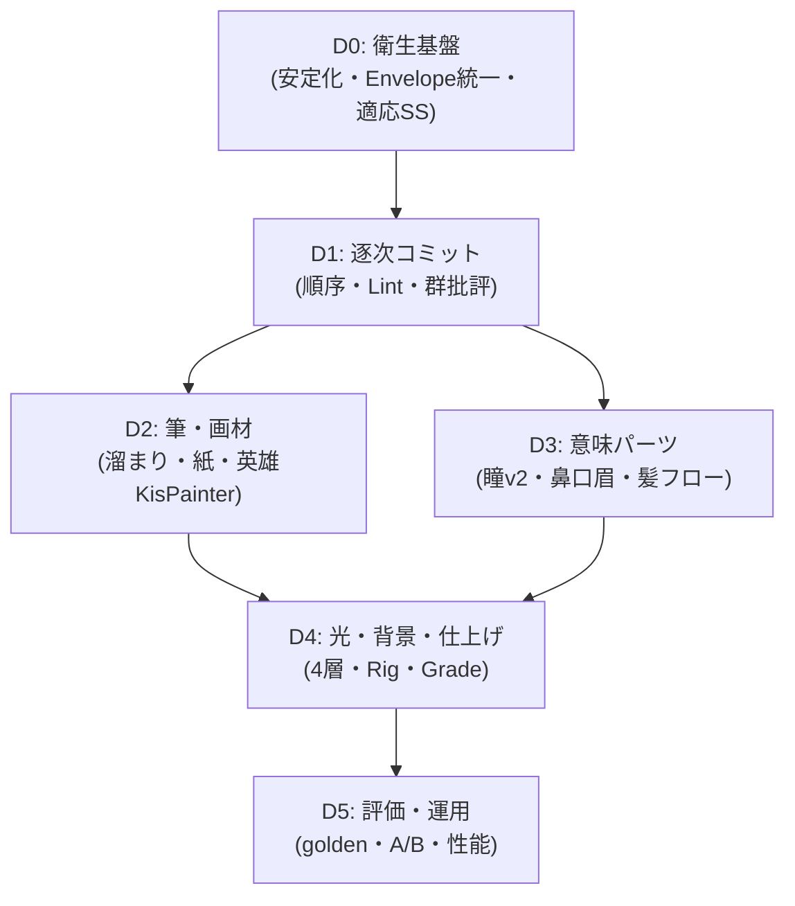

# AI Stroke Painter 描画クオリティ格段向上 実装プラン V4 — Deliberate Stroke (1本1本丁寧に描く)

- 作成日: 2026-09-13
- 対象: `libs/ui/aiillustration` 全体 + `libs/ui/tests`
- 前提: V1 (Phase 1〜4 実装済) / V2 (点々根絶・瞳プリミティブ等) / V3 (`KisAiSceneSpec` + `KisAiLayoutEngine` + `KisAiLightRig` 実装済) / UIUX改善計画 (Simple/Pro・履歴等) の上位計画
- 本書の位置づけ: **「線を1本1本丁寧に描く」ロジックを核に、残る品質の天井を全部抜く**ための実装プラン。V3までの到達点を壊さず、描画1ストローク単位の丁寧さをコードで保証する

---

## 0. エグゼクティブサマリー

### 現状の到達点 (コード実態ベース)

| 領域 | 実装済 | 残る天井 |
| :--- | :--- | :--- |
| 座標直書き脱却 | `KisAiSceneSpec` (意味のみ) + `KisAiLayoutEngine::generateProgram` で正規幾何を生成。LLMは座標を書かないパスが確立 | Layout由来以外の v2 パス (LLM座標直書き) は依然として荒い。丁寧さの保証がパス依存 |
| 線画基礎 | `drawPathOperation` に Centripetal Catmull-Rom + 適応分割 (4〜24) + smoothstep筆圧 + `calculateTaper` + 外形エンベロープ + プロファイル別質感 (airbrush/watercolor/brush/calligraphy) | **1本単位の事前整形・角処理・自己交差対策がない**。`generateStrokeEnvelope` (bowtie対策済) があるのに `drawPathOperation` は独自の単純法線方式で重複実装している |
| 顔・髪の型 | HeadRig対称・EyePair・前髪M字・サイド錠・あほ毛・天使の輪・服 (制服/パーカー/ドレス) まで実装 | 目・鼻・口・眉の造形がまだ粗い。髪は量感はあるが毛流フィールドがなく、ハイライトが単発ハローのみ |
| 光・色 | `KisAiLightRig::fromSpec/synthesizeShading` で単一光源・コア影+リム+顎AO。`applyLineartHierarchy`・`brushPresetName` あり | 陰影が2層止まり (フォームぼかし半径4固定・キャスト1固定)。服の皺・跳ね返り光・SSSなし。背景はグラデ+月/山稜のみでモジュール不足 |
| ノイズ対策 | 粒子抑制 (`setParticleSuppressionEnabled` 既定ON)・顔除外マスク・髪結合 (`uniteOverlappingHairFlats`)・単一アートボード (`🎨 AI Illustration` 再利用) | ストローク単位のゴミ検出が `refineForRendering` の一括処理のみ。描画直前の最終関門がない |

### V4のスローガン

> **速くたくさん描くのをやめ、1本ずつ「計画→整形→試し書き→吟味→確定」を踏む。人間の上手い画家と同じ手順をコードで再現する。**

新パイプライン概念図:

```
【現行】 ops[] → expand → bucket → renderOperationsToImage (一括・無検査)

【V4】 ops[] → StrokePlanner (順序付け) → per-stroke loop:
         Lint (長さ/曲率/交差/色) → Stabilize (RDP/等間隔/Chaikin)
       → Shape (Catmull-Rom + Envelope) → Ink (筆圧/溜まり/かすれ/紙)
       → Review (カバレッジ/対称/はみ出し) → Commit / Skip+log
       → 意味グループ毎に Critic (目ペア・髪・顔) → 必要なら局所描き直し
```

期待効果: 線のガタつき・針金ハロー・先端の丸潰れ・角の棘・顔の左右崩れ・ベタ塗り感を原理的に消し、**どのプロンプトでも「丁寧に描かれた線」に見えるフロアを保証**する。

---

## 1. 核となる新ロジック — Deliberate Stroke Engine

### 1.1 設計: 新規 `KisAiDeliberateStroke.{h,cpp}` (Phase D0〜D1)

既存ファイルを散らさず、1本単位の丁寧さを集約する新規エンジンを追加する。Rendererはこれを呼ぶだけになる。

```cpp
struct KisAiStrokeLintReport {
    bool drop = false;          // 描く価値なし (ゴミ点・極小・画面外)
    bool needsRepair = false;   // 修復して描く (ジッタ・重複点・幅異常)
    QStringList reasons;        // ログ・テレメトリ用
    qreal lengthPx = 0;
    qreal maxCurvature = 0;
    int selfIntersections = 0;
};

struct KisAiStrokeCommitResult {
    bool committed = true;
    QRectF dirtyRect;           // 逐次プレビュー・局所再描画用
    qreal inkCoverage = 0;      // レビュー用
};

class KisAiDeliberateStroke {
public:
    // D0: 1本の前処理 (RDP→等間隔→角保持平滑化)。canvasSize基準・決定的 (seed固定)
    static QVector<KisAiStrokePoint> stabilizeStroke(
        const QVector<KisAiStrokePoint> &points, const QSize &canvasSize,
        bool closed, quint32 seed);

    // D0: 1本の検査。drop/repair判定のみ行い、描画はしない
    static KisAiStrokeLintReport lintStroke(
        const KisAiStrokeOperation &op, const QSize &canvasSize,
        const KisAiLightSettings *rig = nullptr);

    // D1: 描画順序の決定。人間の手順と同じ: 大→小・奥→手前・薄→濃・構造→詳細
    static QVector<int> planStrokeOrder(
        const QVector<KisAiStrokeOperation> &ops, const QSize &canvasSize);

    // D1: 1本の確定描画 (Shape→Ink→Review→Commit)。既存drawPath/drawRibbonを内包
    static KisAiStrokeCommitResult commitStroke(
        QPainter &painter, const KisAiStrokeOperation &op,
        const QSize &canvasSize, int supersampleScale);

    // D1: 意味グループ単位の批評 (目ペア・髪・顔)。NGなら局所リトライ指示を返す
    static QStringList critiqueGroup(
        const QString &groupId, const QImage &before, const QImage &after);
};
```

### 1.2 D0: ストローク衛生基盤 (1〜2日・土台)

現行 `drawPathOperation` (KisAiStrokeRenderer.cpp:883〜) の弱点を塞ぐ。即効でガタつき・棘・潰れが減る。

1. **前処理の統一** (`stabilizeStroke`):
   - `simplifyRDP(epsilon=1.2px)` でLLM由来の微振動・共線ゴミ点を除去 → `resampleEquidistant(step=3px)` で密度均一化 → `smoothPolygonCornerPreserving(135度)` で緩カーブのみ平滑化し鋭角 (目尻・襟角・髪束先端) は保持。
   - 2点以下のゴミ・長さ<2px・画面外100%は `lintStroke` で `drop=true` (既存の `refineForRendering` の面積<0.0001判定をストローク単位に前倒し)。
   - 全て決定的に (seedは `stableSeed(op.id)` 派生)。ランダムゆらぎを持ち込まない。
2. **エンベロープ統一** (最大の重複解消):
   - `drawPathOperation` 内の独自法線エンベロープ (975〜1020行の `leftEdge/rightEdge` 単純平均) を廃止し、`KisAiStrokeQualityUtils::generateStrokeEnvelope` (bowtie・捻れ対策済) に一本化。
   - 中央差分テンジェントのゼロ除算ガード (`tLen>0.0001`)・マイタ制限を共通化し、鋭角での棘状膨張を消す。
   - 始端=丸キャップ・終端=テーパー尖端 (筆の入り・抜き) をプロファイル別に分離。現行は両端とも楕円dabで「丸潰れ」するため、終端のみ先細り多角形で閉じる。
3. **適応スーパーサンプリング**:
   - 現行は `renderOperationsToImage` で一律2倍。V4は意味で変える: 顔・目 (`eye/contour/lash`) は3倍、髪・服は2倍、背景は1倍。`faceExclusionPath` 構築時に使った意味判定を流用し、描画コストは据え置きで顔だけ精細に。
- 対象: 新規 `KisAiDeliberateStroke.{h,cpp}` + `KisAiStrokeRenderer::drawPathOperation/drawRibbonOperation` の置換 + `KisAiStrokeQualityUtils` の流用
- テスト: `testStabilizeRemovesJitter`, `testEnvelopeNoBowtieOnSharpCorner`, `testTaperedTipVsRoundStart`, `testAdaptiveSupersampleFaceOnly`

### 1.3 D1: 逐次コミットループ (3〜4日・V4の核)

「まとめて描いて終わり」を「1本描いて吟味して次へ」に変える。

1. **順序計画** (`planStrokeOrder`):
   - ソートキー: (1) レイヤー順 (Background→Flats→Shading→Lineart→Highlights→FX) (2) 面積降順 (大シルエット優先) (3) 不透明度昇順 (薄→濃で重ね) (4) 顔詳細は最後 (目・口・眉は全土台の後)。
   - `trimOperationsToBudget` と連動: 予算超過時は順序の末尾 (FX微粒子・背景細部) から削り、Flats・顔輪郭は不滅に。
2. **逐次レビュー** (`commitStroke` + `critiqueGroup`):
   - 1本描く毎に dirtyRect の inkCoverage を計測。カバレッジ0 (完全はみ出し・透明) は即skip+警告。
   - 意味グループ (例: `eye_l/eye_r`, `hair_fringe`, `face_contour`) が揃った時点で対称性・重なりを検査。目ペアの中心ズレ> headWidth*0.02 なら `testEyePairSymmetryLint` 準拠の警告を出し、Goal Modeでは局所リトライ候補に登録。
   - 中間画像を `QImage` に累積し、Dockerのプログレッシブプレビュー (UIUX計画§1.3) と将来のタイムラプスにそのまま渡せるようにする。
3. **描画と検査の分離**:
   - `renderOperationsToImage` / `renderProgramToLayers` の両経路で同一ループを使う (プレビューと実キャンバスの乖離を原理的にゼロに。V1 A2bの徹底)。
   - `painter.save/restore` は1本単位で維持し、eraser (`CompositionMode_Clear`) の漏れを防ぐ。
- 対象: `KisAiStrokeRenderer::renderOperationsToImage` + `renderProgramToLayers` + 新規エンジン + Docker (逐次プレビュー受口は任意)
- テスト: `testStrokeOrderBigToSmall`, `testZeroCoverageStrokeSkipped`, `testEyeGroupCritiqueTriggers`, `testPreviewCanvasParityAfterDeliberate` (PSNRゲート)

---

## 2. 他の改善点の洗い出し (可能な限り網羅)

### 2.1 線・筆・画材 (D2: 2〜3日)

| # | 改善点 | 現状の問題 | 施策 | 対象 |
| :--- | :--- | :--- | :--- | :--- |
| D2-1 | インク溜まり・かすれ | 均一αのベタ線。速い線も遅い線も同じ濃さで嘘っぽい | 速度 (サンプル間隔) 連動α: 遅い=溜まり (+15%濃・幅+8%)、速い=かすれ (α-20%・bristle隙間)。seed固定の決定的ゆらぎ | DeliberateStroke + `generateBristleStrands` |
| D2-2 | 水彩縁の単調さ | `watercolor` は縁ペン一律で、紙目がない | 紙grain (微細ノイズ2%) + 縁の濃度を曲率連動 (外カーブ濃・内淡)。強度はDockerスライダー | Renderer + Docker質感UI |
| D2-3 | 英雄線のKrita化 | 全てQPainter多角形。筆致・混色がない | 顔輪郭・睫毛・前髪線のみ `KisPainter` 打鍵パス (プリセットは `brushPresetName` の `gpen→Pencil-2` 等を流用)。まずプレビュー側でA/B、次に実キャンバスへ | Renderer (native path) |
| D2-4 | リボン幅の硬直 | `widthStart/Mid/End` の3点固定でカーブに応じない | 曲率連動幅: 急カーブ=細・直線=太 (±20%) + 先端テーパー曲線を二次に。`synthesizeHairClump` の束にも適用 | QualityUtils + LayoutEngine |
| D2-5 | グラデバンディング | `drawGradientFillOperation` の平滑グラデが8bitで縞に | 1.5%ディザ (V1 C4の完全実施) + 夜空は縦3 stops化 | Renderer |

### 2.2 顔・髪・服の意味パーツ (D3: 3〜4日)

| # | 改善点 | 現状の問題 | 施策 |
| :--- | :--- | :--- | :--- |
| D3-1 | 瞳 v2 (EyePair完全体) | 虹彩グラデ・睫毛ありだが、両目の連動・二重・視線が弱い | EyePair単位生成に格上げ: 間隔=頭幅0.38± facing補正・上睫毛は目頭細→目尻太の単一テーパー線・二重幅線・視線 (`gaze`) で瞳孔オフセット・両目同一ハイライト形状 |
| D3-2 | 鼻・口・眉リグ新設 | 鼻は染み防止のみ、口は単線、眉なし | `NoseRig` (点+短影のみ・べた黒禁止をLint化)、`MouthRig` (smile_open/closed/halfの歯・唇厚パラメ)、`BrowRig` (M字連動の太さ・角度)。表情IDで一括駆動 |
| D3-3 | 髪フロー化 | 量感はあるが束の流れ方向がバラバラ、照り返しが単発ハロー | 頭頂→毛先ベクトル場で束角度を揃える + ハイライトを3連リボン (主光・副光・逆光) + 毛先の透け (α0.85→0.55) |
| D3-4 | 服の皺・立体 | Torsoは筒、皺なし。靴・手なし | Lock位置に皺リブ3本 (Shading wash) + リボン結び目のAO + 手は「描かない勇気」(袖で隠す構図優先・`noExtraLimbs` と連動。手描画は将来フェーズに隔離) |
| D3-5 | チーク・肌SSS | チークは radial化済だが肌の赤み透過がない | 鼻頭・頬・耳・指先にSSS赤 (`#ff9a8a` α0.18) をLightRigから自動派生。夜は抑制・夕は増幅 |

### 2.3 光・色・背景・仕上げ (D4: 2〜3日)

| # | 改善点 | 現状の問題 | 施策 |
| :--- | :--- | :--- | :--- |
| D4-1 | 陰影4層の完成 | form (blur4) + cast (blur1) の2層止まり。AOは顎のみ | Flatsから自動派生の4層化: コア (硬・hue-shift) + フォーム (柔・blur6) + AO (接触部・blur2・乗算1.2) + リム (光源側縁・Screen)。`synthesizeShading` 拡張 |
| D4-2 | 跳ね返り・時間帯 | 夜なのに昼色・影真っ黒が稀に残る | `LightRig` を唯一真実源に徹底: 全Shading/Highlight色は `shadowColor/highlightColor` 導出のみ。`timeOfDay` 連動 (夜=青fill+暖key、夕=橙key+紫fill)。対比色は `mood` 明示時のみ例外 |
| D4-3 | 背景モジュール | グラデ+月+山稜/床影のみ。キャラ物と風景物の差が小さい | `BackgroundRig` 化: 空 (3stops+雲2層)・遠景 (空気遠近α)・中景 (街灯ぼけ/樹影)・前景 (前ボケ) の4スロット。顔矩形との重なり禁止ソルバを維持 |
| D4-4 | Bloom/Grade一致 | Bloomはあるがプレビュー専用寄り・Gradeなし | `🎨 AI: Bloom FX` (Screen 40%) + `🎨 AI: Grade` (暖寒・彩度LUT相当) を実キャンバスに非破壊追加。プレビュー/キャンバスPSNRゲートで一致保証 |
| D4-5 | トラッピング仕上げ | Flats膨張ありだが内側の白ハロが残る場合あり | 膨張+内側1pxの濃色縁 (ink trap) で完全封止。幅は `minDim/1000*1.5` 維持・UI露出済 |

### 2.4 プロンプト・Goal・評価・運用 (D5: 並行2日)

| # | 改善点 | 施策 |
| :--- | :--- | :--- |
| D5-1 | Stroke-level指示 | SceneSpecに `stroke_hints` (例: `lash_outer_to_inner: single_tapered`) を追加。LLMは意味だけ決め、線数はLayoutが確定 |
| D5-2 | 領域リトライ完成 | `KisAiCritiqueRegion {area,issue,action,priority}` をSpecDeltaに還元し、該当レイヤー局所のみ再生成 (マスク付き)。全体再生成を禁止 |
| D5-3 | ゴールデン+ゲート | 代表18プロンプトのSpec・プレビュー・スコアを `tests/golden/` に固定。KPI: 顔粒子0・対称100%・光源一致≥95%・意図反映≥90%・PSNR閾値 |
| D5-4 | A/B・テレメトリ | v3/v4パス切替をDocker hidden + 環境変数で。Spec採用率・drop率・対称誤差を `logDebug` 集計 (秘密情報除外厳守) |
| D5-5 | 性能ガード | 顔3倍化の代償を `QElapsedTimer` 計測で上限化 (例: 1024pxで<800ms)。超過時は背景1倍・ぼかし半径半減の自動縮退 |

---

## 3. 変更ファイル一覧

| ファイル | 変更内容 | Phase |
| :--- | :--- | :--- |
| `KisAiDeliberateStroke.h/.cpp` (新規) | 安定化・Lint・順序・逐次コミット・群批評の集約 | D0/D1 |
| `KisAiStrokeRenderer.h/.cpp` | 独自エンベロープ→共通化、適応SS、逐次ループ、Bloom/Grade実層、ディザ | D0/D1/D2/D4 |
| `KisAiStrokeQualityUtils.h/.cpp` | 曲率幅・紙grain・SSS・4層派生の追加。既存関数は尊重し上積みのみ | D2/D3/D4 |
| `KisAiLayoutEngine.h/.cpp` | EyePair v2・Nose/Mouth/Browリグ・髪フロー・服皺・BackgroundRig | D3/D4 |
| `KisAiLightRig.h/.cpp` | 4層+跳ね返り+時間帯LUT。唯一真実源の徹底 | D4 |
| `KisAiSceneSpec.h/.cpp` + Codec | `stroke_hints` 追加・検証。旧Specは読めるまま (後方互換) | D5 |
| `KisAiStrokeProgram.h/.cpp` | `lint` 閾値・順序キー・SpecDelta還元の接続。`refine` は残し二重関門化 | D0/D1/D5 |
| `KisAiIllustrationDocker.{h,cpp}` | 質感スライダー・逐次プレビュー受口・A/B切替 (Simple/Pro流用) | D2/D5 |
| `libs/ui/tests/*` | 本文中の `test*` を網羅。PSNR・対称・順序の回帰をCI化 | D0〜D5 |

後方互換: v2/v3 JSONは従来パスで読めるまま。DeliberateはLayout/v2両パスの後段フィルタとして働くため、切替OFFでも旧画が出る (Docker hidden)。

---

## 4. ロードマップと着手順序



| 順序 | 内容 | 期待効果 | 目安 |
| :--- | :--- | :--- | :--- |
| Step 1 | D0 | ガタ・棘・丸潰れが即消える。顔の精細感だけ上がる | 1〜2日 |
| Step 2 | D1 (核) | 「丁寧さ」が目に見える。プレビュー=キャンバス一致 | 3〜4日 |
| Step 3 | D2+D3並行 | 筆致・瞳・髪のプロ感。ベタ塗り脱却 | 3〜4日 |
| Step 4 | D4 | 厚み・空気感・夜の説得力。仕上げ一致 | 2〜3日 |
| Step 5 | D5 | 回帰なしに積める。効きを数値で証明 | 並行2日 |

最小実行単位 (MVP): **D0 + D1の順序+Lintまで**で線の丁寧さは一段上がる。そこからD2以降で質感を積む。

---

## 5. やらないこと・リスク管理

- **やらないこと**: SD/Flux等への全面依存はしない (Kritaネイティブの編集可能レイヤー・Undo・軽量オフラインの強みを捨てない)。手の本格描画は隔離 (袖隠し構図で回避を継続)。
- **LLMに線を期待しない**: 美しさの源泉はコード側の保証に置く。プロンプト改善だけでは天井は抜けない前提を崩さない。
- **Kritaコア無影響**: `AI_STROKE_PAINTER_APP` ガード・SPDX・i18n・秘密情報不ログ (V1 §7) を全Phaseで継承。
- **テスト先行**: 各Phaseの `test*` が赤のまま次に進まない。ゴールデン差分は目視レビュー必須。
- **性能**: 顔3倍SSの悪化は縮退スイッチで吸収。計測なしに重くしない。

---

## 6. 受け入れ基準 (Definition of Done)

1. 同一プロンプト (アニメ美少女・夜) で顔粒子0・両目対称・髪が泡状でない・線先が尖り始端が丸いことを目視確認。
2. `ctest -L AIStroke` 全件PASS + ゴールデン18件のKPIゲートPASS + PSNRゲートPASS。
3. Goal 4〜6 Step通しで単一アートボードに収まり、最終Stepが最も美しいこと。
4. 差分が `libs/ui/aiillustration` + testsに限定され、Kritaコア無影響・秘密漏洩なし。
5. D1 OFF/ONのA/BでONが明確に丁寧に見えること (目視+カバレッジログ)。

---

## 付録: 既存計画との対応

| 本書 | V1対応 | V2対応 | V3対応 | UIUX対応 |
| :--- | :--- | :--- | :--- | :--- |
| D0/D1 | A5・B5の発展 (検査の逐次化) | §1残件の最終関門化 | T1/T2の線単位実装 | — |
| D2 | B3・C4の統合発展、A2継承 | §4.1の着手 | T5の画材化の具体化 | 質感スライダー受口 |
| D3 | A0/A7のSpec発展 | §1.2〜1.4の完全体 | HeadRig/EyePairのv2化 | 表情カード連動 |
| D4 | B4の実層化・A2b徹底 | — | T3/T4の完成 | 背景モジュール受口 |
| D5 | C1/C3継承 | §5のKPI化 | Phase 4の継承 | 履歴・A/B連動 |
