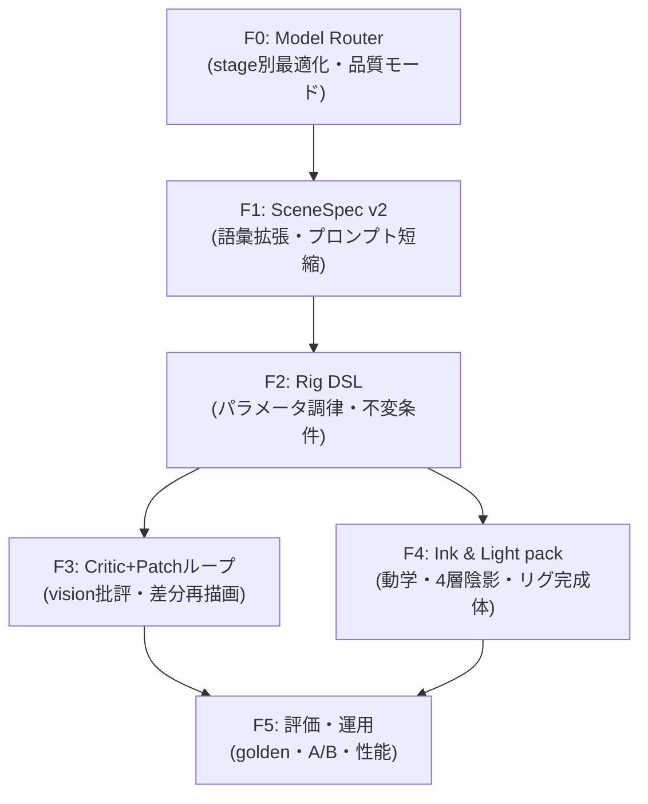

# AI Stroke Painter 描画クオリティ格段向上 実装プラン V5 — Flagship LLM Architecture

- 作成日: 2026-09-14
- 対象: `libs/ui/aiillustration` 全体 + `libs/ui/tests`
- 前提: V1〜V4 実装済。V4 Deliberate Stroke (D0/D1) は `KisAiDeliberateStroke` として実装・配線済み (`KisAiStrokeRenderer.cpp` の `adaptiveSupersampleScale` / `orderOperationsForRendering` / `lintStroke` / `stabilizeStroke` 呼び出し確認済)
- 本書の位置づけ: **「最新フラッグシップLLM (GPT-5系 / Gemini 3系 / Claude 4.5系クラス — 厳密 Structured Outputs・高精度ビジョン・長文脈・high reasoning) を前提に、LLMとの協調ロジックを根子から作り直す」** 実装プラン

---

## 0. エグゼクティブサマリー

### 現状の到達点 (コード実態ベース)

| 領域 | 実装済 | 残る天井 |
| :--- | :--- | :--- |
| 権限分離 | V3で「LLMは意味のみ (`KisAiSceneSpec`)、座標は `KisAiLayoutEngine`」を確立 | LLMが触れる語彙がSceneSpecの静的enumに留まり、表現の幅がリグ実装の数だけしかない |
| ストローク衛生 | V4 D0/D1: 安定化・Lint・順序・適応SS・エンベロープ統一 | 実行基盤としては十分。今後は「入力プログラムの質」が律速になる |
| 改善ループ | Goal Mode が vision 画像 + `previousCritique` + `accumulatedProgram` で動作 | 改善が「プログラム全文の再生成」主経路。良い部分を壊す・暴走する・トークンを食う |
| 批評 | `KisAiCritiqueRegion` + `readinessScore` + `agentCritique` | テキスト批評止まり。vision を「添付」に使っているだけで「検査装置」にしていない |
| 画材・光 | V5セクションのユーティリティ (色トレス・SSS・リム・コーナーインク) が `KisAiStrokeQualityUtils` に蓄積 | Layout経路への適用ポリシーが未統一で、効くプロンプトと効かないプロンプトがある |

### V5の大転換 — 哲学の更新

> **V3の哲学「LLMに座標を書かせない」を、V5では「LLMに語彙とハンドルを与え、検査のループを回す」に進化させる。**
>
> フラッグシップLLMなら4つの役割を正確にこなせる:
> (a) **意味と意図** (SceneSpec v2)、(b) **リグパラメータの調律** (Rig DSL)、
> (c) **画像を見た構造批評** (Vision Critic)、(d) **適用可能な修正パッチ** (Patch Refiner)。
> ジオメトリの生成と品質保証はコード (Rig DSL + Deliberate Stroke) が独占し続ける。

フラッグシップ前提で変える判断:

1. **防御的プロンプトの解体**: 現行 `buildSystemPrompt` は「座標を書くな・壊れるな」の防御規則で肥大化。スキーマ+正規few-shotが制約を担うので、システムプロンプトは「演出意図の伝達」に特化して短縮する。規則はコード (検証) に移す。
2. **ループが当たり前になる**: かつてはトークン高的に1発生成だったが、Specは数百トークン、パッチはさらに小さい。N-best生成・複数周批評が標準構成になる。
3. **visionを検査装置にする**: 全体1枚送るだけでなく、クロップ拡大 (顔・目・髪境目) を併送して構造化批評させる。確認できた欠陥だけをパッチに変換する。
4. **コード側フロアの不変**: LLMが停止・レート制限・変な出力をしても、`defaultSpecForPrompt` + 決定論レンダラで必ず「丁寧な線の絵」が出る設計は崩さない。

### 新パイプライン概念図

```
【現行】 Prompt → (SceneSpec or ops v2) → Layout/refine → renderOperationsToImage → 完了
         Goal Mode: 全体画像を添付 → プログラム全文を再生成 → merge

【V5】   Prompt
         →① Director: SceneSpec v2 (意味のみ・拡張スキーマ)         [flagship text]
         →② N-best: 3案生成 → 決定論スコアラで選抜                  [flagship text ×3]
         →③ LayoutEngine v2: Rig DSL (パラメータ → 正規幾何)         [code, 決定的]
         →④ Deliberate Stroke 描画 (V4エンジン強化版)                [code]
         →⑤ Vision Critic: 全体+クロップ拡大 → 構造批評+パッチ提案    [flagship vision]
         →⑥ Patch Refiner: パッチ検証 → 該当リグのみ局所再描画        [code + LLM]
            ↺ ⑤⑥ を最大3周 (トークン予算・PSNR最小改善で打ち切り)
         →⑦ Finish: 4層陰影・Bloom/Grade・grain → コミット           [code]
```

---

## 1. 破壊と継承 — 何を捨て、何を残すか

| 領域 | V3/V4まで | V5で捨てる / 置き換える | V5で残す (不変の真理) |
| :--- | :--- | :--- | :--- |
| LLM出力形式 | ops座標直書き (v2) と SceneSpec の二系統 | **v2座標直書きパスはレガシーfallbackに降格**。新規は全て Spec + リグパラメータ | ジオメトリ所有権はコード (LLMは座標を永远に書かない) |
| Goal Mode改善 | step≥2 でプログラム全文再生成 → merge | **RFC 6902風パッチ適用に置換**。全文再生成は初回stepのみ | `buildGeometryDigest` / `mergePrograms` / `refineForRendering` の衛生関門 |
| 批評 | テキスト批評 + `readinessScore` | **vision-first 構造批評 (crop-zoom)** に主役交代 | `KisAiCritiqueRegion` 構造を拡張して継承 |
| 描画実行 | Deliberate Stroke (V4) | そのまま実行基盤に据え置き | 決定性 (seed固定)・逐次Lint・プレビュー/キャンバス同一経路 |
| 光・色 | `KisAiLightRig` 単一真実源 (core+cast 2層) | **4層化 + 時間帯LUT** へ強化 | 全影色は rig 派生のみ。対比色は `mood` 明示時の例外のみ |

---

## 2. 核となる新ロジック (R1〜R8)

### 2.1 R1: SceneSpec v2 — 語彙の拡張 (`KisAiSceneSpec` + Codec)

フラッグシップLLMは「enumを埋めるだけ」では能力の1割も使っていない。**座標を禁じたまま語彙だけを大幅に増やす**。

新規フィールド (すべて意味のみ・zero座標・後方互換パース):

```cpp
struct KisAiSceneStyleV2 {
    QString artStyleId;      // anime_cel, watercolor, impasto, ink_sketch, cyber_neon, fine_line
    QStringList customTags;  // LLMの自由表現 (検証付きホワイトリスト照合)
    QString lineWeight;      // delicate, standard, bold
    qreal detailLevel;       // [0,1] — Layoutのパーツ粒度予算に変換
};
struct KisAiSceneCameraV2 {
    QString focal;           // short, normal, long (上下顔比の収まりに反映)
    QString tilt;            // level, high_angle, low_angle
};
struct KisAiSceneColorScriptV2 {
    QColor shadow, midtone, highlight;  // 3点カラースクリプト (LightRig検証つき)
    qreal accentWeight;                  // アクセント色の面積比意図 [0,1]
};
struct KisAiSceneNarrativeV2 {           // 背景の「物語」
    QString time, weather;   // 派生: LightRig timeOfDay + BackdropRig
    QStringList props;       // BackdropRigスロットに解決
};
```

- `KisAiSceneSpecCodec::sceneSpecJsonSchema()` を v2 に拡張。旧Spec JSONはそのまま読める (欠落は既定値)。
- `customTags` は未知語でも落とさず、`KisAiPromptAnalyzer::analyze` のキーワード辞書と突合して解釈できた分だけ反映 (意図反映スコアに寄与)。
- **システムプロンプト短縮**: `buildSystemPrompt` から座標教育・防御規則を撤去し、v2語彙の「意味の辞書」+正規few-shot 1例に再構成する (目標: トークン -40%)。

### 2.2 R2: Rig DSL — パラメータで絵を調律する (`KisAiRigLibrary` 新設)

V3のリグ (HeadRig/EyePair/HairMass) を「パラメータを持つ関数族」に格上げする。**LLMが触れるのはリグパラメータのみ**。JSON Schema strict (または tool call) で受ける。

```cpp
// 新規 KisAiRigLibrary.{h,cpp} — spec + RigParameterSet → ops の純関数群
struct KisAiEyeRigParams {
    qreal aperture;          // 0=closed .. 1=wide
    qreal lashOuterThickness, lashTaper;
    qreal irisRatio;         // 対目高さ比
    QString highlightShape;  // twin_dot, streak, soft
    bool doubleLid;
    QString gaze;            // front, left, right, up (瞳孔オフセットへ解決)
};
struct KisAiHairRigParams {
    QString flowPreset;      // 頭頂→毛先ベクトル場のプリセット
    qreal strandDensity, flyawayAmount, highlightBandCount;
};
// BrowRig / NoseRig / MouthRig / ClothRig / BackdropRig も同様
```

- **不変条件はコードが保証**: 両目対称 (間隔=頭幅0.38±facing補正)、頭郭内包、鼻口眉の三角形比、髪束の流向統一。パラメータが範囲外でも安全側へクランプ (v2の `refine` 思想をリグ入力に前倒し)。
- `KisAiLayoutEngine::generateProgram` は `spec → RigParameterSet (LLM調律分をマージ) → ops` の純関数に再構成。
- `applyLineartHierarchy` / V5 utils (色トレス・SSS・リム・コーナーインク) の適用を**policy flagsで統一**し、「効く絵と効かない絵」のムラを消す。

### 2.3 R3: Patch-based refinement — 全文再生成の廃止 (`KisAiProgramPatch` 新設)

Goal Mode step≥2 と批評ラウンドの改善指示は、**プログラム全文ではなくパッチ**で返させる。V5のロジック刷新の目玉。

```cpp
// 新規 KisAiProgramPatch.{h,cpp}
struct KisAiProgramPatch {
    enum class Op { Replace, Add, Remove };
    Op op;
    QString path;    // "/rig/eye_l/aperture", "/rig/hair/highlightBandCount", "/ops/<id>" (装飾限定)
    QJsonValue value;
};
class KisAiProgramPatchCodec {
public:
    static QJsonObject buildPatchRequestPayload(...);   // 現状画像 + 批評 + 現リグ状態を渡す
    static bool parsePatches(const QByteArray &body, QVector<KisAiProgramPatch> *out, QString *err);
    static KisAiStrokeProgram applyPatches(              // ホワイトリスト検証つき適用
        const KisAiStrokeProgram &base, const QVector<KisAiProgramPatch> &patches,
        QStringList *rejected, QString *err);
};
```

- **ホワイトリスト**: rig パス全許可、`/ops` への Add は装飾プリミティブ (FX・ハイライト・particles等) に限定。線画・Flatsの構造変更は不可 (暴走の閉じ込め)。
- 適用後は `refineForRendering` で再検証し、**差分 op のみ再描画**して既存レイヤーを差し替え (Kritaコマンドなので Undo 可能)。
- 効果: 良い部分を保持 / トークン約1/10 / 変更箇所が明示的になり批評と直結。

### 2.4 R4: Vision Critic engine (`KisAiVisionCritic` 新設)

vision を「検査装置」として設計し直す。

- **入力**: 全体キャンバス (768px, 既存 `captureImageBase64`) + **自動選抜クロップ最大4枚**。選抜は決定論: 顔bbox・エッジ密度上位域・前回批評 `priority>=4` の region を crop-zoom 送信。
- **出力**: `KisAiCritiqueRegion` を拡張 (`suggestionPatches: QVector<KisAiProgramPatch>`, `evidenceCropId` を追加) + `readinessScore`。
- **プロンプトは画家のチェックリスト固定**: 対称性 / はみ出し / 粒子汚染 / 光源一致 (`KisAiLightRig` の方向と突合可能な形で回答させる) / 線質 / パーツ欠落。自由文は `issue` に集約。ハルシネーション対策として「存在しない修正は提案しない」契約 + パッチはコード検証で二重防御。
- **局所再描画**: region → 対応リグの dirtyRect のみ再レンダリングしマスク合成。全体再生成を禁止。
- **打ち切り条件**: 最大3周。`QImage` PSNR改善 < 1.5dB で収束判定。トークン予算上限で強制停止。

### 2.5 R5: N-best self-consistency — Spec選抜

- SceneSpec を temperature 0.65 / 0.8 / 1.0 の3案生成 (Specは小トークンなのでコスト実質ゼロ)。
- **決定論スコアラ** (新規 `scoreSceneSpec`): パレット調和 (HSL距離) / リグ実行可能性 (クランプ発生数=違反ペナルティ) / negative違反0 / プロンプト一致 (`checkIntentAdherence` 流用) → 最大を選抜。
- 選抜根拠は `logDebug` テレメトリに残し、後の閾値調整に使う。

### 2.6 R6: Model Router — 段階ごとの最適モデル (`KisAiModelRouter` 新設)

既存の `supportsJsonSchema` / `isReasoningModel` / `isVisionModel` を束ね、**stage → (model, temperature, reasoning_effort, vision_detail)** の能力テーブル化。

| Stage | 既定 (Qualityモード) | 温度 | 備考 |
| :--- | :--- | :--- | :--- |
| Prompt expansion | flagship text | 0.8 | 既存 `buildPromptExpansionPayload` 流用 |
| SceneSpec v2 | flagship text (structured) | 0.7 | N-best 3案 |
| Patch提案 | flagship text+vision (structured) | 0.3 | 低温度で安定パッチ |
| Vision Critic | flagship vision, effort high | 0.2 | crop-zoom 併用 |

- Docker設定に**品質モード**を追加: `Fast` (中級モデル×critic 1周) / `Quality` (flagship×critic 2周) / `Max` (flagship×critic 3周+N-best 5)。既存のモデル入力・Vision画質コンボは router の初期値に反映。
- フォールバック連鎖は既存資産を再利用: json_schema → json_object (`supportsJsonFormat`) → `repairJsonSyntax` / `repairTruncatedJson` → 最悪時 `defaultSpecForPrompt` で完結。

### 2.7 R7: Ink & Light quality pack — 描画の床を一段引き上げる

V4 D2〜D4 の継続 + V5 utils の全面統合。「どのプロンプトでも床が保たれる」を仕上げる。

| # | 施策 | 内容 | 対象 |
| :--- | :--- | :--- | :--- |
| R7-1 | インク動学 | サンプル間隔→α/幅 (遅=溜まり+15%幅、速=かすれ-20%α) + 紙grain 2% + 水彩曲率連動縁。すべてseed固定の決定的 | DeliberateStroke + QualityUtils |
| R7-2 | 英雄線ネイティブパス | 顔輪郭・睫毛・前髪線のみ `KisPainter` 実打鍵 (`brushPresetName` の gpen→Pencil-2 等を流用)。プレビューとキャンバスを同一経路化 | StrokeRenderer |
| R7-3 | LightRig 4層化 | core (hue-shift硬) + form (blur6柔) + AO (接触部・乗算) + rim (Screen) + 床bounce。`synthesizeShading` 拡張 | LightRig |
| R7-4 | 時間帯LUT | day/sunset/night の key/fill/SSS/空グラデの色スクリプトを rig から一括派生。夜なのに昼色を根絶 | LightRig + LayoutEngine |
| R7-5 | EyeRig v3 完全体 | aperture/二重/睫毛単一テーパー/虹彩グラデ/視線オフセット/両目同一ハイライト。`drawAnimeEyeOperation` をリグ駆動に置換 | RigLibrary + Renderer |
| R7-6 | 鼻・口・眉リグ | NoseRig (点+短影・ベタ黒禁止Lint) / MouthRig (smile_open等6種+唇厚) / BrowRig (M字連動) | RigLibrary |
| R7-7 | 髪フロー + 3帯ハイライト | 頭頂→毛先ベクトル場で束角統一 + 主光/副光/逆光の3連リボン + 毛先透け | RigLibrary |
| R7-8 | BackdropRig | 空 (3stops+雲2層) / 遠景 (空気遠近) / 中景 (街灯ぼけ等) / 前景 (前ボケ) の4スロット。顔矩形重複禁止ソルバ維持 | RigLibrary |
| R7-9 | 仕上げ層の実装 | `🎨 AI: Bloom FX` + `🎨 AI: Grade` を実キャンバスに非破壊追加。プレビュー/キャンバス PSNR ゲートで一致保証 | StrokeRenderer + Docker |

### 2.8 R8: Evaluation & operations — 数値で証明する

- **ゴールデン18プロンプト**: Spec JSON + プレビューPNG + KPI を `libs/ui/tests/golden/` に固定。KPI: 顔粒子0 / 目対称誤差≤頭幅0.02 / 光源一致≥95% / 意図反映≥0.90 / PSNR閾値。
- **CI**: `ctest -L AIStroke` 全件PASS。ゴールデン差分は目視レビュー必須。
- **テレメトリ** (秘密情報除外厳守): Spec採用率・パッチ拒否率・critic周回数・PSNR改善量を `logDebug` 集計。
- **性能ガード**: `QElapsedTimer` で Quality モード 1024px < 15s を上限化。超過時は critic 1周・クロップ2枚・背景1xSS へ自動縮退 (V4 D5-5 の縮退ラダー継承)。

---

## 3. 変更ファイル一覧

| ファイル | 変更内容 | Phase |
| :--- | :--- | :--- |
| `KisAiRigLibrary.{h,cpp}` (新規) | 全パーツのリグ+パラメータ・不変条件・ops生成の純関数群 | F2 |
| `KisAiProgramPatch.{h,cpp}` (新規) | パッチ構造・Codec・ホワイトリスト適用・差分再描画接続 | F3 |
| `KisAiVisionCritic.{h,cpp}` (新規) | クロップ選抜・批評ペイロード・region拡張・局所再描画の指揮 | F3 |
| `KisAiModelRouter.{h,cpp}` (新規) | stage→モデル/温度/effort テーブル・品質モード・フォールバック連鎖 | F0 |
| `KisAiSceneSpec.h/.cpp` + Codec | v2フィールド追加・schema拡張・旧Spec互換パース | F1 |
| `KisAiStrokeProgram.h/.cpp` (Codec) | `buildSystemPrompt` 短縮再構成・patch payload・CritiqueRegion拡張・`refineForRendering` は検証関門として維持 | F1/F3 |
| `KisAiLayoutEngine.h/.cpp` | `generateProgram` を RigParameterSet 経由の純関数化。既存rig実装は RigLibrary へ移設 | F2 |
| `KisAiLightRig.h/.cpp` | 4層陰影・時間帯LUT・カラースクリプト検証 | F4 |
| `KisAiStrokeRenderer.h/.cpp` | インク動学・英雄線KisPainterパス・差分レイヤー再描画・Bloom/Grade実層 | F3/F4 |
| `KisAiDeliberateStroke.h/.cpp` | インク動学の受口 (stabilize後の速度連動)。既存ロジック尊重・上積み | F4 |
| `KisAiIllustrationDocker.{h,cpp}` | 品質モードUI・critic進捗表示・差分適用のUndo連携・A/B (v4パス維持) | F3/F5 |
| `libs/ui/tests/*` | 本文記載の `test*` 全網羅 + golden 18件 + CI ラベル | F0〜F5 |

後方互換: v2座標JSON・旧SceneSpec・V4パスは全て残し、切替OFFなら今日と同じ画が出る (Docker hidden + 環境変数のA/B継承)。

---

## 4. ロードマップと着手順序



| 順序 | 内容 | 期待効果 | 目安 |
| :--- | :--- | :--- | :--- |
| Step 1 | F0 + F1 | 語彙が広がり表現の天井が即上がる。トークン -40% | 2〜3日 |
| Step 2 | F2 (核) | LLMの調律が全パーツに効く。パラメータ外でも壊れない | 4〜5日 |
| Step 3 | F3 (核) | 「描いて→見て→直す」ループの完成。全文再生成の暴走根絶 | 4〜5日 |
| Step 4 | F4 | 筆致・陰影・光の厚み。床の質が一段上げ | 4〜5日 (F3と並行可) |
| Step 5 | F5 | 回帰なしに積める。効きを数値で証明 | 並行2〜3日 |

MVP: **F0 + F1 + F2のHead/Eye/Hairのみ**でも「LLMがリグを調律する」新体験は成立。F3でループ、F4で床を固める。

---

## 5. やらないこと・リスク管理

- **やらないこと**: 拡散モデル (SD/Flux等) への全面依存はしない (編集可能レイヤー・Undo・軽量オフラインの強みを保持)。手の本格描画は隔離継続 (袖隠し構図)。v2座標パスの削除はしない (fallbackとして凍結)。
- **LLM依存の単一点障害対策**: 通信断・レート制限・不良出力時は `defaultSpecForPrompt` + 決定論レンダラで必ず完結する。flagship前提でも**コード側フロア保証は最後まで崩さない**。
- **プライバシー**: vision送信は既存のユーザー設定・秘密情報不ログ規約 (V1 §7) を全Phaseで継承。クロップ画像も同一経路で管理。
- **Kritaコア無影響**: `AI_STROKE_PAINTER_APP` ガード・SPDX・i18n を継承。差分は `libs/ui/aiillustration` + tests に限定。
- **暴走パッチ**: ホワイトリスト外パスは即拒否してテレメトリ化。パッチ連鎖による品質劣化は PSNR ゲートで検知しロールバック。
- **テスト先行**: 各Phaseの `test*` が赤のまま次に進まない。

---

## 6. 受け入れ基準 (Definition of Done)

1. 同一プロンプトで、Vision Critic が検出した欠陥がパッチで修正され、**修正前後の画像差分が該当regionに限定**されることを目視+dirtyRectログで確認。
2. `ctest -L AIStroke` 全件PASS + ゴールデン18件のKPIゲートPASS + プレビュー/キャンバスPSNRゲートPASS。
3. Goal Mode 4〜6 step 通しで、step2以降が**パッチ適用のみ**で進行し全文再生成が発生しないこと。
4. 品質モード Fast/Quality/Max の3モードが動作し、Maxが最も良い絵になること (目視+KPI)。
5. 通信断シミュレーションでオフライン決定論パスが完走し、V4相当以上の画が出ること。
6. 差分が `libs/ui/aiillustration` + tests に限定され、Kritaコア無影響・秘密漏洩なし。

---

## 付録: 既存計画との対応

| 本書 | V1〜V3対応 | V4対応 |
| :--- | :--- | :--- |
| R1 | SceneSpec (V3 Phase 1) の語彙拡張 | D5-1 stroke_hints を rig params に昇格 |
| R2 | HeadRig/EyePair/LayoutEngine の DSL 化 | D3-1〜D3-4 のパラメータ化 |
| R3 | Goal Mode・mergePrograms の改善経路刷新 | D5-2 領域リトライの実装形 |
| R4 | critiqueRegions・vision の検査装置化 | D1 群批評の LLM 拡張版 |
| R5/R6 | capability判定関数群の統合運用 | D5-4 A/B の router 化 |
| R7 | LightRig 4層 (V3 Phase 2 発展)・V5 utils の統合 | D2/D3/D4 の完成形 |
| R8 | golden・KPI・テレメトリ (V1 C1/C3, V2 §5) | D5-3/D5-5 の継承拡張 |
