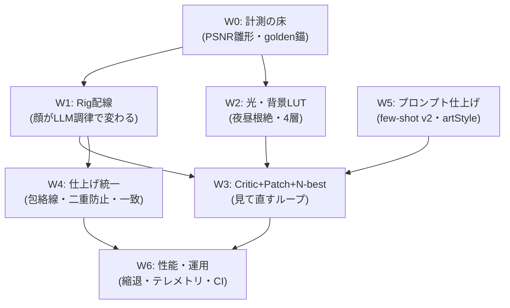

# AI Stroke Painter 描画クオリティ改善計画 V6 — Wiring & Payoff (配線完成で効かせる)

- 作成日: 2026-09-15
- 対象: `libs/ui/aiillustration` + `libs/ui/tests` + Docker配線のみ
- 前提: V1〜V5実装済。V5エンジン群は「部品としては完成、絵には効いていない」のが現状
- 本書の位置づけ: **新規エンジンを足さず、既存V5資産の配線を完成させて描画クオリティの床を上げる**ための実装プラン。スローガンは「作るな、繋げ」

---

## 0. エグゼクティブサマリー

### 現状の真実 (コード実態ベース・2026-09-15調査)

| 機能 | 部品の実装 | 絵への配線 | 判定 |
| :--- | :--- | :--- | :--- |
| Rig DSL (`KisAiRigLibrary`: `eyePairOps`/`doubleLidOps`/`browOps`/`noseOps`/`mouthOps`/`hairHighlightOps`) | 済 (`KisAiRigLibrary.cpp:266-506`、テスト済) | **キャラ系は未配線**。`characterProgram` (`KisAiLayoutEngine.cpp:761-983`) は目・眉・鼻・口を手書き生成し、`parametersFromSpec` を呼ばない。Rigが効くのは landscape の山/水/桜+`backdropWeatherOps` のみ (`KisAiLayoutEngine.cpp:1022-1050`) | **最大の不発弾**。LLMがrig値を調律してもキャラの顔が変わらない |
| SceneSpec v2語彙 (`style`/`camera`/`color_script`/`narrative`/`rig`) | Schema+パース済 (`KisAiSceneSpec.cpp:59-261`, `:420-502`) | Layoutがほぼ無視。`style.detailLevel`、`camera.focal/tilt`、`colorScript`、`narrative.props` (キャラ系) が `characterProgram`/`backgroundForSpec` で参照されない | LLMが覚えた語彙が絵に出ない＝意図反映率の天井 |
| LightRig 4層 (`timeOfDayLut`/`synthesizeFormShading`/`synthesizeBounceLight`) | 済 (`KisAiLightRig.h:73-106`、`KisAiLightRig.cpp:359-469`、テスト済) | 未配線。`characterProgram:978` と `landscapeProgram:1057` は旧 `synthesizeShading` のみ呼ぶ | 陰影の厚み・夜昼LUTが絵に出ない |
| 背景LUT | `timeOfDayLut.skyTop/Mid/Bottom` あり | `backgroundForSpec` (`KisAiLayoutEngine.cpp:480-512`) はハードコード色。LUTを使わない | 「夜なのに昼色」の残存原因の1つ |
| N-best選抜 (`scoreSceneSpec`/`selectBestSpec`) | 済 (`KisAiSceneSpec.cpp:802-848`) | Docker未使用。`generateLlmStrokes` (`KisAiIllustrationDocker.cpp:1626-1655`) は単発payload、`finishLlmStrokesRequest` (`:1887`) は単発 `parseResponse` | 3案生成・選抜が動いていない |
| Vision Critic + Patch (`KisAiVisionCritic`/`KisAiProgramPatchCodec`) | 済 (payload/parse/crop/PSNR収束まで実装+テスト) | Docker未使用。Dockerのincludeは `KisAiLayoutEngine.h` + `KisAiModelRouter.h` のみ (`KisAiIllustrationDocker.cpp:13-14`)。Goal系 (`executeGoalStep`/`finishGoalStepRequest` `:2756-3170`) は全文再生成+`mergePrograms` のまま | 「描いて→見て→直す」ループがUIで回っていない |
| Model Router品質モード | UIあり (`KisAiIllustrationDocker.cpp:823-834` Fast/Quality/Max + `:3749-3757` 永続化) + `planFor`/`specCandidateCount`/`critiqueRoundBudget` 実装済 | リクエスト組み立てが未接続。温度/topP/maxTokensはスピン直読み (`:1543-1546`)、`specCandidateCount`/`critiqueRoundBudget` の参照なし | モード切替が画質に効いていない |
| Deliberate包絡線統一 (`buildEnvelopePolygon` → `generateStrokeEnvelope`) | 済 (`KisAiDeliberateStroke.cpp:638-659` + `KisAiStrokeQualityUtils.cpp:488-`) | `drawPathOperation` (`KisAiStrokeRenderer.cpp:1378-1414`) は独自 `leftEdge/rightEdge` 法線方式のまま | 鋭角の棘・bowtie対策が細線以外に効いていない |
| `assignBrushPresetHints` / `applyLineartHierarchy` | 済+テスト | `assignBrushPresetHints` の実呼び出しなし。`applyLineartHierarchy` はキャラ系のみ (`KisAiLayoutEngine.cpp:981`)、landscape/v2直書き系は対象外 | 将来のKisPainter英雄線パス (`brushPresetName` 対応) の前提が寝たまま。線の階層にムラ |
| 二重装飾 | Layoutがチーク/SSS/睫毛影/リム由来を生成 (`:827-944`) | Renderer `expandProceduralOperations` (`KisAiStrokeRenderer.cpp:222-249`) がSSS fringe/corner dots/rim/blushを**無条件で追加** | 濃すぎ・くどさ・重複の原因。冪等ガードなし |
| 仕上げ一致 | Bloom/Grade/Vignette/Grain実層あり (`KisAiStrokeRenderer.cpp:810-941`) | 生成条件が `stepPhase==finishing || goalReached&&最終step` のみ。単発LLMストロークで付くか・プレビューと一致するか要ロック | プレビュー=キャンバス乖離リスク (V1 A2bの残件) |

### V6の哲学

> **新しい絵の具を買うな。絵の具とキャンバスを繋ぐホースを直せ。**
> V5で作った Rig / Light 4層 / Critic+Patch / N-best / Router は全部「倉庫にある」。V6は倉庫から画室へ運ぶ作業に全振りする。新規シェーダ・新規リグ形状は作らない (例外は配線に必須の薄い接着剤のみ)。

期待効果: 同一プロンプトで **顔の対称・睫毛/二重/視線の反映・髪ハイライト帯・時間帯色・陰影の厚みが一段上がり、Goal系の暴走 (全文再生成で良い部分を壊す) が消える**。トークンも Spec N-best+Patch化で減る。

---

## 1. 目標とKPI (V5 R8の継承・V6で初めて測れる化)

- 顔粒子0 (既存negative維持 + ゴールデンで回帰)
- 目対称誤差 ≤ 頭幅0.02 (`eyePairSymmetryWarnings` ゼロをゴールデン18件で担保)
- 光源一致 ≥ 95% (全Shading/Highlight色が `KisAiLightRig` 導出であることを単体テストで主張)
- 意図反映: `checkIntentAdherence` / `scoreSceneSpec.intentMatch` ≥ 0.90 をゴールデンで計測 (v2語彙が効き始めるので初めて上がる)
- プレビュー/キャンバス PSNRゲート PASS (`KisAiVisionCritic::psnr` をテストに流用。閾値は現行差分を測ってから固定。暫定 ≥ 35dB)
- Patch適用のregion限定性: dirtyRect外の画素差分がゼロであることをログ+目視で確認 (V5 DoD#1の継承)
- 性能: Qualityモード 1024px < 15s、Fast < 8s目安。超過時は §5 の縮退ラダー (V4 D5-5/V5 R8継承)

---

## 2. 作業分解 (W0〜W6)

### W0: 計測の床 (0.5〜1日・最初にやる)

**なぜ最初か**: 配線前後の「効き」を数値で証明できないと、後のW1〜W4が目視論争になる。

1. `KisAiVisionCritic::psnr` をテストに流用し、`renderProgramToImage` vs `renderProgramToLayers` 由来画像の parity テスト雛形を追加 (閾値は仮置き→実測で固定)。
2. ゴールデン18プロンプトの運用を固定 (`libs/ui/tests/golden/` にSpec JSON+プレビューPNG+KPI)。V5 R8の残件。最初は現行出力のスナップショットでよい (回帰の錨)。
3. テレメトリ項目の予約: Spec採用率・パッチ拒否率・critic周回数・PSNR改善量を `logDebug` カテゴリ名だけ先に固定 (実装はW3)。
- 対象: `KisAiVisionCritic` (流用)、`libs/ui/tests/*`、Docker `logDebug` カテゴリ
- テスト: `testPreviewCanvasParityPsnr` (雛形・閾値TODO明示)、`testGoldenSnapshotExists`
- 受け入れ: 現行の乖離量が数値で出ること (PASSしなくてよい。値を読むことが目的)

### W1: Rig配線 — キャラ系をRigLibrary駆動に (核・3〜4日・最大効果)

**現状**: `characterProgram` が目・眉・鼻・口・髪ハイライトを独自生成。`spec.rig`/`spec.style`/`spec.camera` が捨てられている。

1. **唯一入口化**: `characterProgram` の先頭で `KisAiRigLibrary::parametersFromSpec(spec)` を1回だけ作り、以降の顔生成はその `params` から派生させる。`spec.composition.headCenter/headHeight` → `params` への正規化 (`headWidth = headHeight*0.78` 等) を `parametersFromSpec` に寄せ、Layout側の二重計算を消す。
2. **顔パーツ置換** (振る舞い保存・段階置換):
   - 目: 手書き `AnimeEye` 2個+睫毛影ループ (`:809-847`) → `eyePairOps(params)` + `doubleLidOps(params)` に委譲。`eyeScaleX` のfacing補正は `eyeAnchors` 側に寄せるか、移行期は `params` 生成後にfacing係数を掛ける薄いアダプタに隔離。`gazeShift`/`eyeExpression` の対応表は `parametersFromSpec` 既存表 (`KisAiRigLibrary.cpp:186-217`) に統一し、Layout側の重複表 (`:793-807`) を削除。
   - 眉: 手書き3点アーチ (`:849-863`) → `browOps(params)`。`hasBrows=false` なら出さない (現行は常に出る)。
   - 鼻: bridge HL+shadow+tip HL (`:865-877`) → `noseOps(params)`。ベタ黒禁止Lint契約を維持。
   - 口: smile_open分岐+lip gloss+lower shadow (`:879-915`) → `mouthOps(params)`。`mouthWidthScale/highlight` が初めて効く。
   - 髪HL: 天使の輪相当の単発ハロー依存 → `hairHighlightOps(params)` (0〜3帯) に置換。`strandDensity` が帯幅に効く (`bandScale` 式を流用)。
3. **v2語彙の反映** (薄く・確実に):
   - `detailLevel [0,1]` → パーツ粒度予算: 例 `flyaway数`、`tearTrough`/`eyelidShade` 等の副次装飾のon/off、`hairHighlightBands` の既定値補正。式は1箇所 (`parametersFromSpec` 後段 or Layout先頭の `detailBudget` 関数) に集約し、各所に散らさない。
   - `camera.focal (short/normal/long)` → 頭身・目サイズの微係数 (例 short=目+4%・顔-2% 等。小さく)。`tilt (high/low)` → `headCenter.y` 微シフト + 目Y微シフト。範囲はクランプ (`clamped` 準拠)。
   - `colorScript (shadow/midtone/highlight/accentWeight)` → 有効時のみ `LightRig` 導出色を上書きブレンド。無効 (透明) なら現行動作。`mood` 明示時のみ対比色例外 (V5の約束を維持)。
   - `narrative.time/weather/props` → キャラ系背景にも `backdropWeatherOps(params)` を追加 (現行はlandscapeのみ)。顔矩形ガードはRig側実装を流用。`narrative.time` → `narrativeTimeToTimeOfDay` で `timeOfDay` に解決し、`spec.light.timeOfDay` 未指定時のfallbackに使う。
4. **後方互換**: 旧Spec (v2ブロック欠落) は既定値で旧画と一致すること。ゴールデン差分の目視レビュー必須。
- 対象: `KisAiRigLibrary` (facing係数アダプタ・detailBudgetのみ追加)、`KisAiLayoutEngine::characterProgram`、`KisAiSceneSpec` (参照のみ)
- テスト: `testCharacterUsesRigEyePair` (左右対称・`eyeAperture/irisRatio/highlight` 変更が両目に鏡像反映)、`testRigBrowsNoseMouthWired`、`testDetailLevelScalesOrnaments`、`testCameraFocalTiltShiftsHead`、`testColorScriptBlend`、`testCharacterBackdropWeatherFaceGuard`
- 受け入れ: 同一プロンプトで `eye_aperture/iris_ratio/hair_highlight_bands` を変えると絵が変わること (今は変わらない)。旧Specで旧画と一致すること。

### W2: 光・色・背景の単一真実源化 (2〜3日・W1と並行可)

1. **4層接続**: `characterProgram` 末尾と `landscapeProgram` 末尾で、`synthesizeShading` に加え `synthesizeFormShading` + `synthesizeBounceLight` を追加。順序: core → form → AO/chin (既存) → bounce → rim。`flatsOnly` 収集は既存流用 (`:968-973`、` :1052-1056`)。
2. **LUT統一**: `backgroundForSpec` のハードコード空色 (`:480-512`) を `timeOfDayLut(spec.light.timeOfDay).skyTop/Mid/Bottom` 駆動に置換。`meadowColor` (`:1038`)・`ridgeColor` (`:536`) 等の直書き分岐もLUT+`colorScript` に寄せる。`fromSpec` が `narrative.time` を見るよう薄く拡張 (W1の解決を再利用)。
3. **色直書きの駆逐**: `darkerWarm(skin,…)` 直打ち (`:592,602,608,612…`) を `KisAiLightRig::shadowColor/highlightColor` + `calculateHueShiftedShadow/Highlight` 経由に段階置換。まず頬・首影・睫毛影等の大面積から。`keyTintFor/fillTintFor` が唯一入口。
4. **policy flags統一** (V5 R2の残件): `applyLineartHierarchy` + 色トレス (`calculateHarmonicLineColor`) + SSS (`generateSkinSssFringe`) + リム (`generateRimLightStrokes`) + コーナーインク (`generateCornerInkingDots`) の適用条件を1箇所のポリシー表に集約し、「効く絵と効かない絵のムラ」を消す。`refineForRendering` は検証関門のまま (暗黙適用しない約束を維持)。
- 対象: `KisAiLayoutEngine`、`KisAiLightRig` (薄い拡張のみ)、`KisAiStrokeQualityUtils` (ポリシー表)
- テスト: `testFourLayerShadingPresent` の拡張 (form+bounce存在主張をキャラ/風景両系に)、`testBackgroundUsesLut` (day/sunset/nightで空stopsがLUT一致)、`testAllShadingDerivesFromRig` (Shading層色がrig導出色集合に含まれる)
- 受け入れ: night指定で昼色が出ないこと。form/bounce追加前後でPSNRが適度に変化し、顔粒子が増えないこと。

### W3: Critic+Patch+N-best+RouterのDocker配線 (核・4〜5日)

**現状**: 部品はあるがUIから呼ばれない。Goal系は全文再生成のまま。

1. **N-best (R5) 配線**: `generateLlmStrokes` のSceneSpec分岐で、品質モードに応じた案数 (`ModelRouter::specCandidateCount`: Fast1/Quality3/Max5) を `buildSceneSpecPayload` で並列POST → `parseSceneSpec` 複数 → `selectBestSpec` で選抜。選抜根拠を `logDebug` に残す。単発失敗時は `defaultSpecForPrompt` にフォールバック (既存の床保証)。
2. **Router接続**: 温度/topP/maxTokens/reasoningEffort/visionDetail をスピン直読みから `ModelRouter::planFor(stage, preferredModel)` 解決に切替。各stage (`SceneSpec`/`VisionCritique`/`PatchProposal`/`GoalStep`) の温度 (Spec 0.7 / Patch 0.3 / Critic 0.2) と `structuredStrategy` (json_schema→json_object→none) のフォールバック連鎖を `modelFallbackChain` に一本化。`qualityModeCombo` が初めて効く。
3. **Criticループ (R4) 配線**: 単発生成後に `renderProgramToImage` → `VisionCritic::selectCrops (顔box+エッジ高密度+前回priority≥4、最大4)` → `buildCritiquePayload` (全体+クロップ) → `parseCritiqueResponse` → `extractSuggestedPatches` → `ProgramPatchCodec::applyPatches` (ホワイトリスト検証) → 差分opのみ再描画 → `hasConverged (PSNR改善<1.5dB)` or 最大3周 (Qualityモードの `critiqueRoundBudget` に従う)。`KisAiCritiqueRegion {area,issue,action,priority}` + `suggestionPatches/evidenceCropId` 拡張を維持。
4. **Goal系のPatch化 (R3)**: step≥2 を全文再生成→`buildPatchRequestPayload`→`parsePatches`→`applyPatches`→該当リグのみ局所再描画に置換。初回stepのみ全文。`mergePrograms` は初回合成に残す。UndoはKritaコマンド (`renderProgramToLayers` の差し替え経路) で保全。
5. **UI**: critic進捗 (周回/PSNR改善/reject理由) をGoal Inspector + Debugログに表示。通信断・レート制限・不良出力時はオフライン決定論パスで完走 (V5の床保証を崩さない)。
- 対象: `KisAiIllustrationDocker` (配線の主戦場)、`KisAiProgramPatch`/`KisAiVisionCritic`/`KisAiModelRouter`/`KisAiSceneSpecCodec` (薄い接着剤のみ)
- テスト: `testNBestSelectsBest` (3案→最高スコア)、`testPatchWhitelistRejectsStructural` (Flats/Lineart構造変更は拒否)、`testCriticLoopConverges` (PSNRゲートで打ち切り)、`testGoalStep2UsesPatchOnly` (全文再生成が発生しない)、`testOfflineFallbackPaints` (通信断で決定論完走)
- 受け入れ: V5 DoD#1〜#5 (region限定差分・patch-only step2以降・Fast/Quality/Maxの階段・オフライン完走)。

### W4: ストローク仕上げの統一 (2〜3日・W1〜W3と並行可)

1. **包絡線一本化** (V4 D0の残件): `drawPathOperation` の独自 `leftEdge/rightEdge` (1378-1414) を `KisAiDeliberateStroke::buildEnvelopePolygon` (`generateStrokeEnvelope` bowtie対策済) に置換。`tLen>0.0001` ガード・マイタ制限を共通化。始端=丸キャップ・終端=テーパー尖端の分離 (丸潰れ解消) をプロファイル別に。
2. **二重装飾ガード**: `expandProceduralOperations` のSSS/corner/rim/blush追加前に「Layout済みならskip」の冪等条件 (同種id存在・同領域カバレッジ) を追加。ポリシーはW2の表に合流。
3. **階層・ヒントの全パス化**: `assignBrushPresetHints` を `generateProgram`/`refineForRendering` 出口 (どちらか1箇所) に接続。`applyLineartHierarchy` をlandscape/v2系にも適用 (px絶対指定は尊重の約束を維持)。
4. **仕上げ一致**: プレビューと実キャンバスの finishing (Bloom/Grade/Vignette/Grain) 条件を一致させ、PSNRゲート (W0) でロック。`trappingPx` の二重適用防止 (`activeProgram.canvasSize` 正規化の注意書きを維持) も回帰テスト化。
- 対象: `KisAiStrokeRenderer`、`KisAiDeliberateStroke`、`KisAiStrokeQualityUtils`
- テスト: `testEnvelopeNoBowtieOnSharpCorner`、`testTaperedTipVsRoundStart`、`testNoDoubleBlushOrSss`、`testPresetHintsAssigned`、`testPreviewCanvasParityAfterWiring` (W0の本番化)
- 受け入れ: 鋭角の棘・先端丸潰れの目視解消。単発/Goalどちらの経路でもプレビュー≒キャンバス。

### W5: プロンプト・スキーマの仕上げ (1日・W3の前段でも可)

1. `canonicalSpecExample` にv2例 (style/camera/rig) を追加。今はv3キーのみなのでLLMが新語彙を使わない。
2. `buildSceneSpecPayload` の `Q_UNUSED(artStyle)` を解消し、Docker `artStyleCombo` をSpecに反映 (style上書き or systemText付記)。現行は無視される。
3. v2座標直書き (`buildSystemPrompt` 系) は**凍結**し、手を付けない (V5の「レガシーfallback降格」方針通り)。工数をSpec系に集中。
- 対象: `KisAiSceneSpec` のみ
- テスト: `testCanonicalExampleMentionsV2`、`testArtStyleReachesSpec`
- 受け入れ: 同一プロンプトでv2語彙の出現率が上がり、`scoreSceneSpec` が選抜に効くこと。

### W6: 性能・運用 (並行1〜2日)

1. **縮退ラダー**: `QElapsedTimer` でQuality 1024px < 15sを上限化。超過時は critic1周・クロップ2枚・背景1xSS・ぼかし半径半減へ自動縮退 (V4 D5-5継承)。`adaptiveSupersampleScale` の3xは顔系のみ・4096px上限を維持し、レイヤーバケット毎の3x working確保 (6回分のメモリ) を `renderProgramToImage` 側の単一working化 or 逐次解放で緩和。
2. **テレメトリ**: Spec採用率・パッチ拒否率・critic周回数・PSNR改善量を `logDebug` 集計 (秘密情報除外厳守・V1 §7継承)。
3. **CI**: `ctest -L AIStroke` 全件PASS + ゴールデンKPIゲート。差分目視レビュー必須。
- 対象: Docker + Renderer + tests
- テスト: `testPerfBudget1024` (時間は環境依存のため上限ゆるめ+縮退発火の主張)、ゴールデンKPIゲート
- 受け入れ: 重い絵でも固まらず、縮退ログが残ること。

---

## 3. 変更ファイル一覧

| ファイル | 変更内容 | Phase |
| :--- | :--- | :--- |
| `KisAiLayoutEngine.{h,cpp}` | `characterProgram` のRig委譲・detail/camera/colorScript/narrative反映・4層接続・LUT背景 | W1/W2 |
| `KisAiRigLibrary.{h,cpp}` | facingアダプタ・detailBudget等の薄い追加のみ。既存rig本体は尊重 | W1 |
| `KisAiLightRig.{h,cpp}` | `fromSpec` のnarrative解決・LUT参照の薄い拡張のみ | W2 |
| `KisAiStrokeQualityUtils.{h,cpp}` | ポリシー表集約・冪等ガード | W2/W4 |
| `KisAiIllustrationDocker.{h,cpp}` | N-best・Router・Critic+Patchループ・Goal patch化・進捗UI・テレメトリ・縮退 | W3/W6 |
| `KisAiStrokeProgram.{h,cpp}` | `refineForRendering` は検証関門として維持。presetHints接続点のみ | W4 |
| `KisAiStrokeRenderer.{h,cpp}` | 包絡線一本化・二重装飾ガード・仕上げ一致・性能緩和 | W4/W6 |
| `KisAiSceneSpec.{h,cpp}` | 正規few-shot v2化・artStyle反映 | W5 |
| `KisAiProgramPatch`/`KisAiVisionCritic`/`KisAiModelRouter` | 接着剤のみ。新規契約なし | W3 |
| `KisAiDeliberateStroke.{h,cpp}` | 包絡線受口の維持・上積みのみ | W4 |
| `libs/ui/tests/*` + `golden/` | 本文の `test*` + golden 18件 + PSNRゲート | W0〜W6 |

後方互換: v2座標JSON・旧SceneSpec・V4描画パスは残す。切替OFFなら今日と同じ画 (Docker hidden + 環境変数A/B継承・V5 §3表の約束を維持)。差分は `libs/ui/aiillustration` + testsに限定し、Kritaコア無影響・`AI_STROKE_PAINTER_APP` ガード・SPDX・i18n・秘密情報不ログを継承。

---

## 4. ロードマップと着手順序

| 順序 | 内容 | 期待効果 | 目安 |
| :--- | :--- | :--- | :--- |
| Step 1 | W0 | 効きを数値で語れる。後の目視論争を消す | 0.5〜1日 |
| Step 2 | W1+W2 (並行) | 顔・髪・光・背景の床が一段上がる。LLM調律が初めて絵に効く | 3〜5日 |
| Step 3 | W5→W3 (核) | 全文再生成の暴走根絶。「描いて→見て→直す」完成 | 4〜5日 |
| Step 4 | W4 (並行可) | 棘・丸潰れ・くどさ・ preview乖離の解消 | 2〜3日 |
| Step 5 | W6 | 回帰なしに積める。重い絵でも固まらない | 並行1〜2日 |

MVP: **W0 + W1の目・眉・鼻・口委譲まで**で「rigを変えると顔が変わる」新体験が成立。W2で光、W3でループ、W4で線の順に積む。

---

## 5. やらないこと・リスク管理

- **やらないこと**: 拡散モデル依存・手の本格リグ・v2座標パスの削除・`KisPainter` 英雄線の全面切替 (presetHint接続までの準備に留める)・新規画風リグの造形追加。V5 §5の隔離方針を継承。
- **LLM単一点障害対策**: 通信断・レート制限・不良出力時は `defaultSpecForPrompt` + 決定論レンダラで必ず完結。flagship前提でもコード側フロアは崩さない。
- **暴走パッチ**: ホワイトリスト外は即拒否+テレメトリ。PSNR劣化はロールバック (V5 §5継承)。
- **二重適用**: W2/W4のポリシー表に集約し、Layout済み装飾へのRenderer重ね掛けを禁止。条件分岐の散在を増やさない。
- **性能**: 顔3xの代償は縮退ラダーで吸収。計測なしに重くしない。3x workingの多重確保を見直す。
- **テスト先行**: 各Wの `test*` が赤のまま次に進まない。ゴールデン差分は目視レビュー必須。
- **Kritaコア無影響・プライバシー**: `AI_STROKE_PAINTER_APP` ガード・SPDX・i18n・秘密情報不ログ (V1 §7) を全Wで継承。vision送信は既存のユーザー設定経路のみ。

---

## 6. 受け入れ基準 (Definition of Done)

1. rig値 (`eye_aperture/iris_ratio/hair_highlight_bands` 等) を変えるとキャラの顔・髪が変わり、旧Specでは旧画と一致すること (W1)。
2. night指定で昼色が出ず、form+bounce適用前後で厚みが増し顔粒子が増えないこと (W2)。
3. Vision Criticの欠陥がパッチで修正され、差分が該当regionに限定されること。step2以降がpatch-onlyで全文再生成が起きないこと (W3・V5 DoD継承)。
4. Fast/Quality/Maxで階段差が出て、オフライン決定論パスがV5相当以上で完走すること (W3)。
5. 鋭角の棘・先端丸潰れが消え、プレビュー≒キャンバス (PSNRゲート) であること (W4)。
6. `ctest -L AIStroke` 全件PASS + ゴールデンKPIゲートPASS + 差分が `libs/ui/aiillustration` + testsに限定・秘密漏洩なし (W0/W6)。

---

## 付録: 既存計画との対応

| 本書 | V4対応 | V5対応 |
| :--- | :--- | :--- |
| W1 | D3-1〜D3-4 (瞳v2・鼻口眉・髪フロー) の配線完成 | R1語彙・R2 Rig DSLの絵への接続 |
| W2 | D4-1〜D4-3 (4層・時間帯・背景) の接続完成 | R7-3/R7-4 + R2ポリシー統一 |
| W3 | D5-2領域リトライ・D1群批評のLLM拡張版 | R3/R4/R5/R6のDocker配線完成 |
| W4 | D0包絡線統一・D2筆画材の残件 | R7-1/R7-2/R7-9の仕上げ一致 |
| W5 | D5-1 stroke_hintsのrig昇格の仕上げ | R1 few-shot・プロンプト短縮の残件整理 |
| W0/W6 | D5-3/D5-5 golden・A/B・性能 | R8 golden・テレメトリ・縮退の完成 |
