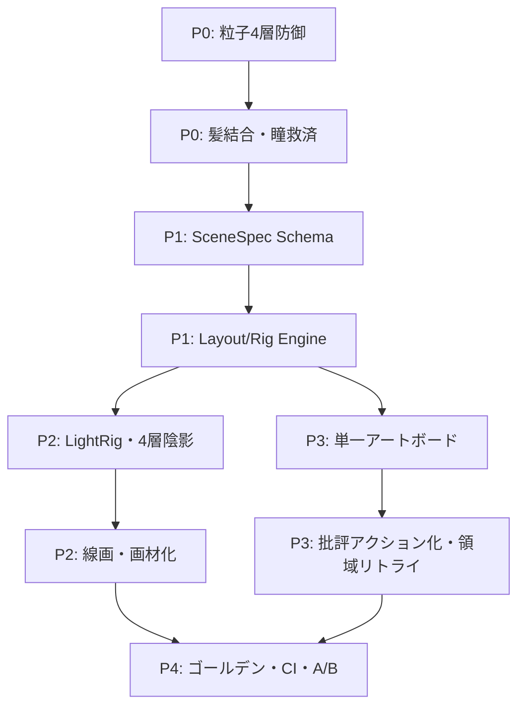

# AI Stroke Painter イラスト品質の格段向上 — 改善およびロジック刷新計画案 (V3)

- 作成日: 2026-09-12
- 対象: `libs/ui/aiillustration` 全体 (StrokeProgram / StrokeRenderer / PromptAnalyzer / QualityUtils / Docker / Tests)
- 前提: `plans/AI_QUALITY_IMPROVEMENT_PLAN.md` (V1: Phase 1〜4 実装済) および `plans/AI_QUALITY_IMPROVEMENT_PLAN_V2.md` (V2: 点々根絶・瞳プリミティブ等、一部実装済) の上位計画として策定
- 本書の位置づけ: **小手先の補正ではなく、ロジックそのものの刷新で品質の天井を上げる**ための計画案。V1/V2 の残件回収 + アーキテクチャ刷新 + レンダラー刷新を一本化する

---

## 0. エグゼクティブサマリー

現行方式の核心は「LLM が正規化座標 `[x, y]` の羅列を直接出力し、QPainter がそれをなぞる」ことにある。
この方式はプロトタイプとしては優秀だが、画質の天井が低い。理由は単純で、**テキスト推論の LLM に人間の手の運動制御 (美しいカーブ・左右対称・毛束の流れ・瞳の構造) を期待している**からである。
V1 でプロンプト階層化・トラッピング・Bloom 等の改善が入り、V2 で `AnimeEye`・顔面除外マスク・チーク補正が部分的 (~50%) に入ったが、以下は未解決のまま残っている:

| 残存する天井 | 現状 |
| :--- | :--- |
| LLM が髪・顔輪郭の座標を直接書く | `hair_strand` 等はあるが、依然として LLM 出力座標への依存度が高い。毛束リボン合成・髪シルエット結合は未実装 |
| 色・光源が操作ごとにバラバラ | `calculateHueShiftedShadow` はあるが、光源ベクトルの一元管理がなく、陰影色が衝突する |
| Goal Mode が加算マージで濁る | `mergePrograms` による蓄積方式のまま。単一アートボード化・差分洗練は未着手 |
| パーティクル多重蓄積 | `particles` の厳格抑制ルール・蓄積上限・UI トグルは未実装 (V2 §1.1 の大半が残件) |
| 塗りが QPainter ベタ塗り | Krita ブラシエンジン未接続。質感・混色・筆致がない |
| 構図が 1 発生成 | CompositionPlan はあるが、構図→幾何の 2 段階生成が形骸化しがち |

本計画 (V3) の刷新スローガンは一つ:

> **LLM は「手」ではなく「監督 (Art Director)」に。手の仕事は決定論的ペインター (Procedural Painter) に。**

すなわち、LLM には座標を書かせず、**「何を・どこに・どんな色と光で・どんな表情で」だけを決めさせ**、座標と描画はコード側の正規幾何エンジンが黄金比・左右対称・光源一貫性の保証付きで生成する。
これにより、LLM の気まぐれに左右されず、**どのプロンプトでも最低品質 (フロア) がプロ水準になる**。

---

## 1. 現状診断 — なぜ今のままでは「格段に」は上がらないのか

### 1.1 根本原因の整理 (コード実態ベース)

```
【品質の天井を決めている5つの構造要因】

1. 座標直書き依存 (最大の天井)
   - KisAiStrokeProgramCodec::buildSystemPrompt が数百行の巨大規則で
     LLM に直接座標出力を要求。LLM は 0.01 刻みの微小座標の整合
     (左右対称・滑らかな毛流れ) をテキスト推論では維持できない。
   - Few-shot 規範幾何 (V2 §3.1) は未実装。抽象ルールのみで具体例なし。

2. 意味と幾何の混在
   - `hair`, `eye`, `skin` 等の意味 (セマンティクス) と、
     実際の多角形座標が同一レイヤー (Kind::Fill / Path) に混在。
   - 結果、「髪」と書いてあるのに中身は泡状の円群、という乖離が
     ランタイムでしか検出できない。

3. 光と色の分散管理
   - Shading / Highlights の色が操作ごとに LLM の思いつきで決まる。
   - 光源方向・暖寒・時間帯 (昼/夜) の単一真実源 (Single Source of Truth) がない。
   - 夜なのに昼色背景、影が真っ黒、ハイライトが白飛び、が起きる。

4. 加算型 Goal Mode
   - Step ごとに mergePrograms で操作を足すだけ。前ステップのゴミ
     (点々・はみ出し・重複) が消えずに蓄積し、Step 6 で濁りのピークに。
   - Vision 批評 (agentCritique) は文章のみで、どの領域をどう直すかの
     機械可読な指示 (領域 + アクション) になっていない。

5. フラットなラスタライズ
   - 全て QPainter の fill / path。Krita のブラシ (筆圧・テクスチャ・
     混色・水彩縁) が未使用。Bloom / Vignette 等のポストプロセスは
     プレビュー寄りで、質感の根本解決になっていない。
```

### 1.2 V2 の実装済 / 未実装の切り分け (2026-09-12 時点で確認)

| V2 施策 | 状態 | 備考 |
| :--- | :--- | :--- |
| `AnimeEye` プリミティブ | ✅ 実装済 | `Kind::AnimeEye` + `drawAnimeEyeOperation` あり。Few-shot 例示と Smart Eye Enhancer (旧形式の自動補正) は残件 |
| 顔面除外マスク | ✅ 部分実装 | `faceExclusionPath` が FX レイヤーに適用済。肌 Flats 全体からのマスク生成・髪主要部への拡張は残件 |
| チーク補正 | ✅ 実装済 | `isBlush` 検出 + ラジアルウォッシュ化あり |
| パーティクル抑制 (プロンプト厳格化・蓄積遮断・孤立点除去・UI トグル) | ❌ 未実装 | プロンプト文は緩いまま (`ONLY use when...` 程度)。Goal Mode 蓄積遮断・UI トグルなし |
| 髪シルエット結合・束感リボン化 | ❌ 未実装 | `hair_strand` 検出のみ。`united()` 結合・テーパー束生成なし |
| 単一アートボード化 | ❌ 未実装 | `mergePrograms` 蓄積のまま |
| 規範幾何 Few-shot | ❌ 未実装 | 辞書・テンプレート注入なし |
| Krita ブラシ化 | ❌ 未着手 | 設計のみ |

→ **V3 は V2 残件を回収しつつ、さらに一歩進んで「LLM に座標を書かせない」側へ倒す。**

---

## 2. 刷新の核心 — 5つの設計転換

| # | 転換 | Before | After |
| :--- | :--- | :--- | :--- |
| T1 | **生成責任の分離** | LLM = 画家 (座標を描く) | LLM = 監督 (SceneSpec を決める)。画家 = 決定論的 Layout/Paint エンジン |
| T2 | **意味プリミティブ化** | 汎用 `Fill/Path` に意味を後付け (`id` 判定) | 意味が型になる (`EyePair`, `HairMass`, `HeadRig` 等)。レンダラーが正規幾何を生成 |
| T3 | **光・色の一元管理** | 操作ごとに色指定 | `LightRig + Palette` が単一真実源。全陰影・照返しはここから導出のみ |
| T4 | **加算 → 差分洗練** | Step ごとに足す | 単一アートボードを上書き洗練。Vision 批評は領域別アクション化 |
| T5 | **ベタ塗り → 画材化** | QPainter ベタ | セル影2段 + AO + リム + ブラシ質感 + 仕上げグレーディングの多層画作り |

```
【新パイプライン概念図】

  User Prompt
      │
      ▼
 ┌────────────┐   SceneSpec (JSON, 座標なし)    ┌──────────────────┐
 │ Art Director│ ─────────────────────────────▶ │  Layout Engine   │
 │ (LLM)       │  主題/構図/ポーズ/表情/配色/光源  │  (決定論的 C++)  │
 └────────────┘                                └────────┬─────────┘
      ▲                                                 │ StrokeProgram v3
      │ Critique (領域別アクション)                      ▼ (正規幾何・保証付き)
 ┌────────────┐                                ┌──────────────────┐
 │ Vision     │◀────────────────────────────── │  Paint Engine    │
 │ Critic     │   プレビュー画像                │  (Krita画材化)   │
 └────────────┘                                └────────┬─────────┘
                                                       ▼
                                                単一アートボード
                                                (Flats/Shading/Lineart/
                                                 Highlights/FX + Bloom)
```

---

## 3. 具体施策 — フェーズ別

### Phase 0: V2 残件の即時回収 (1〜2日・即効)

V3 の土台として、V2 で設計済み・未実装の即効施策を先に閉じる。単独でも点々ノイズと顔崩壊が大幅に減る。

#### 0.1 パーティクル4層防御の完成 (V2 §1.1 の完全実施)
1. **プロンプト厳格化**: `buildSystemPrompt` / Goal フェーズ指示の FX 節を「明示要求 (星空・雪・花びら・魔法等) がない限り `particles` 出力禁止。顔面・主体への配置は無条件禁止」に書き換え。`Highlights_FX` の予算配分を面ハイライト中心に再定義。
2. **蓄積遮断**: Goal Mode で既存 `accumulatedProgram` 内に `Particles` があれば後続ステップの同種操作を自動ドロップ (ログに記録)。
3. **孤立点除去**: `refineForRendering()` に「1点パス・長さ < 0.005 の2点パス・面積極小ポリゴンのドロップ」を追加。
4. **UI トグル**: Docker 詳細設定に「FX パーティクルを抑制 (既定ON)」チェックボックス。OFF 時のみ `particles` を許可。
- 対象: `KisAiStrokeProgram.cpp` (refine・prompt), `KisAiStrokeRenderer.cpp` (除外マスク拡張), `KisAiIllustrationDocker.{h,cpp}` (UI・蓄積遮断)
- テスト: `testParticleSuppressionDefault`, `testParticleAccumulationBlock`, `testIsolatedPointDrop`, `testFaceExclusionBlocksParticles`

#### 0.2 髪シルエット結合 + 束感リボン化 (V2 §1.3 の完全実施)
1. `expandProceduralOperations` に Hair パスを追加: `Flats` 内の `hair` 系ポリゴンの近接・重複群を `QPainterPath::united()` で結合し、単一の滑らかなベースシルエット化 (微小孤立円は吸収または除去)。
2. 結合シルエットの頭頂→毛先ベクトルからテーパー束 (Ribbon Clumps) を自動派生。浮遊ハローのクランプ (頭部 bounding box の外側 N% を超えたら切断)。
3. 旧形式 (円群) のまま来た場合も同処理で救済するため、LLM 側の出力形式変更は不要 (後方互換)。
- 対象: `KisAiStrokeRenderer.cpp`, `KisAiStrokeQualityUtils.cpp`
- テスト: `testHairMeshUnion`, `testHairRibbonDerivation`, `testHaloClamp`

#### 0.3 Smart Eye Enhancer (旧形式瞳の自動救済)
1. `id` に `eye/iris/pupil` を含む旧形式 `Fill/Path` を検出 → 位置・サイズ・虹彩色を推定 → `AnimeEye` 正規組立 (白目・虹彩グラデ・瞳孔・アイライン・まつ毛・キャッチライト) に置換または重畳補正。
2. 両目の対称性チェック: 中心線からの距離・サイズ差が閾値を超えたら警告 + 自動整列オプション。
- 対象: `KisAiStrokeRenderer.cpp`, `KisAiStrokeQualityUtils.cpp`
- テスト: `testSmartEyeEnhancer`, `testEyeSymmetryLint`

---

### Phase 1: ロジック刷新の核 — SceneSpec + Layout Engine (3〜5日・効果最大)

**狙い: LLM に座標を書かせない。LLM の出力は意味だけにし、座標はコードが保証する。**

#### 1.1 SceneSpec の導入 (LLM 出力の意味層化)
- 新 JSON `SceneSpec` を定義。座標フィールドなし。例:
```json
{
  "subject": { "type": "character", "pose_id": "three_quarter_bust", "facing": "front-right" },
  "head": { "expression": "smile_open", "gaze": "front", "hair_style": "long_hime", "hair_color": "#2b3a67", "eye_color": "#3b82f6" },
  "composition": { "framing": "bust_up", "head_center": [0.5, 0.38], "head_height": 0.42, "depth": "shallow" },
  "palette": { "mood": "night_festival", "key": "#2b3a67", "accents": ["#ff9fb2", "#ffd166"] },
  "light": { "direction": [-0.5, -0.7], "warmth": "warm_key_cool_fill", "time": "night" },
  "background": { "type": "night_sky_town", "elements": ["moon", "town_lights"], "forbid": ["tree", "stars_over_face"] },
  "negative": { "no_particles_on_face": true, "no_text": true, "no_extra_limbs": true }
}
```
- `strokeProgramJsonSchema()` と並ぶ `sceneSpecJsonSchema()` を新設し、Structured Outputs (`json_schema`) で厳格化。座標の自由記述欄をそもそも持たせない。
- 既存 v2 プログラムは当面併存。Docker に「生成モード: v3 SceneSpec (既定) / v2 互換」切替を用意し、段階移行。
- 対象: `KisAiStrokeProgram.{h,cpp}` (schema・parse・payload), `KisAiPromptAnalyzer` (Spec 検証)
- テスト: `testSceneSpecSchemaStrict`, `testSceneSpecNoCoordinates`, `testSceneSpecNegativeEnforced`

#### 1.2 Canonical Rig / Layout Engine (決定論的幾何生成)
- **HeadRig (アニメ頭部黄金比)**: 頭部中心・頭部高さの2パラメータから、顎ライン・頬・前髪M字・サイドヘア・目ペア位置・鼻・口・チーク位置を左右対称に生成。LLM は `head_center/head_height/expression` だけ決める。
- **EyePair Rig**: 既存 `AnimeEye` を `EyePair` 単位に格上げ。両目の間隔・傾き・視線方向をリグで一括制御し、単眼指定を禁止。
- **HairMass Synthesizer**: `hair_style` ID (例: `long_hime/bob/twin_tails/short_messy`) ごとの束テンプレート (束数・分岐角・毛先カール) を持ち、頭部リグに追従してリボン束を生成。LLM は髪型 ID と色だけ決める。
- **Body/Background Layout**: `framing` (bust_up/upper_body/full_body) と `depth` (3層: 前景・中景・遠景 + 空気遠近係数) から配置矩形を演算。背景要素は矩形スロットにのみ配置し、顔矩形との重なりを禁止 (レイアウト制約ソルバ)。
- 対象: 新規 `KisAiLayoutEngine.{h,cpp}` + `KisAiCanonicalRigs.{h,cpp}`、Renderer はその出力を `StrokeProgram v3` として受け取る
- テスト: `testHeadRigSymmetry`, `testEyePairAlignment`, `testHairFollowsHead`, `testFaceSlotExclusion`, `testFramingVariants` (bust/full の代表値)

#### 1.3 Few-Shot 規範幾何辞書 (V2 §3.1 の完成形を Spec 側で実現)
- 座標の Few-shot ではなく、**Spec 値の Few-shot**にする («美しい» の具体例を Spec で示す)。例: 目間隔 = 頭幅の 0.28、頭頂→顎の比率、前髪分岐パターン等を 3〜5 例で提示。
- LLM は数値を微調整するだけで済むため、幾何破綻が原理的に起きない。
- 対象: `KisAiPromptAnalyzer.cpp` (Character ドメイン時に辞書注入)
- テスト: ゴールデンプロンプトでの Spec 分布スナップショット

---

### Phase 2: 画作り刷新 — LightRig / Paint Engine (3〜5日・質感の跳躍)

#### 2.1 LightRig + Palette の一元管理 (T3)
1. SceneSpec の `light + palette` を唯一の真実源に。`Shading/Highlights` の全色は `calculateHueShiftedShadow/Highlight` からの導出のみ許可し、LLM の個別色指定は `accents` 経由に制限。
2. 光源ベクトルを全陰影ポリゴンのオフセット・グラデ方向・リムライト位置に伝播。時間帯 (`time`) と連動 (夜 = 青寒フィル + 暖色キー)。
3. 意図的対比色 (サイバーパンク等) は `mood` で明示された場合のみ例外。
- 対象: `KisAiStrokeQualityUtils`, `KisAiStrokeRenderer`, 新規 `KisAiLightRig`
- テスト: `testLightRigConsistency` (全陰影が同一光源に従う), `testNightPaletteCoherence`

#### 2.2 陰影の4層自動合成 (セル影2段 + AO + リム)
- Flats シルエットから以下を自動派生し、LLM の Shading 出力を **「ヒント」扱い**に格下げ (採用 or 正規影で置換を選択可能に):
  1. コア影 (1段目・硬) + フォーム影 (2段目・柔・ぼかし)
  2. AO (顎下・髪下・衣擦れの接触影)
  3. リムライト (光源逆側の縁光)
- 既存 `applyTrapping` と連動し、白抜けゼロを維持。
- 対象: `KisAiStrokeRenderer`, `KisAiStrokeQualityUtils`
- テスト: `testFourLayerShadingPresent`, `testShadowHueShifted` (真っ黒影の禁止), `testTrappingKept`

#### 2.3 線画エンジン刷新 (太さヒエラルキー + 先細り)
1. 外周線 (太) → 内構造線 (中) → ディテール (細) の3階層に線幅を正規化。LLM の `size` 指定はヒント化。
2. 毛束・まつ毛・輪郭は先細り (Taper) 必須化。Catmull-Rom 後に Chaikin 平滑化を追加し、針金状の折れを除去。
3. Flats からの微小はみ出しは自動クリップ (顔・髪境界)。
- 対象: `KisAiStrokeRenderer::drawPathOperation/drawRibbonOperation`
- テスト: `testLineHierarchy`, `testTaperPresent`, `testLineClippedToFlats`

#### 2.4 Krita 画材化 (ブラシ・質感)
1. `brush.profile` → Krita プリセット (`Pencil-2/Basic-5/Chalk/Airbrush` 等) のマッピングを Renderer のネイティブラスタライズパス (`KisPainter` 打鍵) として実装。まず Shading 柔影・チーク・髪柔影から適用し、段階的に拡大。
2. 水彩縁・紙 grain・キャンバステクスチャの微量付与 (強度は UI スライダー化)。
3. グラデバンディング対策の微小ディザ (V1 C4) を統合。
- 対象: `KisAiStrokeRenderer`, Docker (質感スライダー)
- テスト: `testBrushPresetMapping`, `testGrainStrengthBounded`

#### 2.5 仕上げグレーディングの実キャンバス化
- V1 B4 の Bloom 非破壊レイヤーを継承し、さらに Color Grading (暖寒バランス・彩度カーブ相当の LUT 的補正) を `🎨 AI: Grade` レイヤーとして追加。プレビューと実キャンバスの一致を PSNR テストで保証。
- 対象: `KisAiStrokeRenderer`
- テスト: `testPreviewCanvasParity`

---

### Phase 3: Goal Mode 刷新 — 差分洗練ループ (2〜3日・濁りの根絶)

#### 3.1 単一アートボード化 (V2 §2.1 の完全実施)
1. Step ごとのレイヤーグループ乱立 (`🎨 AI [Step n/m]`) を廃止。単一親 `🎨 AI Illustration` + 固定6子 (`Background/Flats/Shading/Lineart/Highlights/FX`) のみ。
2. 各 Step は **全置換 or 領域差分更新**。前 Step のゴミは持ち越さない (クリーンアップパス必須)。
3. 最終 Step のみ Bloom/Grade を付与。
- 対象: `KisAiStrokeRenderer::renderProgramToLayers`, `KisAiIllustrationDocker`
- テスト: `testGoalModeSingleArtboard` (グループ数=1、子=固定構成)

#### 3.2 Vision 批評の機械可読化 (領域別アクション)
- 批評プロンプトを「Anime Aesthetics Checklist + 領域タグ付き」化:
```text
Return JSON: { "regions": [ { "area": "left_eye|hair|face_noise|...", "issue": "...", "action": "repaint|soften|remove|keep", "priority": 1-5 } ], "readiness": 0.0-1.0 }
```
- 次 Step の Spec 差分 (`SpecDelta`) として還元。文章のまま投げない。
- `detail` は Step に応じて動的化 (序盤 low → 仕上げ high)。V1 A4 を継承。
- 対象: `KisAiStrokeProgram` (Goal payload・パーサ), Docker
- テスト: `testCritiqueActionParsed`, `testSpecDeltaApplied`

#### 3.3 領域別リトライ (顔だけ直す)
- 全体再生成ではなく、Critique の `priority` 上位領域のみ Layout Engine で再生成し、該当レイヤー局所を置換 (マスク付き)。
- パーティクル再蓄積の禁止と併せ、後半 Step でのノイズ増加を原理的に防ぐ。
- 対象: Docker + Layout Engine
- テスト: `testRegionRetryKeepsCleanAreas`

---

### Phase 4: 評価・基盤・運用 (並行・2日)

#### 4.1 ゴールデンセット + 自動ゲート
- 代表18プロンプト (キャラ/風景/夜/ cyber / けも/植物/マンガFX 各3) の Spec・プレビュー・スコアのスナップショットを `tests/golden/` に固定。CI (`ctest -L AIStroke`) で回帰検出。
- 新 KPI (フロア保証型):
  - 顔面パーティクル侵入: **0 件** (全ゴールデン)
  - 両目対称性誤差: 閾値以下 **100%**
  - 光源一貫性: **≥ 95%**
  - 意図要素反映率: **≥ 90%** (B7 Lint 継承)
  - 無関係モチーフ (未要求の木・星等): **< 2%**
  - プレビュー/キャンバス差分: PSNR 閾値以上
- 対象: `tests/`, CI ハーネス
- テスト: 上記 KPI のアサーション化

#### 4.2 プロンプト A/B 切替
- v2 / v3 生成モード + 旧/新システムプロンプトを環境変数・Docker hidden オプションで切替可能にし、目視 A/B を容易化。

#### 4.3 テレメトリ (秘密情報除外厳守)
- Spec 採用率・正規影置換率・領域リトライ率・ドロップ粒子数・スコア分布を `logDebug` 集計。API キー・URL のログ出力は厳禁 (V1 §7 継承)。

---

## 4. 新規・変更ファイル一覧 (実装タスク分解)

| ファイル | 変更内容 | Phase |
| :--- | :--- | :--- |
| `KisAiStrokeProgram.h/.cpp` | `sceneSpecJsonSchema()` 新設、Spec パース・検証、Goal payload の SpecDelta 対応、プロンプト FX 厳格化、孤立点除去、蓄積粒子遮断 | 0 / 1 / 3 |
| `KisAiLayoutEngine.h/.cpp` (新規) | SceneSpec → StrokeProgram v3 生成の決定論エンジン | 1 |
| `KisAiCanonicalRigs.h/.cpp` (新規) | HeadRig / EyePair / HairMass / Body・背景スロットの正規幾何テンプレ | 1 |
| `KisAiLightRig.h/.cpp` (新規、または QualityUtils 内) | 光源・パレットの一元管理、陰影色導出 | 2 |
| `KisAiStrokeRenderer.h/.cpp` | 髪結合・束化、Smart Eye 補正、4層陰影、線階層・Taper・Chaikin、ブラシ打鍵パス、単一アートボード、Grade レイヤー | 0 / 2 / 3 |
| `KisAiStrokeQualityUtils.h/.cpp` | 対称性・光源・顔侵入 Lint、スコア v2 拡張 (対称・光源項) | 0 / 2 / 4 |
| `KisAiPromptAnalyzer.cpp` | Spec Few-shot 辞書、FX 推奨の厳格化、ドメイン脱テンプレ維持 | 0 / 1 |
| `KisAiIllustrationDocker.{h,cpp}` | 生成モード切替、粒子抑制トグル、質感スライダー、単一アートボード運用、領域リトライ UI | 0 / 2 / 3 |
| `tests/*` | 各 Phase の単体・ゴールデンテスト (本文中の `test*` を網羅) | 0〜4 |

後方互換方針: v2 JSON 入力は Layout Engine 前段のマイグレータで Spec 近似に変換するか、従来 Renderer パスで描画 (Docker 切替)。既存ユーザーの旧プログラムが読めなくなることはない。

---

## 5. ロードマップと着手順序



| 順序 | 内容 | 期待効果 | 目安 |
| :--- | :--- | :--- | :--- |
| Step 1 | Phase 0 (V2 残件回収) | 点々消失・瞳と髪の救済。即効で「鬱陶しさ」が消える | 1〜2日 |
| Step 2 | Phase 1 (Spec + Rig) | 構図・顔・目の破綻が原理的に消える。フロアが跳ね上がる | 3〜5日 |
| Step 3 | Phase 2 (光・陰影・線・画材) | 「ベタ塗り感」が消え、厚み・透明感・筆致が出る | 3〜5日 |
| Step 4 | Phase 3 (Goal 刷新) | Step を重ねるほど美しくなる。濁りと無限ゴミの根絶 | 2〜3日 |
| Step 5 | Phase 4 (評価・運用) | 回帰なしに改善を積める。A/B で効きを証明 | 並行2日 |

最小実行単位 (MVP): Step 1 + Step 2 の `SceneSpec + HeadRig/EyePair` までで、キャラ絵の品質フロアは一段上がる。そこから Step 3 以降で質感を積む。

---

## 6. やらないこと・リスク管理

- **やらないこと**: 外部画像生成モデル (SD/Flux) への全面依存はしない。本プロジェクトの強み (Krita ネイティブの編集可能レイヤー・Undo・軽量オフライン動作) を捨てない。ハイブリッド (AI 下絵トレース) は中長期オプションに留める (V2 §4.2 継承)。
- **LLM への過度な期待をしない**: 美しさの源泉を LLM の気まぐれに置かず、コード側の保証に置く。プロンプト改善だけでは天井は抜けない、という前提を崩さない。
- **Krita コアへの影響遮断**: `AI_STROKE_PAINTER_APP` ガード・SPDX・i18n・秘密情報不ログの厳格ルール (V1 §7) を全 Phase で継承。
- **テスト先行**: 各 Phase の `test*` が赤のまま次 Phase に進まない。ゴールデン差分は目視レビュー必須。

---

## 7. 受け入れ基準 (Definition of Done)

1. 同一プロンプト (アニメ美少女・夜景) で、顔面への粒子侵入 0、両目対称、髪が泡状でないことを目視確認。
2. `ctest -L AIStroke` 全件 PASS + ゴールデン18件の KPI ゲート PASS。
3. Goal Mode 4〜6 Step 通しでレイヤー構成が単一アートボードに収まり、最終 Step が最も美しいこと。
4. プレビューと実キャンバスの見た目一致 (PSNR ゲート)。
5. 差分が `libs/ui/aiillustration` + tests に限定され、Krita コア無影響・秘密漏洩なし。

---

## 付録: 既存計画との対応表

| 本書 | V1 対応 | V2 対応 |
| :--- | :--- | :--- |
| Phase 0 | A5 (Lint)・B5 (score) の拡張利用 | §1.1・§1.3・§1.2残件の完成 |
| Phase 1 | A0 (prompt 階層)・B2 (2段階生成) の発展的置換 | §3 (Few-shot) を Spec 型で実現、§方針2 (高次プリミティブ) の正規化 |
| Phase 2 | B3 (色正規化)・B4 (Bloom)・C4 (dither) の統合発展、A2 (trapping) 継承 | §4.1 (ブラシ化) の着手 |
| Phase 3 | A3 (Goal 還元)・A4 (detail) の発展 | §2 (単一アートボード・批評精緻化) の完成 |
| Phase 4 | C1 (golden/CI)・C3 (telemetry) の継承 | §5 (検証) の KPI 化 |
