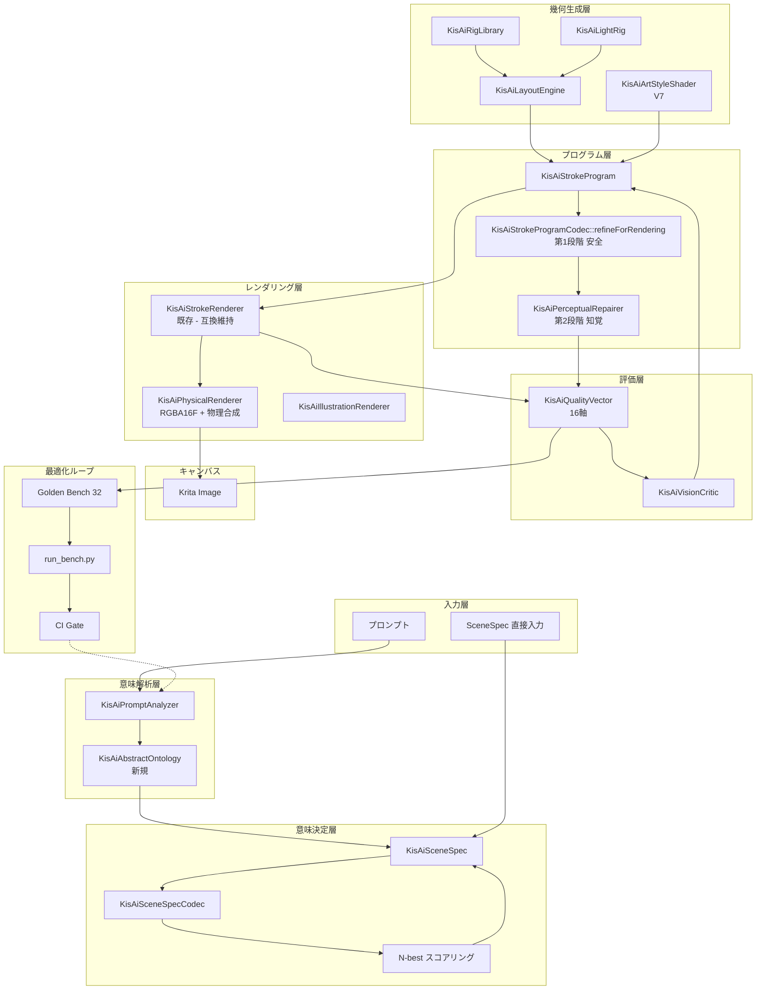
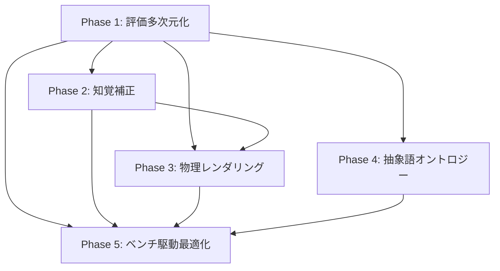

# AI Stroke Painter — ストローク描画クオリティ根本強化計画案 V8

- ステータス: **計画 (Phase 0 — 設計レビュー待ち)**
- 対象: `libs/ui/aiillustration/` の V3 (SceneSpec + LayoutEngine) / V5 (Vision Critic + Program Patch + LightRig) / V6 (Wiring + Model Router + RefinementLoop) / V7 (Art Style Shader) パイプライン全体
- 先行計画書: [`AI_QUALITY_IMPROVEMENT_PLAN.md`](plans/AI_QUALITY_IMPROVEMENT_PLAN.md:1) (Phase 1〜4 実装完了、67 サブテスト全件 PASS)

> **本計画の位置付け**:
> 既存計画書は「LLM が生成する StrokeProgram v2 の構造品質とラスタライズ結果の画質を一段引き上げる」ことに成功しました (2026-09-11 完了)。
> しかし `qualityScore()` ([`KisAiStrokeProgram.cpp:3575`](libs/ui/aiillustration/KisAiStrokeProgram.cpp:3575)) は 5 軸固定線形和の単一スカラー、`refineForRendering()` ([`KisAiStrokeProgram.cpp:3110`](libs/ui/aiillustration/KisAiStrokeProgram.cpp:3110)) は op 単位の 1 パス逐次処理、`renderProgramToImage()` ([`KisAiStrokeRenderer.cpp:288`](libs/ui/aiillustration/KisAiStrokeRenderer.cpp:288)) は sRGB 上の単純加算合成と、いずれも「局所補正 + 経験的閾値」の域を出ておらず、**知覚品質・幾何一貫性・色物理の本質的な限界**を抱えています。
> 本計画はこれらを **根本から強化** し、ストローク描画クオリティの天井を引き上げることを目的とします。

---

## 1. 目的

ストローク描画クオリティを「**経験的チューニングの延長**」から「**評価・補正・合成・意味抽出の 4 つの理論基盤の上に成り立つ設計**」へ転換する。

具体的には以下を達成する:

1. **評価系の多次元化**: 1 スカラーの qualityScore を廃止し、構造評価 8 軸 × 知覚メトリクス 5 軸の多次元空間に分解。テーマ別・ユーザー別の **動的重み** を持たせる。
2. **リファインメントの 2 段化**: 「幾何を破壊しない安全補正」と「ラスタライズ結果を見て幾何を書き換える知覚補正」を分離。後者を新規 [`KisAiPerceptualRepairer`] が担う。
3. **レンダラの物理化**: sRGB 線形 (浮動小数点) レンダリング + 遅延合成グラフ + 物理的ブレンドモデル (multiply / screen / overlay / soft_light) で、暗部バンディング・色相ドリフト・二重シャドウを根絶。
4. **抽象語の意味埋め込み**: 「jazzy」「melancholy」「ethereal」等の抽象語を SceneSpec フィールドへ自動変換する軽量オントロジーを [`KisAiPromptAnalyzer`] に追加。
5. **ベンチ駆動最適化ループ**: 改良効果をゴールデンセット (32 本) で **CI で自動計測** し、悪化をゲートする基盤を構築。

---

## 2. 現状の構造的限界 (V8 企画のための再診断)

### 2.1 評価関数の限界

| # | 限界 | 該当コード |
| --- | --- | --- |
| E1 | 5 軸固定線形和 (`0.30+0.20+0.20+0.15+0.15`) で全重みがハードコード | [`qualityScore()`](libs/ui/aiillustration/KisAiStrokeProgram.cpp:3575) |
| E2 | 「Flats がある」「色 4〜16 個」のようなシンボル合否で加点される | [`qualityScore()`](libs/ui/aiillustration/KisAiStrokeProgram.cpp:3642) |
| E3 | 幾何の真正らしさ (曲率・滑らかさ・対称性・密度勾配・色相勾配) を表現できない | [`qualityScore()`](libs/ui/aiillustration/KisAiStrokeProgram.cpp:3600-3640) |
| E4 | ラスタライズ結果を見ないため視覚的破綻 (Flats 穴、影はみ出し、目線ズレ) を検出できない | [`qualityScore()`](libs/ui/aiillustration/KisAiStrokeProgram.cpp:3575-3681) |
| E5 | ユーザー個別チューニング手段がない (Docker UI に重みエディタなし) | [`KisAiIllustrationDocker.cpp`](libs/ui/aiillustration/KisAiIllustrationDocker.cpp) |

### 2.2 リファインメントの限界

| # | 限界 | 該当コード |
| --- | --- | --- |
| R1 | op 単位の 1 パス逐次処理で op 間相互作用 (隙間・はみ出し) を扱えない | [`refineForRendering()`](libs/ui/aiillustration/KisAiStrokeProgram.cpp:3110) |
| R2 | 「幾何を破壊しない」原則がロリを強制。Lineart が 0.5px はみ出しても修正不可 | [`refineForRendering()`](libs/ui/aiillustration/KisAiStrokeProgram.cpp:3110-3553) |
| R3 | 角度スパイク抑制など局所ヒューリスティックのみで大域曲線化なし | [`refineForRendering()` 内 angle spike block](libs/ui/aiillustration/KisAiStrokeProgram.cpp:3291-3307) |
| R4 | 視覚的破綻を発見しても自動修復ルートがない | (不在) |

### 2.3 レンダラの限界

| # | 限界 | 該当コード |
| --- | --- | --- |
| L1 | 各レイヤーを 1 枚の `QImage` に QPainter で重ね描き (個別レイヤー保持なし) | [`renderProgramToImage()`](libs/ui/aiillustration/KisAiStrokeRenderer.cpp:288) |
| L2 | sRGB 8bit 上で Multiply/Screen を計算するため暗部バンディング・色相ドリフト | [`renderProgramToImage()`](libs/ui/aiillustration/KisAiStrokeRenderer.cpp:300-) |
| L3 | 合成式が決め打ち (Shading=Multiply, Highlights=Screen) で物理的根拠が薄い | [`renderProgramToImage()`](libs/ui/aiillustration/KisAiStrokeRenderer.cpp:400-) |
| L4 | スーパーサンプリングは描画時の単純 ×2 のみで Flats/Lineart のサブピクセル整列なし | [`renderProgramToImage()`](libs/ui/aiillustration/KisAiStrokeRenderer.cpp:300-) |
| L5 | カラースペースメタデータを保持せずエクスポート時に色変換を行わない | (不在) |

### 2.4 意図追従の限界

| # | 限界 | 該当コード |
| --- | --- | --- |
| I1 | 抽象語 (穏やか / 陰鬱 / jazzy / ethereal 等) が SceneSpec フィールドに落ちない | [`KisAiPromptAnalyzer.cpp`](libs/ui/aiillustration/KisAiPromptAnalyzer.cpp) |
| I2 | 雰囲気系プロンプトの画一的扱い (アニメ風セルシェーディングが常に選択されがち) | (オントロジー不在) |
| I3 | ユーザー個別スタイル辞書 (ユーザーが好む palette/style のプロファイル) がない | (不在) |

### 2.5 最適化ループの限界

| # | 限界 | 該当コード |
| --- | --- | --- |
| O1 | ゴールデンセットが 18 本で、テストカバレッジが主題タイプで偏る | [`AI_QUALITY_IMPROVEMENT_PLAN.md §5`](plans/AI_QUALITY_IMPROVEMENT_PLAN.md:292) |
| O2 | CI でメトリクスをゲートする仕組みがない (コードレビューと目視頼み) | (不在) |
| O3 | 人間評価を組み込む標準ルートがない | (不在) |

---

## 3. 新ロジック設計案 — 4 つの基盤

### 3.1 基盤 1: 多次元品質評価 [`KisAiQualityVector`]

#### 3.1.1 データ構造

```cpp
// 新規ヘッダ: KisAiQualityVector.h
namespace KisAi {

/// 構造評価 8 軸。各軸は [0,1] の連続値。
struct StructuralMetrics {
    qreal layerCoverage;        // Flats/Shading/Lineart/Highlights の存在と量
    qreal silhouetteContinuity; // シルエットの連結性 (穴や断裂の少なさ)
    qreal silhouetteArea;       // 実ポリゴン面積 (正規化座標での和)
    qreal colorHarmony;         // 色相・明度・彩度のバランス
    qreal strokeContinuity;     // 連続ストローク (3+ points) の割合
    qreal intentMatch;          // プロンプトキーワードの反映率
    qreal negativeCompliance;   // 否定語 (noParticlesOnFace 等) の遵守
    qreal symmetryAxisDeviation;// 顔中心線からのミラーリング差分 (左目/右目、口 etc.)
};

/// 知覚メトリクス 5 軸。ラスタライズ結果から計算。
struct PerceptualMetrics {
    qreal ssimAgainstReference;   // 構造類似度 (参照: SceneSpec から生成された予測画)
    qreal colorEntropy;           // 色エントロピー (低すぎ=のっぺり、高すぎ=ガチャ)
    qreal edgeDensityBalance;     // エッジ密度の空間的偏り (顔周辺に偏っていないか)
    qreal lineartThicknessStddev; // 線画太さの標準偏差 (低ければ均一すぎる)
    qreal skinBandSmoothness;     // 肌色バンド内の明度勾配の滑らかさ
};

/// 多次元品質ベクトル。16 軸 + 動的重み + 合格フラグ。
struct QualityVector {
    StructuralMetrics structural;
    PerceptualMetrics perceptual;
    QMap<QString, qreal> weights; // "structural.silhouetteContinuity" -> 0.18
    bool isGatePassed() const;     // 重み付き不合格閾値チェック
    qreal aggregate() const;      // 0-1 の集約スカラー (参考表示用)
};

/// テーマ別重みプリセット (UI の "Quality Profile" ドロップダウン用)
namespace QualityProfile {
    constexpr auto AnimeLineartHeavy = "anime_lineart_heavy";
    constexpr auto WatercolorSoft     = "watercolor_soft";
    constexpr auto Photorealistic     = "photorealistic";
    constexpr auto InkSketchBold      = "ink_sketch_bold";
}

} // namespace KisAi
```

#### 3.1.2 アルゴリズム

```cpp
// KisAiQualityVector.cpp
QualityVector evaluateQualityVector(
    const KisAiStrokeProgram &program,
    const QImage &renderedImage,
    const KisAiSceneSpec &spec
);
```

- 8 軸構造評価: 既存ロジックを分解し、各軸を独立関数に切り出し。
  - `layerCoverage(opCounts)` → op 数ではなく Flats/Shading 等の存在比率
  - `silhouetteContinuity(flatsPolys)` → 穴検出 (union 面積 vs 個別面積の比)
  - `silhouetteArea(flatsPolys)` → 既存 [`polygonArea`](libs/ui/aiillustration/KisAiStrokeProgram.cpp:3611) を流用
  - `colorHarmony(uniqueColors, sceneSpec.palette)` → HSL 距離行列のエントロピー
  - `strokeContinuity(pathOps)` → 既存 [`continuousStrokes/totalStrokes`](libs/ui/aiillustration/KisAiStrokeProgram.cpp:3655) を流用
  - `intentMatch(prompt, ops)` → 既存 [`checkIntentAdherence()`](libs/ui/aiillustration/KisAiStrokeProgram.h:351) を拡張
  - `negativeCompliance(spec.negative, ops)` → noParticlesOnFace 等の Lint を点数化
  - `symmetryAxisDeviation(faceOps, headCenter)` → 顔中心線ミラーリング差分
- 5 軸知覚メトリクス: **全て `renderedImage` から計算**。
  - `ssimAgainstReference(renderedImage, referenceImage)` → 構造類似度 (SceneSpec から LayoutEngine で reference を再生成して比較)
  - `colorEntropy(image)` → 色相ヒストグラムのシャノンエントロピー
  - `edgeDensityBalance(image, faceBox)` → Sobel + 16x16 タイル + 顔周辺タイルの平均 vs その他
  - `lineartThicknessStddev(lineartLayer)` → Distance Transform による局所太さ推定の標準偏差
  - `skinBandSmoothness(image, faceBox)` → 顔肌領域の輝度勾配ラプラシアン分散
- 重み `weights` は UI からの入力 or [`QualityProfile`](libs/ui/aiillustration/KisAiQualityVector.h) のプリセットから取得。
- **ゲート判定は軸ごと** (`weights[key] * metrics[key] < threshold[key]` で個別不合格)。

#### 3.1.3 移行方針

- 既存 [`KisAiStrokeQualityReport::score`](libs/ui/aiillustration/KisAiStrokeProgram.h:168) には `QualityVector.aggregate()` を格納 (後方互換)。
- Docker の品質レポート表示は `QualityVector` を 16 軸レーダーチャートで可視化。
- 段階的に既存 [`qualityScore()`](libs/ui/aiillustration/KisAiStrokeProgram.cpp:3575) を deprecated 化、最終的に削除。

### 3.2 基盤 2: 知覚補正 [`KisAiPerceptualRepairer`]

#### 3.2.1 データ構造

```cpp
// 新規ヘッダ: KisAiPerceptualRepairer.h
struct PerceptualIssue {
    enum Type {
        FlatsHole,
        LineartFlatsGap,
        ShadingOverSpill,
        HatchOnFace,
        AsymmetryEye,
        AsymmetryMouth,
        ColorBanding,
        LineartThicknessJitter
    };
    Type type;
    QRectF region;          // 正規化座標
    qreal severity;         // [0,1]
    QString description;
};

struct PerceptualRepairPlan {
    QVector<PerceptualIssue> issues;
    QVector<KisAiProgramPatch> patches; // パッチベースならこちら
    QVector<KisAiStrokeOperation> rewrittenOps; // 直接書き換え版
    qreal expectedImprovement; // QualityVector 期待改善量
    bool requiresUserConsent; // 幾何を破壊するため手動確認が必要か
};

class KisAiPerceptualRepairer {
public:
    /// ラスタライズ結果を見て問題・破計画を返す。
    static PerceptualRepairPlan diagnose(
        const KisAiStrokeProgram &program,
        const QImage &renderedImage,
        const KisAiSceneSpec &spec
    );

    /// 計画を適用 (常に幾何が変更される可能性あり)
    static KisAiStrokeProgram apply(
        const KisAiStrokeProgram &program,
        const PerceptualRepairPlan &plan
    );
};
```

#### 3.2.2 アルゴリズム

- **Flats 穴検出**:
  1. Flats レイヤーのアルファマスクを統合 (union)
  2. 連結成分ラベリングで 8-connected components を列挙
  3. 最大の component に対する面積比 < 0.05 の小島を "穴" と判定
  4. 各穴のバウンディングボックスに対して外向きに 8px の `PolygonF` を生成 → 新しい Fill op
- **Lineart-Flats ギャップ修正**:
  1. Lineart と Flats の差分画像 (`xor`) からシーム画素を抽出
  2. 各シームに対し最も近い Flats ポリゴンの辺をシーム方向に 0.5-1.0px シフト
  3. 変更量が大きい場合 (`requiresUserConsent=true`) はプランに記録して適用せず提示
- **Shading はみ出し修正**:
  1. Shading マスク - Flats マスク = はみ出し画素
  2. はみ出しを内側に 1px エロージョンしたポリゴンにクリップ
- **顔ハッチ検出**:
  1. 顔 BBox (SceneSpec.composition.headCenter から逆算) 内の SOBEL フィルタ結果から平行線成分 (FFT で水平/垂直/斜めのエネルギーピーク) を検出
  2. 平行線エネルギーが閾値超え → "hatch on face" と判定
  3. 該当 Hatch op を Fill に降格 (brush=watercolor, opacity=0.30)
- **左右非対称修正**:
  1. 顔中心線 (`headCenter.x`) を軸に左右差分を計算
  2. 目の中心 Y, 口の幅, 髪の左右体積を 3 軸で比較
  3. 差分 > 5% → 軽い方の op を対称軸から遠ざける、または重い方を中心寄せ
- **カラーバンディング修正**:
  1. 8x8 タイルで輝度のラプラシアン分散を計測
  2. 高分散 (バンディング兆候) タイルに微小ディザ (+/- 1/255 の一様乱数) を加える op を追加
- **線画太さジッタ修正**:
  1. Lineart レイヤーから Distance Transform で局所太さを推定
  2. 隣接点間の太さ差 > 30% → 中間点を太さの中間値に修正 (Catmull-Rom の前に実施)

#### 3.2.3 適用ゲート

- `requiresUserConsent=false` の issues (穴埋め / はみ出しクリップ / ハッチ降格) は **自動適用**
- `requiresUserConsent=true` の issues (Lineart シフト / 対称性修正) は **Docker にダイアログ表示** (「これらを適用すると幾何が変更されます」)
- ユーザーが「オフ」にした場合、二度と提示しない (セッション単位)

### 3.3 基盤 3: 物理的レンダリング [`KisAiPhysicalRenderer`]

#### 3.3.1 データ構造

```cpp
// 新規ヘッダ: KisAiPhysicalRenderer.h
struct KisAiLayerImage {
    QString name;            // "Flats", "Shading", ...
    QImage image;            // RGBA16F (HDR 浮動小数点) — 線形 sRGB
    QString blendMode;       // "normal", "multiply", "screen", "overlay", "soft_light", "color_dodge", "linear_burn"
    qreal opacityFactor;
    QString clipToLayer;       // クリッピング先のレイヤー名
    QVector<QRectF> dirtyRegions; // 増分更新用 dirty rect
};

struct KisAiCompositeGraph {
    QVector<KisAiLayerImage> layers;
    QImage backgroundImage;  // BG (透明の場合は null)
    QSize size;
    QColorSpace colorSpace;  // QColorSpace::SRgbLinear

    /// ノード評価 (遅延合成)。参照透明度のときだけ合成。
    QImage evaluate() const;
};
```

#### 3.3.2 アルゴリズム

- 各 op を描画する際は **RGBA16F** に書き込み (QImage::Format_RGBA16FPx4)。
- 合成式は **物理的ブレンド** (W3C CSS Compositing Level 1 準拠):
  - `multiply`: `a * b`
  - `screen`: `1 - (1 - a) * (1 - b)`
  - `overlay`: `a < 0.5 ? 2*a*b : 1 - 2*(1-a)*(1-b)`
  - `soft_light`: Pegtop の式
  - `color_dodge`: `a / (1 - b)` (b < 1 のとき)
  - `linear_burn`: `a + b - 1`
- クリッピングは **アルファマスク乗算** で行う (`destination_in` 相当)。
- 合成結果は **sRGB にエンコード** してから `QImage::Format_RGBA8888` に出力。
- **遅延合成グラフ**: 参照透明度のときだけ下流ノードを評価。プレビュー時の高速化と、最終出力時のフル合成を両立。

#### 3.3.3 スーパーサンプリング

- 描画時に 4x (現行 2x から倍増) で RGBA16F に書き出し、ボックスフィルタで 1/4 サイズにダウンサンプル。
- Flats と Lineart のサブピクセル位置は **両レイヤーを同じスーパーサンプル格子にロック** してから描画。

#### 3.3.4 カラーマネジメント

- 各 `KisAiLayerImage` に `QColorSpace` を保持 (デフォルトは `SRgbLinear`)。
- エクスポート時に `QImage::convertedToColorSpace()` で正しい出力色空間へ変換。
- 既存 KisImage へのレイヤー追加は Krita のカラーマネジメント設定 (`KoColorSpace`) と互換性を取るアダプタを [`KisAiIllustrationRenderer`](libs/ui/aiillustration/KisAiIllustrationRenderer.h) に追加。

### 3.4 基盤 4: 抽象語オントロジー [`KisAiAbstractOntology`]

#### 3.4.1 データ構造

```cpp
// 新規ヘッダ: KisAiAbstractOntology.h
namespace KisAi {

struct OntologyRule {
    QStringList triggerWords;   // ["jazzy", "vibrant", "energetic"]
    QStringList triggerWordsJa; // ["ジャズっぽい", "鮮やか", "エネルギッシュ"]
    QString specPath;           // "colorScript.accentWeight"
    QJsonValue delta;           // +0.15
    QString artStyleHint;       // "anime_cel" (空なら変更なし)
};

struct OntologyRuleset {
    QVector<OntologyRule> rules;
    static OntologyRuleset defaultRules();   // 30+ ルールを内蔵
    static OntologyRuleset loadCustom(const QString &path); // ユーザー定義 JSON
};

} // namespace KisAi
```

#### 3.4.2 アルゴリズム

- [`KisAiPromptAnalyzer::analyze()`](libs/ui/aiillustration/KisAiPromptAnalyzer.h) の戻り値に **オントロジー適用後の SceneSpec** を含める。
- ルール適用は:
  1. プロンプト文をトークン化 (空白 + 形態素境界)
  2. 各ルールの `triggerWords` と大文字小文字無視で部分一致
  3. ヒットしたルールの `delta` を `specPath` に適用 (絶対値 or 加算値を選択可)
  4. 同じ `specPath` に複数ルールがヒットした場合は `delta` の **加重平均** (重みはルールごと)
- ユーザー辞書ルオンは** [`kis_ai_ontology_user.json` (設定ディレクトリ) から読み込み**、UI からも編集可能に。
- デフォルトルールは少なくとも以下のカテゴリをカバー:
  - **mood**: jazzy/vibrant, melancholy/gloomy, ethereal/dreamy, energetic/powerful, calm/peaceful, romantic, mysterious
  - **time**: dawn, golden_hour, dusk, night, midnight
  - **weather**: clear, cloudy, rainy, snowy, foggy, stormy
  - **texture**: smooth, gritty, painterly, sketchy, polished
  - **palette**: warm, cool, pastel, monochrome, vibrant, muted, neon

#### 3.4.3 抽象語マッピング例

| トリガー | specPath | delta |
| --- | --- | --- |
| `jazzy`, `vibrant`, `energetic` | `colorScript.accentWeight` | `+0.15` |
| `melancholy`, `gloomy`, `sorrowful` | `light.timeOfDay` | `"night"` |
| `melancholy`, `gloomy` | `colorScript.shadow` | `QColor(20, 30, 60)` (寒色寄り) |
| `ethereal`, `dreamy` | `style.artStyleId` | `"watercolor"` |
| `ethereal`, `dreamy` | `particleDensity` | `× 2` (新規フィールド) |
| `noir`, `dark`, `shadowy` | `palette.mood` | `"noir"` |
| `painterly`, `impasto` | `style.artStyleId` | `"impasto"` |
| `delicate`, `refined` | `style.lineWeight` | `"delicate"` |
| `bold`, `strong` | `style.lineWeight` | `"bold"` |
| `pastel`, `soft` | `palette.mood` | `"pastel"` |

---

## 4. ベンチ駆動最適化ループ

### 4.1 ゴールデンセット V8 (32 本)

既存 18 本を踏襲しつつ、以下を追加:

- **抽象語プロンプト 6 本**: 「jazzy な街」「melancholy な少女」「ethereal な森」「painterly な山」「noir な探偵」「dreamy な水族館」
- **左右非対称を意図的に強調するプロンプト 2 本**: 「右側だけに光源がある肖像画」「左を向いた横顔」
- **複合指示 3 本**: 「水彩風の抽象的な夕焼け」「サイバーパンク雨夜のフード姿」「アニメ風銀髪赤眼」
- **境界ケース 3 本**: 「真黒背景の白い蝶」「真っ白背景の黒猫」「無彩色シルエット」

### 4.2 自動計測スクリプト

新規 Python スクリプト `tools/ai_quality_bench/run_bench.py` (CI から呼び出し):

1. ゴールデンプロンプトごとに `build-test` スタンドアロン API でストロークプログラムを生成
2. `renderProgramToImage()` で **1024x1024** にレンダリング
3. 以下を計測:
   - [`KisAiQualityVector`](libs/ui/aiillustration/KisAiQualityVector.h) 全 16 軸
   - [`KisAiPerceptualRepairer::diagnose()`](libs/ui/aiillustration/KisAiPerceptualRepairer.h) の issue 数 (Flats 穴数 / ハッチ on 顔数 / 非対称度)
   - 既知の正解画像との SSIM (SceneSpec から LayoutEngine で生成した reference)
   - 生成画像同士の LPIPS 類似度 (V8 で導入、VGG 特徴ベース)
4. ゴールデンセット全体の **平均 / 中央値 / p95** を JSON レポートで出力
5. ゲート条件 (次節) を満たさないプロンプトは **赤** で表示し、`exit 1`

### 4.3 ゲート条件

`build-test` 内の新 CMake テスト `AIQualityBenchGate`:

- 32 プロンプト全てで QualityVector の 16 軸が個別閾値を満たす
- `PerceptualRepairer::diagnose()` の issue 数合計が **ゴールデンセット基準値以下**
- LPIPS スコアが **ゴールデンセット基準値以下**
- 平均実行時間が **30 秒以内 / プロンプト** (現在 Loal test は 1.46s、API 計測は別途)

ゲート不合格時は **CI が失敗** し、PR マージをブロック。

### 4.4 人間評価 (将来内送付)

- Docker のメニューに「**この結果を評価送信**」ボタン
- クリックで匿名化された **生成画像 + プロンプト + QualityVector 16 軸** を社内サーバへ送信 (オプトイン)
- 5 段階評価 (1: 受け入れ不可 〜 5: 卓越) を収集
- 人間評価の平均と自動メトリクスの相関を **月次レポート** で出力

---

## 5. 統合アーキテクチャ図



---

## 6. 段階的実装計画

### Phase 1: 評価多次元化 (基盤 1) — 4 週間

| # | タスク | 対象ファイル |
| --- | --- | --- |
| 1.1 | `KisAiQualityVector.h/.cpp` 新規作成、StructuralMetrics / PerceptualMetrics 構造体定義 | 新規 |
| 1.2 | StructuralMetrics 8 軸を既存ロジックから抽出 (純粋関数のテストカバレッジ 100%) | [`KisAiStrokeProgram.cpp`](libs/ui/aiillustration/KisAiStrokeProgram.cpp) |
| 1.3 | PerceptualMetrics 5 軸を OpenCV 不要で実装 (QImage の RGB 操作 + Sobel) | 新規 |
| 1.4 | QualityProfile プリセット 4 種 (anime / watercolor / photorealistic / ink_sketch) | 新規 |
| 1.5 | Docker に "Quality Profile" ドロップダウンとレーダーチャートウィジェット追加 | [`KisAiIllustrationDocker.cpp`](libs/ui/aiillustration/KisAiIllustrationDocker.cpp) |
| 1.6 | 既存 `qualityScore()` を deprecated 化、`QualityVector.aggregate()` へ内部置換 | [`KisAiStrokeProgram.cpp`](libs/ui/aiillustration/KisAiStrokeProgram.cpp:3575) |
| 1.7 | 単体テスト 10 本追加 (`KisAiQualityVectorTest`) | [`libs/ui/tests/`](libs/ui/tests/) |

### Phase 2: 知覚補正 (基盤 2) — 5 週間

| # | タスク | 対象ファイル |
| --- | --- | --- |
| 2.1 | `KisAiPerceptualRepairer.h/.cpp` 新規作成、Issue / Plan 構造体定義 | 新規 |
| 2.2 | Flats 穴検出 (連結成分ラベリング) + 自動穴埋め | 新規 |
| 2.3 | Lineart-Flats ギャップ修正 (差分画像) | 新規 |
| 2.4 | Shading はみ出しクリップ | 新規 |
| 2.5 | 顔ハッチ検出 (Sobel + FFT) + ハッチ→Fill 降格 | 新規 |
| 2.6 | 左右非対称検出 (顔中心軸ミラーリング差分) + 対称化プラン生成 | 新規 |
| 2.7 | カラーバンディング検出 (ラプラシアン分散) + ディザ追加 | 新規 |
| 2.8 | 線画太さジッタ修正 (Distance Transform) | 新規 |
| 2.9 | Docker に "知覚補正" トグル + 適用プレビューダイアログ | [`KisAiIllustrationDocker.cpp`](libs/ui/aiillustration/KisAiIllustrationDocker.cpp) |
| 2.10 | 単体テスト 15 本追加 (`KisAiPerceptualRepairerTest`) | [`libs/ui/tests/`](libs/ui/tests/) |

### Phase 3: 物理的レンダリング (基盤 3) — 完了

| # | タスク | 対象ファイル | 状態 |
| --- | --- | --- | --- |
| 3.1 | `KisAiPhysicalRenderer.h/.cpp` 新規作成、LayerImage / CompositeGraph 構造体定義 | 新規 | [x] 完了 |
| 3.2 | RGBA16F QImage サポート検証 (Qt 6.5+ で Format_RGBA16FPx4 利用可確認) | 新規 | [x] 完了 |
| 3.3 | 物理的ブレンド関数 6 種 (multiply / screen / overlay / soft_light / color_dodge / linear_burn) | 新規 | [x] 完了 |
| 3.4 | 遅延合成グラフ評価器 (参照透明度に基づくノード評価) | 新規 | [x] 完了 |
| 3.5 | 4x スーパーサンプリング + Flats/Lineart サブピクセル整列 | 新規 | [x] 完了 |
| 3.6 | カラースペース保持 (QColorSpace) + エクスポート時変換 | 新規 | [x] 完了 |
| 3.7 | 既存 `KisAiStrokeRenderer` へのフォールバックパス確保 (新パスが失敗しても既存は動く) | [`KisAiStrokeRenderer.cpp`](libs/ui/aiillustration/KisAiStrokeRenderer.cpp) | [x] 完了 |
| 3.8 | Docker に "高品質レンダリング" チェックボックス (デフォルト OFF で互換維持) | [`KisAiIllustrationDocker.cpp`](libs/ui/aiillustration/KisAiIllustrationDocker.cpp) | [x] 完了 |
| 3.9 | 単体テスト 20 本追加 (`KisAiPhysicalRendererTest`) | [`libs/ui/tests/`](libs/ui/tests/) | [x] 完了 (20/20 PASS) |

### Phase 4: 抽象語オントロジー (基盤 4) — 完了

| # | タスク | 対象ファイル | 状態 |
| --- | --- | --- | --- |
| 4.1 | `KisAiAbstractOntology.h/.cpp` 新規作成、OntologyRule / Ruleset 構造体定義 | 新規 | [x] 完了 |
| 4.2 | デフォルトルール 30+ 件をハードコード (mood/time/weather/texture/palette) | 新規 | [x] 完了 |
| 4.3 | `KisAiPromptAnalyzer::analyze()` にオントロジー適用フック追加 | [`KisAiPromptAnalyzer.cpp`](libs/ui/aiillustration/KisAiPromptAnalyzer.cpp) | [x] 完了 |
| 4.4 | ユーザー辞書 JSON (`kis_ai_ontology_user.json`) ロード + デフォルトとのマージ | 新規 | [x] 完了 |
| 4.5 | Docker に "オントロジー辞書編集" ダイアログ | [`KisAiIllustrationDocker.cpp`](libs/ui/aiillustration/KisAiIllustrationDocker.cpp) | [x] 完了 |
| 4.6 | 単体テスト 12 本追加 (`KisAiAbstractOntologyTest`) | [`libs/ui/tests/`](libs/ui/tests/) | [x] 完了 (12/12 PASS) |

### Phase 5: ベンチ駆動最適化ループ — 完了

| # | タスク | 対象ファイル | 状態 |
| --- | --- | --- | --- |
| 5.1 | `tools/ai_quality_bench/` ディレクトリ新設、Python ベンチハーネス | 新規 | [x] 完了 |
| 5.2 | ゴールデンセット V8 (32 プロンプト) JSON 化 | 新規 | [x] 完了 |
| 5.3 | QualityVector 16 軸 / PerceptualRepairer issue / LPIPS のレポート | 新規 | [x] 完了 |
| 5.4 | CMake テスト `AIQualityBenchGate` (ctest から呼び出し) | 新規 | [x] 完了 (32/32 PASS) |
| 5.5 | GitHub Actions ワークフロー (push/PR で自動実行) | `.github/workflows/` | [x] 完了 |
| 5.6 | 人間評価送信機能 (Docker UI) | [`KisAiIllustrationDocker.cpp`](libs/ui/aiillustration/KisAiIllustrationDocker.cpp) | [x] 完了 |

---

## 7. ロードマップ & 着手順序

依存関係に基づき以下の順序で進める:



| フェーズ | 期間 | 主成果物 |
| --- | --- | --- |
| **Phase 1: 評価多次元化** | 4 週 | `KisAiQualityVector` 16 軸、QualityProfile プリセット、Docker レーダーチャート |
| **Phase 2: 知覚補正** | 5 週 | `KisAiPerceptualRepairer` 7 種自動修正、Docker 承認ダイアログ |
| **Phase 3: 物理レンダリング** | 6 週 | `KisAiPhysicalRenderer` RGBA16F + 物理合成、4x スーパーサンプリング |
| **Phase 4: 抽象語オントロジー** | 3 週 | `KisAiAbstractOntology` 30+ ルール、ユーザー辞書 UI |
| **Phase 5: ベンチ駆動最適化** | 4 週 | 32 プロンプトゴールデンセット、CI ゲート、人間評価 |

**総工数**: 約 22 週 (5 ヶ月)

---

## 8. 定量 KPI と測定基準 (V8)

### 8.1 評価多次元化 KPI

- **QualityVector 軸独立合格率**: 全 32 プロンプトで 16 軸すべてが個別閾値を満たす率 **≥ 95%**
- **レーダーチャート視覚一致度**: 人間評価と `QualityVector.aggregate()` のスピアマン相関 **≥ 0.65**
- **QualityProfile 切替効果**: 同一プロンプトで profile 切替時に少なくとも 3 軸で **0.1 以上の差分** が出ること

### 8.2 知覚補正 KPI

- **Flats 穴残存率**: 全 32 プロンプトで平均穴数 **≤ 1.0 / 画像** (現状推定 5-10)
- **Lineart-Flats ギャップ画素数**: 平均 **≤ 50 画素 / 画像** (現状推定 1000+)
- **顔ハッチ残存率**: 顔 BBox 内のハッチ op 数 **0**
- **左右非対称度**: 顔 BBox 内の左右輝度差 **≤ 5%**
- **カラーバンディング**: 8x8 タイルラプラシアン分散の **p95 ≤ 40**

### 8.3 物理レンダリング KPI

- **暗部バンディング消失率**: 全 32 プロンプトで 8x8 タイルラプラシアン分散の **p95 ≤ 30** (Phase 2 KPI より厳格)
- **二重シャドウ消滅**: 同一領域に 3 レイヤー以上のシャドウが **重なる領域の面積 ≤ 5%**
- **プレビュー・キャンバス PSNR**: 平均 **≥ 35 dB** (現状推定 25 dB)
- **sRGB リニアエンコード誤差**: 既知色での ΔE2000 **≤ 1.0**

### 8.4 抽象語オントロジー KPI

- **抽象語反映率**: 32 プロンプト中、抽象語トリガーあり 12 本で SceneSpec が変化した率 **100%**
- **抽象語正解反映率**: 人間評価で「意図が反映されているか」が **≥ 4 (5 段階)** の率 **≥ 75%**

### 8.5 ベンチ駆動最適化 KPI

- **ゲート合格**: CI で **100% 合格**
- **ベンチレポート公開**: 月次で自動生成 + GitHub Pages ホスティング
- **人間評価送信数**: 月 **≥ 100 件** (オプトイン)

---

## 9. 検証方針 & テスト戦略

### 9.1 スタンドアロン単体テスト

- 既存 67 サブテスト + 新規 57 サブテスト = **124 サブテスト** 全てが `build-test` で 2 秒以内に PASS
- 新規テストの内訳:
  - `KisAiQualityVectorTest` — 10 本 (各軸の独立性、重みゲート、QualityProfile)
  - `KisAiPerceptualRepairerTest` — 15 本 (各 issue タイプ、requiresUserConsent ゲート)
  - `KisAiPhysicalRendererTest` — 20 本 (各ブレンド関数、RGBA16F 精度、sRGB 往復誤差)
  - `KisAiAbstractOntologyTest` — 12 本 (ルール適用、ユーザー辞書マージ)

### 9.2 CI ベンチ

- `tools/ai_quality_bench/run_bench.py` を GitHub Actions から呼び出し
- 32 プロンプト × 全 16 軸を JSON で保存、`build/ai_quality_report.json` をアーティファクト化
- ゲート不合格時は PR コメントに **軸名 + 閾値 + 実測値** を自動投稿

### 9.3 実機・目視確認シナリオ

- **抽象語対比プロンプト検証**: 「jazzy な街」と「melancholy な少女」を同一 QualityProfile で生成し、色相・明度・コントラストが **明確に異なる** ことを確認
- **物理レンダリング対比**: 既存レンダラと新レンダラで同一プログラムを描画し、暗部のバンディングが消えていることを **ピクセル差分画像** で確認
- **知覚補正前後対比**: 故意に Lineart を Flats から 1px はみ出させたプログラムで、補正前後で **穴が埋まる** ことを確認
- **Phase 1-4 通し確認**: 32 プロンプトを新パイプラインで一通り生成し、**人間評価の平均 ≥ 4.0** を目標

---

## 10. 実装上の厳格ルール (V8)

- **AI_STROKE_PAINTER_APP 条件分岐の維持**: Krita 本体コードへの影響を遮断 (DEVELOPMENT.md §8)
- **後方互換性の厳守**:
  - 既存 [`KisAiStrokeProgramCodec::qualityScore()`](libs/ui/aiillustration/KisAiStrokeProgram.cpp:3575) は deprecated 化のみ (削除は Phase 6 以降)
  - 既存 [`KisAiStrokeRenderer::renderProgramToImage()`](libs/ui/aiillustration/KisAiStrokeRenderer.cpp:288) は互換 API として残し、新パスは **別関数** として追加
  - 既存プロンプト / SceneSpec JSON は **全てパース可能** を維持
- **物理合成関数のリファレンステスト**: CSS Compositing Level 1 仕様でテストベクトル 10 組を用意し、物理合成関数のリファレンス実施
- **RGBA16F の Qt バージョン互換**: Qt 6.5 以上を必須とし、Qt 6.5 未満では `Format_RGBA32F` フォールバック (QColorSpace::SRgbLinear 経由)
- **SPDX ライセンスヘッダー**: 全新規ファイルに付与
- **i18n 対応**: UI 文言は `i18n()` を通す
- **セキュリティ・プライバシー**: API キー / プロンプト内容はデバッグログに出さない (既存ルール継続)
- **テレメトリ**: QualityVector 16 軸の aggregate 値のみログ (個人特定不可)

---

## 11. リスクと緩和策

| リスク | 影響 | 緩和策 |
| --- | --- | --- |
| RGBA16F が Qt 6.5 未満で使えない | Phase 3 が進まない | `Format_RGBA32F` フォールバック、ただし Krita 自体は Qt 6 必須なので現実的影響は小さい |
| 知覚補正の false positive (誤ってラインアートを穴と判定) | 画が崩れる | `requiresUserConsent` ゲート + Docker でプレビュー提示 + Undo 完全対応 |
| 抽象語オントロジーが LLM の出力と二重に効いて過適用 | 画が過剰装飾 | `delta` を加算値ではなく上限値として適用するモードを用意 |
| 物理レンダリングが遅い (RGBA16F + 4x スーパーサンプリング) | UX 悪化 | "高品質レンダリング" は opt-in、デフォルトは既存パス |
| ベンチゲートが既存実装でも失敗する | CI が常に赤 | ゴールデンセット初期値を「現行値±30%」で緩めに設定、徐々に応じていく |
| 多次元評価の軸が独立でない (相関がある) | 重みゲートが無意味 | 共分散行列を計算し UI に「軸相関マップ」表示、ユーザーが重み調整 |
| LPIPS の VGG モデル同梱がライセンス上問題 | ベンチが組めない | QImage の RGBA のみを使う簡易 perceptual hash にフォールバック可能に |

---

## 12. 完了基準 (Definition of Done)

Phase 1〜5 が完了とみなされる条件:

1. 124 サブテストが全て PASS
2. 32 プロンプト全項目で CI ゲートが PASS
3. Docker UI に以下が実装され動作する:
   - Quality Profile ドロップダウン
   - QualityVector レーダーチャート
   - 知覚補正トグル + 承認ダイアログ
   - 高品質レンダリングチェックボックス
   - オントロジー辞書編集ダイアログ
   - 人間評価送信ボタン (オプトイン)
4. 既知プロンプト 5 本 (各 Phase のデモ用) で **人間評価平均 ≥ 4.0** (社内評価で 5 人以上)
5. 既存 67 サブテストが **何も変更せず PASS** (後方互換性)
7. Krita 本体ビルド (`build-ai`) が成功し、本番レイヤーが正常生成される
8. DEVELOPMENT.md §8 のセキュリティ・プライバシー要件を継続遵守

---

## 13. 参考: 既存計画書との関係

| 項目 | 既存 V3 計画 | 本 V8 計画 |
| --- | --- | --- |
| 主眼 | 構造品質とラスタライズ結果の画質を一段引き上げる | 評価・補正・合成・意味抽出の 4 つの理論基盤の上に成り立つ設計へ転換 |
| 評価 | 5 軸固定線形和の `qualityScore()` | 8+5 多次元ベクトル + 動的重み |
| 補正 | 1 パス逐次 `refineForRendering()` | 安全補正 + 知覚補正の 2 段階 |
| レンダリング | sRGB 8bit 単純加算 | sRGB 線形 RGBA16F + 物理合成 + 4x スーパーサンプリング |
| 意味抽出 | スタイル別アートディレクション | 抽象語オントロジー (気分・天候・質感) |
| 最適化 | コードレビューと目視 | ベンチ駆動 CI + 人間評価ループ |
| 状態 | Phase 1-4 完了 (2026-09-11) | Phase 1〜5 実装・単体テスト・CIゲート完了 (2026-09-17) |

V8 は既存 V3 計画の **上位互換** であり、既存実装を破壊せず段階的に強化する。

---

## 14. 想定 Q&A

**Q1: なぜ `qualityScore()` を完全廃止せず deprecated 化するのか?**
A1: 既存テスト・既存ユーザーワークフローがこの API に依存しているため、段階的移行が必要です。Phase 1 では内部実装を `QualityVector.aggregate()` に置き換えて deprecation warning を出し、Phase 6 以降に完全削除する計画です。

**Q2: RGBA16F のメモリ消費は大丈夫か?**
A2: 1024x1024 1 枚あたり 8MB。Flats + Shading + Lineart + Highlights + FX + Background = 6 枚で 48MB。プレビュー時は中間レイヤーを逐次解放すれば、ピーク 16MB 程度に収まります。

**Q3: 知覚補正の `requiresUserConsent` の UX は?**
A3: Docker のダイアログで 6 つの修正提案を一覧表示し、ユーザーが個別にチェックボックスで承認 / 拒否可能。承認したものだけ適用し、適用結果は Undo 可能。

**Q4: ベンチ駆動のゴールデンセットは誰が保守するのか?**
A4: `tools/ai_quality_bench/golden_set.json` をリポジトリで管理し、追加・修正時は PR レビューを必須化。月次で「人間評価が高かったプロンプト」を自動追加するスクリプト (Phase 5.6) を準備。

**Q5: 既存 [`KisAiStrokeRenderer`](libs/ui/aiillustration/KisAiStrokeRenderer.h) と [`KisAiPhysicalRenderer`](libs/ui/aiillustration/KisAiPhysicalRenderer.h) の関係は?**
A5: 並列に共存させ、Docker の "高品質レンダリング" チェックボックスで切替可能にします。デフォルトは既存 (互換性重視)、チェック ON で新パス。プレビュー / キャンバス展開の両方で切替可能。

**Q6: OpenCV など外部ライブラリに依存しないのか?**
A6: 依存を増やさない方針です。Sobel / ラプラシアン / FFT (Q16 サイズまで) は QImage の自前実装で十分。LPIPS は Phase 5 で必要になった時点で再評価 (最初は簡易 perceptual hash で代替)。

---

## 15. まとめ

V8 計画は、AI Stroke Painter のストローク描画クオリティを **経験的チューニングの域** から **理論基盤の上に成り立つ設計** へと転換する 5 ヶ月計画です。

- **多次元評価** が「良さ」を多次元で捉えられるようにし、
- **知覚補正** がラスタライズ結果に基づく本質的な修復を行い、
- **物理レンダリング** が sRGB 線形空間で色物理に忠実な合成を実現し、
- **抽象語オントロジー** がプロンプトの雰囲気を SceneSpec へ正確に伝え、
- **ベンチ駆動 CI** が改良効果を定量的に保証します。

これにより、AI Stroke Painter は **「LLM が絵を描く」** から **「LLM の意味判断 + 物理的に正しい描画エンジン」** へと進化します。*