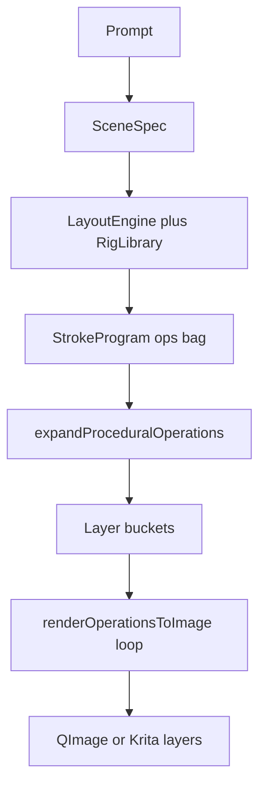
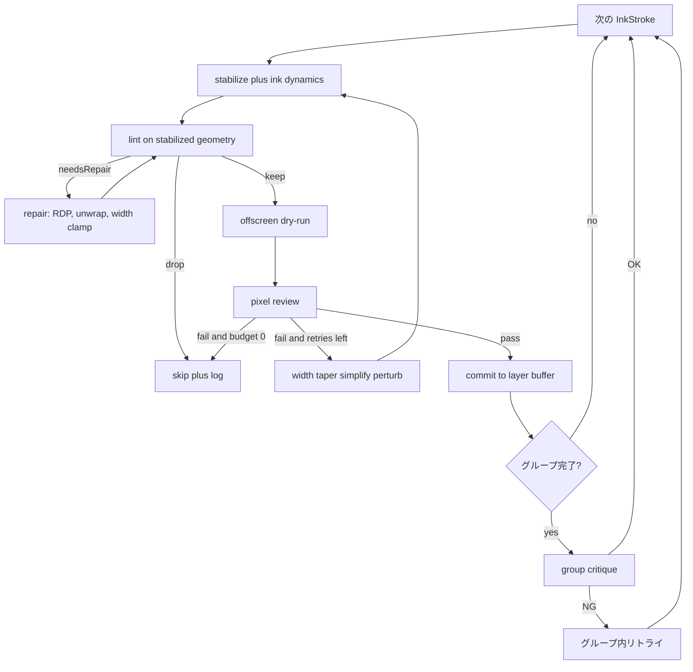

# AI Stroke Painter — V9 Atomic Ink 計画

- 作成日: 2026-09-20
- 対象: [`libs/ui/aiillustration`](libs/ui/aiillustration) + [`libs/ui/tests`](libs/ui/tests) + [`tools/ai_quality_bench`](tools/ai_quality_bench)
- 前提: V4 Deliberate Stroke の衛生基盤 (stabilize / lint / order / envelope) は実装済。V6 配線・V8 品質ベクトル / 知覚補正 / 物理合成も実装済
- 本書の位置づけ: **「線を1本1本、計画→整形→試し書き→吟味→確定」する描画エンジンへ刷新する**。既存の一括ラスタライズを核から置き換えることを許可する

---

## 0. 結論

現行は「きれいな線を出す部品」は揃っているが、**インクを確定する手続きがまだ一括投げ**である。

人間の上手い線画は、1本を置くたびに「この線は通るか」を見てから次へ進む。V9 はそれをコードの契約にする。

スローガン:

> まとめて塗らない。1本を確実に通してから、次の1本を置く。

---

## 1. 現状診断 (コード実態)

### 1.1 パイプラインの実体



- 意味生成: [`KisAiLayoutEngine::characterProgram()`](libs/ui/aiillustration/KisAiLayoutEngine.cpp:918) が顔・髪・服・陰影を **一度に ops 配列へ積む**
- 衛生: [`KisAiDeliberateStroke::stabilizeStroke()`](libs/ui/aiillustration/KisAiDeliberateStroke.cpp:217) / [`lintStroke()`](libs/ui/aiillustration/KisAiDeliberateStroke.cpp:281) / [`planStrokeOrder()`](libs/ui/aiillustration/KisAiDeliberateStroke.cpp:506)
- 描画: [`KisAiStrokeRenderer::renderOperationsToImage()`](libs/ui/aiillustration/KisAiStrokeRenderer.cpp:1032) が lint drop 以外を **for ループで連続 rasterize**
- 評価: [`KisAi::QualityVectorEvaluator`](libs/ui/aiillustration/KisAiQualityVector.h:109) と [`KisAiPerceptualRepairer`](libs/ui/aiillustration/KisAiPerceptualRepairer.h:118) は **全画完成後** に走る

### 1.2 「雑にまとめて描く」残件 (V9 が潰す天井)

| # | 現象 | 根拠 | なぜ丁寧に見えないか |
| --- | --- | --- | --- |
| B1 | 1本確定ループが未実装 | V4 の `commitStroke` / `critiqueGroup` はヘッダにも無い。[`reviewStroke()`](libs/ui/aiillustration/KisAiDeliberateStroke.cpp:704) は定義のみで **呼び出しゼロ** | カバレッジ0でも自己交差でも、lint drop 以外は全部インクになる |
| B2 | `needsRepair` が死んでいる | [`lintStroke()`](libs/ui/aiillustration/KisAiDeliberateStroke.cpp:354) が `self-intersecting` / `high-curvature-jitter` を立てても、Renderer は `drop` しか見ない | 壊れた線を直さず描く |
| B3 | 複合プリミティブが数十本を一括描画 | [`drawAnimeEyeOperation()`](libs/ui/aiillustration/KisAiStrokeRenderer.cpp:2851) が白目・虹彩・瞳孔・ハイライト・上睫毛・セパレート束・二重・下睫毛を **1関数で全部描く**。口も同様 | 睫毛1本の入り抜き・失敗時の局所描き直しが不可能 |
| B4 | 前髪が1本のジグザグ | [`hair_fringe_line`](libs/ui/aiillustration/KisAiLayoutEngine.cpp:375) が M字全体を単一 Path にしている | 毛束の入り抜きが無く、谷も先端も同じ線として扱われる |
| B5 | 二重平滑化 | [`expandProceduralOperations()`](libs/ui/aiillustration/KisAiStrokeRenderer.cpp:238) が `stabilizeAndBeautifyStroke`、描画時に再度 `stabilizeStroke` | 短い表情線が直線化し、丁寧さが消える |
| B6 | lint が安定化前の幾何を見る | [`drawPathOperation()`](libs/ui/aiillustration/KisAiStrokeRenderer.cpp:1338) は安定化コピーを作り、直後に **元 op** を lint | 直せる線を落とし、直すべき線を通す |
| B7 | 接合・止まりの概念が無い | StrokeOperation に group / parent / junction が無い ([`KisAiStrokeOperation`](libs/ui/aiillustration/KisAiStrokeProgram.h:49)) | T字止まり・角溜まり・線幅連続が偶然頼み |
| B8 | レイヤー一括ラスタ | [`renderProgramToLayers()`](libs/ui/aiillustration/KisAiStrokeRenderer.cpp:739) はレイヤー単位で `renderOperationsToImage` | キャンバス上で1本ずつ確定する体験も、失敗時の1本リトライも無い |
| B9 | 髪クランプが Fill 塊 | [`hierarchicalHairClumpOps()`](libs/ui/aiillustration/KisAiRigLibrary.cpp:1175) が5塊の多角形+輪郭 | 毛の流れではなくシルエット塗りに見える |
| B10 | 細線パスが QPen セグメント | [`renderFineLineStroke()`](libs/ui/aiillustration/KisAiStrokeRenderer.cpp:1170) は envelope を使わず折れ線ペン | 入り抜き・溜まりがプロファイルごとに分裂 |

V4 で入った床 (ジッタ除去・順序・envelope・適応SS) は残す。V9 は **インク確定の手続き** を新核にする。

---

## 2. 目標と非目標

### 2.1 目標

1. 画面に残る線は、すべて **原子インクストローク** として個別に検査・確定されている
2. 複合パーツ (目・口・ハッチ・集中線) は描画前に原子ストロークへ展開される
3. 1本が不合格なら、絵全体を捨てず **その1本だけ修復またはスキップ** する
4. 意味グループ (左目、右目、顎、前髪束N) が揃った時点で群批評し、次グループへ進む
5. プレビューと実キャンバスが同一コミッタを通る

### 2.2 非目標

- SD / Flux への全面依存はしない
- LLM に座標を再び書かせない (SceneSpec + Layout は維持)
- 手の本格描画は今フェーズでは隔離
- Krita コア (`libs/image` 等) への侵入はしない。英雄線の KisPainter 接続は任意の後段

---

## 3. 新アーキテクチャ — Atomic Ink Engine

### 3.1 中間表現: `KisAiInkStroke`

[`KisAiStrokeOperation`](libs/ui/aiillustration/KisAiStrokeProgram.h:49) は LLM / Layout 契約として残す。描画通貨は新規 IR に移す。

```cpp
struct KisAiInkStroke {
    QString id;
    QString groupId;          // eye_l, jaw, hair_fringe_2
    QString role;             // construction, mass, contour, internal, accent
    QString parentId;         // T-junction の止まり先
    QString layer;
    QVector<KisAiStrokePoint> spine; // 正規化座標
    KisAiStrokeBrush brush;
    bool closed = false;
    enum Cap { RoundStartTaperEnd, RoundBoth, TaperBoth } cap;
    QStringList junctionHints; // t_stop, corner_pool, overlap_under
    int retryBudget = 2;
};
```

Layout / Rig / expandProcedural の出力は、描画直前にすべてこの IR へ正規化する。

### 3.2 複合プリミティブの爆発

[`Kind::AnimeEye`](libs/ui/aiillustration/KisAiStrokeProgram.h:59) / `AnimeMouth` / `Hatch` / `MangaLines` / `Particles` は **ラスタ関数ではなく展開器の入力** にする。

目の例 (左目グループ `eye_l`):

1. `eye_l_sclera` Fill
2. `eye_l_iris` Fill (clip to sclera)
3. `eye_l_pupil` Fill
4. `eye_l_limbal` Path
5. `eye_l_striation_0..N` Path
6. `eye_l_catch_main` / `eye_l_catch_sub` Fill
7. `eye_l_lash_upper` Path (目頭細→目尻太の単一テーパー)
8. `eye_l_lash_clump_1..K` Path
9. `eye_l_crease` Path
10. `eye_l_lash_lower_1..K` Path

[`drawAnimeEyeOperation()`](libs/ui/aiillustration/KisAiStrokeRenderer.cpp:2851) の幾何は展開器へ移植し、各線は通常の Path コミットを通る。既存 Kind は Layout が出し続けてよい (後方互換)。Renderer は Kind を見たら展開してからしかインクしない。

前髪は [`hair_fringe_line`](libs/ui/aiillustration/KisAiLayoutEngine.cpp:375) を廃止し、谷で切った **束ごとの Path** (`hair_fringe_clump_0..4`) にする。

### 3.3 ストロークグラフ

新規 [`KisAiStrokeGraph`](libs/ui/aiillustration/KisAiStrokeGraph.h) (予定):

- ノード = InkStroke
- 辺 = 接合 (T-stop / corner / overlap / symmetry-pair)
- 描画順はレイヤー順だけではなく:
  1. construction (任意・最終的に消す)
  2. mass (Flats)
  3. contour (外側から内側)
  4. internal flow (毛流れ・皺)
  5. accent (キャッチライト・溜まり)

対称ペア (`eye_l` / `eye_r`) は **左右を交互に同じ役割** で進める (左睫毛→右睫毛→左二重→右二重)。片方を完成させてからもう片方、は左右差の元になるため禁止。

### 3.4 1本ループ (核)



Review の合格条件 (決定的・閾値はテストで固定):

- dirtyRect 内の不透明画素 > 0
- 画面外比率 < 0.85
- 既存インクとの意図しない交差 (contour が mass の外へ 1.5px 超) は trap または clip
- 自己交差は repair 後 0
- 細線の最小幅 >= プロファイル下限 (fineliner 0.45px 等、既存 lint と一致)

`needsRepair` の修復:

- 自己交差: RDP + 交差セグメント切断
- 高曲率ジッタ: 角保持 Chaikin 1回
- 無効ブラシ: size/opacity/color をレイヤー既定へフォールバック

### 3.5 コミッタを単一入口にする

新規 [`KisAiStrokeCommitter`](libs/ui/aiillustration/KisAiStrokeCommitter.h) (予定) が唯一の描画入口。

- [`renderOperationsToImage()`](libs/ui/aiillustration/KisAiStrokeRenderer.cpp:1032)
- [`renderProgramToLayers()`](libs/ui/aiillustration/KisAiStrokeRenderer.cpp:540)
- [`KisAiPhysicalRenderer::renderProgramToPhysicalImage()`](libs/ui/aiillustration/KisAiPhysicalRenderer.h:109)

はすべて Committer を呼ぶ。プレビューとキャンバスの乖離を構造的に消す。

実キャンバスは当面 **レイヤー単位の最終 blit** を維持して Undo マクロを壊さない。ただし内部バッファへの確定は1本単位。Docker には `strokeCommitted(id, dirtyRect, previewTile)` シグナルを出し、プログレッシブプレビューを可能にする。

### 3.6 既存 Deliberate の役割分担

| 既存 | V9 での扱い |
| --- | --- |
| [`stabilizeStroke()`](libs/ui/aiillustration/KisAiDeliberateStroke.cpp:217) | 維持。コミッタの前段 |
| [`applyInkDynamics()`](libs/ui/aiillustration/KisAiDeliberateStroke.cpp:557) | 維持 |
| [`lintStroke()`](libs/ui/aiillustration/KisAiDeliberateStroke.cpp:281) | **安定化後の InkStroke** に対して実行するよう呼び出し順を修正 |
| [`planStrokeOrder()`](libs/ui/aiillustration/KisAiDeliberateStroke.cpp:506) | StrokeGraph の初期順として残し、接合・対称を後段で上書き |
| [`buildEnvelopePolygon()`](libs/ui/aiillustration/KisAiDeliberateStroke.cpp:638) | 細線も含め唯一のシルエット。`renderFineLineStroke` の QPen 分岐は envelope 上の可変幅ポリラインへ統合 |
| [`reviewStroke()`](libs/ui/aiillustration/KisAiDeliberateStroke.cpp:704) | 幾何推定から **dry-run 画素レビュー** に置換 |
| [`expandProceduralOperations()`](libs/ui/aiillustration/KisAiStrokeRenderer.cpp:163) 内の `stabilizeAndBeautifyStroke` | **削除**。平滑化はコミッタ内の1回だけ |

---

## 4. 大幅変更点と移行

### 4.1 壊してよいもの

1. [`drawAnimeEyeOperation()`](libs/ui/aiillustration/KisAiStrokeRenderer.cpp:2851) / [`drawAnimeMouthOperation()`](libs/ui/aiillustration/KisAiStrokeRenderer.cpp:3108) の一括ラスタ。幾何は `KisAiPrimitiveExpander` へ移動
2. [`hair_fringe_line` 単一 Path](libs/ui/aiillustration/KisAiLayoutEngine.cpp:375)
3. Renderer 内の独自 `leftEdge` / `rightEdge` 再計算 ([`drawPathOperation()`](libs/ui/aiillustration/KisAiStrokeRenderer.cpp:1459))。envelope 一本化の残件を完了
4. `expandProceduralOperations` の事前 beautify
5. lint-on-raw-op の呼び出し順

### 4.2 残すもの

- SceneSpec → Layout → StrokeProgram 契約
- RigLibrary のパラメータ駆動
- LightRig / QualityVector / PerceptualRepairer / PhysicalRenderer
- Krita レイヤー構成 (Background / Flats / Shading / Lineart / Highlights / FX)
- オフライン決定論パス

### 4.3 互換

- 旧 JSON の `kind: anime_eye` は展開器が吸収。スキーマ削除は最終ステップ
- Docker に `Atomic Ink` トグルは **開発中のみ**。完了後は常時 ON (旧一括パスはテスト用に残し、本番から外す)
- `qualityScore()` は V8 方針通り aggregate 互換を維持

### 4.4 性能ガード

- dry-run は dirtyRect のタイルのみ (全キャンバス複製禁止)
- 顔グループのみ 3x SS、他は既存 [`adaptiveSupersampleScale()`](libs/ui/aiillustration/KisAiDeliberateStroke.cpp:616)
- 1本リトライ上限 2。グループリトライ上限 1
- 1024px でコミットログを出し、縮退時は dry-run をカバレッジ推定に落とす (画素レビュー省略は Lineart 以外)

---

## 5. 実装ステップ (実行順)

各ステップは独立にテスト可能。次へ進む条件は当該 `test*` が赤のままにしないこと。

### S0 — 計測の錨

- 現行ゴールデン32 ([`tools/ai_quality_bench/golden_set.json`](tools/ai_quality_bench/golden_set.json:1)) の aggregate をベースラインとして記録
- 代表3プロンプト (美少女顔 / 夜桜風景 / 線画重視) のプレビュー PNG を `tests/golden/v9_baseline/` に固定
- 受け入れ: 後続差分が数値で語れる

### S1 — InkStroke IR + Expander

- 新規 `KisAiInkStroke.h/.cpp`
- 新規 `KisAiPrimitiveExpander` : AnimeEye / AnimeMouth / Hatch / MangaLines / Particles → InkStroke 列
- Path / Fill / Ribbon はそのまま 1:1 変換
- テスト: `testEyeExpandsToAtomicLashes`, `testMouthExpandsToLipPaths`, `testHatchBecomesPaths`, `testLegacyAnimeEyeJsonStillPaints`

### S2 — コミッタ (核)

- 新規 `KisAiStrokeCommitter`
- ループ: stabilize → lint(安定化後) → repair → dry-run → pixel review → commit / skip
- [`renderOperationsToImage()`](libs/ui/aiillustration/KisAiStrokeRenderer.cpp:1032) を Committer 呼び出しに置換
- `reviewStroke` を画素レビューに置換して実際に呼ぶ
- テスト: `testZeroCoverageSkipped`, `testNeedsRepairSelfIntersectionFixed`, `testLintRunsOnStabilized`, `testCommitLogDeterministic`

### S3 — グラフ順と群批評

- 新規 `KisAiStrokeGraph` (接合・対称ペア・role 順)
- グループ完了時の `critiqueGroup` (目ペアは既存 [`eyePairSymmetryWarnings()`](libs/ui/aiillustration/KisAiDeliberateStroke.cpp:670) を画素ベースに拡張)
- 前髪を束単位 Path に分割 ([`KisAiLayoutEngine.cpp`](libs/ui/aiillustration/KisAiLayoutEngine.cpp:365) / [`hierarchicalHairClumpOps()`](libs/ui/aiillustration/KisAiRigLibrary.cpp:1175))
- テスト: `testSymmetricEyeRolesInterleaved`, `testFringeIsMultipleStrokes`, `testJawBeforeLashes`, `testGroupCritiqueRetriesLashOnly`

### S4 — 線の確実さ (入り抜き・接合・細線統一)

- envelope を細線にも適用。`renderFineLineStroke` の QPen 分岐を廃止または envelope 上の可変幅に縮小
- T-stop: 子ストローク終端を親輪郭にスナップ (1.2px)
- 角溜まり: 既存 [`generateCornerInkingPolygon()`](libs/ui/aiillustration/KisAiStrokeQualityUtils.h:398) をコミット後フックに接続
- 始端丸 / 終端テーパーをプロファイル契約としてテスト
- テスト: `testTaperedTipVsRoundStart`, `testTStopSnapsToParent`, `testNoBowtieOnSharpCorner`, `testFineLineUsesEnvelope`

### S5 — キャンバス / UI / 仕上げ一致

- [`renderProgramToLayers()`](libs/ui/aiillustration/KisAiStrokeRenderer.cpp:540) と PhysicalRenderer を Committer 経由に
- Docker: プログレッシブプレビュー (タイル更新) + コミットログ (秘密情報なし)
- PerceptualRepairer は **全画後の第2関門** として残す (1本ループの代替にしない)
- テスト: `testPreviewCanvasParityPsnr`, `testPhysicalPathUsesCommitter`

### S6 — ゴールデン回帰とゲート

- [`KisAiQualityBenchGateTest`](libs/ui/tests/KisAiQualityBenchGateTest.h:11) に線画軸を追加:
  - 原子ストローク率 (複合 Kind の直接ラスタ 0)
  - drop 率上限 / repair 成功率
  - 目対称警告 0
  - 顔粒子 0
- ベースライン比で aggregate 非悪化、線画プロンプトは改善
- `ctest -L AIStroke` 全件 PASS

---

## 6. 変更ファイル

| ファイル | 内容 | ステップ |
| --- | --- | --- |
| `KisAiInkStroke.h/.cpp` 新規 | 原子 IR | S1 |
| `KisAiPrimitiveExpander.h/.cpp` 新規 | 複合爆発 | S1 |
| `KisAiStrokeCommitter.h/.cpp` 新規 | 1本ループ | S2 |
| `KisAiStrokeGraph.h/.cpp` 新規 | 順序・接合・対称 | S3 |
| [`KisAiDeliberateStroke.h/.cpp`](libs/ui/aiillustration/KisAiDeliberateStroke.h) | repair / 画素 review / group critique | S2/S3 |
| [`KisAiStrokeRenderer.cpp`](libs/ui/aiillustration/KisAiStrokeRenderer.cpp) | firehose 削除、envelope 一本化、複合ラスタ廃止 | S2/S4/S5 |
| [`KisAiLayoutEngine.cpp`](libs/ui/aiillustration/KisAiLayoutEngine.cpp) | 前髪束分割 | S3 |
| [`KisAiRigLibrary.cpp`](libs/ui/aiillustration/KisAiRigLibrary.cpp) | 髪クランプを流れ線中心に | S3 |
| [`KisAiStrokeProgram.h`](libs/ui/aiillustration/KisAiStrokeProgram.h) | 任意: `groupId` / `role` を Operation に追加 (IR へコピー) | S1 |
| [`KisAiIllustrationDocker.cpp`](libs/ui/aiillustration/KisAiIllustrationDocker.cpp) | プログレッシブ受口 | S5 |
| [`KisAiPhysicalRenderer.cpp`](libs/ui/aiillustration/KisAiPhysicalRenderer.h) | Committer 経由 | S5 |
| [`libs/ui/CMakeLists.txt`](libs/ui/CMakeLists.txt:450) | 新規ソース登録 | S1 |
| `libs/ui/tests/KisAiAtomicInkTest.cpp` 新規 | S1〜S4 の契約テスト | 各 |
| [`KisAiQualityBenchGateTest`](libs/ui/tests/KisAiQualityBenchGateTest.h) + golden | ゲート | S0/S6 |

---

## 7. 受け入れ基準

1. 同一プロンプトで、睫毛・顎・前髪束が **別ストロークとしてログに出る** (1本のジグザグや AnimeEye 一括が残らない)
2. 意図的に自己交差させた Path が、repair 後に描画されるか drop され、生の交差のままインクにならない
3. カバレッジ0の線はスキップされ、隣の線は描かれる
4. 目ペアの役割が左右交互で、対称警告がゴールデン顔プロンプトで 0
5. プレビューとレイヤー出力の PSNR ゲート PASS
6. `ctest -L AIStroke` 全件 PASS。ゴールデン32 の aggregate 非悪化
7. 差分は `libs/ui/aiillustration` + tests + bench に閉じ、秘密情報をログしない

---

## 8. リスク

- 展開後の op 数増加 → strokeBudget と trim を **グループ単位の不滅集合** (顔輪郭・両目・口) で再定義
- dry-run コスト → dirtyRect タイル + 縮退ラダー
- ゴールデン見た目変化 → S0 ベースライン目視必須。束分割は顔の印象を変えるため fringe 分割は S3 で独立レビュー
- AnimeEye 移植ミス → S1 で「展開後の合成画像 ≈ 旧一括画像」の PSNR 下限を先にロックしてから一括ラスタを削除
