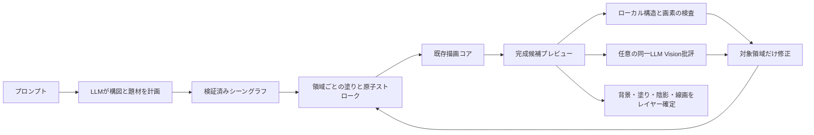
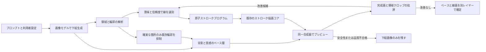

# ストローク描画クオリティ刷新計画案 — LLM完全ストローク優先・画像誘導は後段

## 1. 決定済みの方針・用語の訂正

- **第一優先: LLM完全ストローク描画モード。** 既存のオンラインLLMがプロンプトから作画指示を生成し、コードがストローク・塗り・グラデーション等をラスタライズして全レイヤーを作る。**画像生成モデルの呼び出し、下絵画像の取得・保持・出力はいずれも禁止**。ネットワーク不使用という意味の「完全オフライン」ではない。
- 生成済みキャンバスの批評には、同じLLMにVision機能がある場合に限り、利用者の送信同意の下でキャンバス画像を送ってよい。Visionを利用できなくてもストローク出力は完遂できること。**Visionは画像生成モデルではなく、作画済み画像を読む任意機能**とする。
- **第二段階: 画像モデル併用ハイブリッド。** 従来の画像モデル利用案は廃止せず、第一優先モードが独立の品質ゲートを満たした後の別モードとして保留する。先行試作はハイブリッド専用とし、LLM完全ストローク経路へ混入させない。
- 従来のLLM座標描画、コード側の決定論生成、画像生成単体は比較用・互換用に残す。新しいLLM完全ストロークモードは既存の [`KisAiIllustrationDocker::generateLlmStrokes()`](../libs/ui/aiillustration/KisAiIllustrationDocker.cpp:2002) を基礎に段階的に強化し、外部画像モデルの高画質を無条件に再現できるとは主張しない。
- 本計画でいう「完全」は**新しく生成するレイヤーの画素の出自**を指す。LLMが描画プログラムを作り、ブラシ描画・塗り・グラデーション・それらから計算する仕上げだけで画像を構成する。既存キャンバス上のユーザー所有レイヤーは変更しない。Kritaのラスターレイヤー編集は維持するが、線一本ごとのベクター編集は必須としない。

## 2. 現状診断と設計上の帰結

| 確認できた実装 | 品質上限と対策 |
| --- | --- |
| [`KisAiSceneSpec`](../libs/ui/aiillustration/KisAiSceneSpec.h:174) は人物・風景・顔・服・背景を中心とした少数の固定スロット。風景生成もキーワード分岐による定型的な山・水・桜等の配置 [`KisAiLayoutEngine::landscapeProgram()`](../libs/ui/aiillustration/KisAiLayoutEngine.cpp:1527) | 第一段階ではLLMが題材横断の構図・遮蔽・部品構造を記述できるようにする。画像誘導は第二段階専用。 |
| 旧ローカル経路は題材別の手書き幾何へ分岐する [`KisAiStrokeProgramCodec::createDeterministicProgram()`](../libs/ui/aiillustration/KisAiStrokeProgram.cpp:4653) | 旧経路は独立した比較対象・利用者が選べる代替として保持し、LLM完全ストロークの失敗時に無告知で切り替えない。オンラインLLMの造形の自由度を固定リグに閉じ込めない。 |
| 既存LLM描画は一括の作画JSONを生成し、SceneSpecを採用した場合は固定Layoutから描画する [`KisAiStrokeProgramCodec::buildChatCompletionsPayload()`](../libs/ui/aiillustration/KisAiStrokeProgram.cpp:1095)、[`KisAiIllustrationDocker::finishLlmStrokesRequest()`](../libs/ui/aiillustration/KisAiIllustrationDocker.cpp:2501) | 第一段階では画像モデルに頼らず、構造化した多段階LLM作画と制約付き造形へ刷新する。 |
| 画像生成は独立したAPI呼び出しで、結果をそのまま一枚のレイヤーへ置く [`KisAiIllustrationDocker::generateRemoteImage()`](../libs/ui/aiillustration/KisAiIllustrationDocker.cpp:2692)、[`KisAiIllustrationDocker::finishRemoteImageRequest()`](../libs/ui/aiillustration/KisAiIllustrationDocker.cpp:2812) | 第一段階ではこの経路を呼び出さないことを保証する。第二段階のハイブリッド用にだけ下絵解析を検討する。 |
| 原子化と一本描画は導入済み [`KisAiStrokeCommitter::prepareAtomicOps()`](../libs/ui/aiillustration/KisAiStrokeCommitter.cpp:85)、カバレッジ描画も導入済み [`KisAiStrokeCoverageRaster::paintStroke()`](../libs/ui/aiillustration/KisAiStrokeCoverageRaster.h:94) | 描画コアを再利用する。ただし現状のコミッタは直接描画後に無条件採用し、画素レビューを呼んでいない [`KisAiStrokeCommitter::commitToPainter()`](../libs/ui/aiillustration/KisAiStrokeCommitter.cpp:281)。第一段階で可逆タイルに試描きしてから採否を決める。 |
| 視覚批評の画像・クロップ付きリクエスト生成はある [`KisAiVisionCritic::buildCritiquePayload()`](../libs/ui/aiillustration/KisAiVisionCritic.cpp:251) が、今回確認した呼び出しはモジュール内のみ。Goal経路は自己申告の完成度等で終了判定する [`KisAiIllustrationDocker::isGoalQualitySatisfied()`](../libs/ui/aiillustration/KisAiIllustrationDocker.cpp:5955) | 同じLLMのVisionを任意で実生成経路に接続し、自己申告やピクセル差分を「上手さ」と誤認せず局所修正の採否を判断する。 |
| 既存32件ゲートは256pxの**決定論的プログラム**を構造・知覚集約点で検査する [`KisAiQualityBenchGateTest::evaluatePromptQuality()`](../libs/ui/tests/KisAiQualityBenchGateTest.cpp:83) | この回帰ゲートは維持し、別の評価セットで旧LLM描画と新LLM完全ストロークを同条件・人手ブラインドで比較する。 |
| Goalのパッチは装飾レイヤーと一部の顔リグに限定される [`KisAiProgramPatchCodec`](../libs/ui/aiillustration/KisAiProgramPatch.h:55) | 第一段階では対象IDと変更範囲を固定した構造・陰影・線画用の局所パッチ契約を別設計する。 |

既存の原子インク／カバレッジ改善は [`AI_QUALITY_V9_ATOMIC_INK_PLAN.md`](AI_QUALITY_V9_ATOMIC_INK_PLAN.md)、[`AI_QUALITY_V10_COVERAGE_INK_PLAN.md`](AI_QUALITY_V10_COVERAGE_INK_PLAN.md) を参照。第一段階では線を細かくするだけでなく、**LLMの構図・造形指示から良いストローク／塗りを計画し、描画結果を見て局所修正する**方向へ重心を移す。

## 3. 第一優先 — LLM完全ストローク描画モードの刷新

### 3.1 目標フローと画像非依存契約

- 新たに生成する全レイヤーは、作画プログラムのストローク・面塗り・グラデーション等と、そのパラメータから導出する決定論的なブラシ質感・合成から生成する。背景も描画操作で作り、画像モデルのラスタ出力・参照下絵・撮影画像の貼付け・Vision画像の転載を禁止する。既存の [`KisAiStrokeProgram`](../libs/ui/aiillustration/KisAiStrokeProgram.h:212) と [`KisAiStrokeOperation`](../libs/ui/aiillustration/KisAiStrokeProgram.h:52) を互換の描画出口として使う。
- API能力は「既存オンラインLLMのテキスト指示生成」「**同じLLM**のVision批評」を分けて判定する。画像生成エンドポイントを呼ばないこと、画像由来レイヤーを出力に含まないことを通信モックと出力検査で保証する。既存のユーザー画像参照機能は他の旧モードで維持するが、この新モードには混入させない。LLMの初回生成失敗時はその旨を表示し、既存の画像生成／ローカル描画へ無告知で切り替えない。批評途中の失敗なら最後の有効な描画プログラムを保持する。
- **品質改善の対象は既存のLLM描画本体**。現行の [`KisAiIllustrationDocker::finishLlmStrokesRequest()`](../libs/ui/aiillustration/KisAiIllustrationDocker.cpp:2501) は、単一候補の構造スコア・顔対称性を中心に採用してそのままプレビュー／レイヤーへ描く。同じLLMによる全画・領域クロップの実批評と、絵を改善したパッチの選択を実際の生成経路へ接続する。

### 3.2 根本的なロジック変更

1. **計画の所有権を明確化**: LLMに題材、被写体、ポーズ・前後関係、視点、主焦点、色・光、必要なディテールを階層的なシーングラフとして依頼。従来の [`KisAiSceneSpec`](../libs/ui/aiillustration/KisAiSceneSpec.h:174) の人物／風景中心の固定スロットでは表現しきれない複数被写体・小物・建築・動物・自然を共通のオブジェクトID、親子、遮蔽、有界領域で表す。未知の題材は顔リグに押し込まず、安全な汎用幾何か低ディテールで明示的に縮退する。
2. **形状は一括長文座標列ではなく階層単位で作る**: LLMは構図→大形→各部の形・接合点・制御点→描画順の順に小さな領域パッチを返す。既存の [`KisAiStrokeProgramCodec::buildChatCompletionsPayload()`](../libs/ui/aiillustration/KisAiStrokeProgram.cpp:1095) の一括出力や、既存リグだけへの閉じ込めを唯一の経路にしない。LLMの座標候補は有界・有限・同一座標系で検証し、曲線補間や筆圧はコード側で導出。題材ごとに「構造主導のコード幾何」と「検証済みLLM制御点」を候補比較して採用する。
3. **空間・依存関係の制約で画面を成立させる**: オブジェクトごとにシルエット、占有率、負の空間、奥行き、接触・重なり、光源と影、レイヤー依存を保存。顔の目・髪だけでなく、手と小物、四肢と胴体、建築のパース、景観の前景／中景／遠景の破綻を題材別のルールで検査。禁止事項は人種・題材に依存しない安全な幾何制約として扱い、リグは適用可能な被写体にだけ使う。
4. **線画だけでなく全レイヤーの情報量を上げる**: 大きな面の塗り・グラデーション・局所的な陰影・反射・質感を、輪郭と同じシーンIDに紐付けて計画する。既存の [`KisAiStrokeRenderer::renderProgramToImage()`](../libs/ui/aiillustration/KisAiStrokeRenderer.cpp:315) のBackground／Flats／Shading／Lineart等を活用するが、暗黙の二重装飾と大域後処理でディテール欠落をごまかさない。細部予算は面積順ではなく焦点、遮蔽、局所コントラスト、題材の識別に必要な度合いで配分する。現行の面積・点数主体の選別は [`KisAiStrokeProgramCodec::trimOperationsToBudget()`](../libs/ui/aiillustration/KisAiStrokeProgram.cpp:2305) を参照。
5. **実際の画素を見てからインクを確定**: 原子ストロークの画素差検査・失敗時の局所リトライ／棄却を有効化する。現在の [`KisAiStrokeCommitter::commitToPainter()`](../libs/ui/aiillustration/KisAiStrokeCommitter.cpp:254) は直接描画後に無条件採用するため、試描きタイル→交差・過剰露出・ゼロ変化の確認→採用／ロールバックへ改修する。塗りにもシルエット破綻・背景塗り残し・レイヤーのクリップを検査する。
6. **同じオンラインLLMのVisionで閉ループ化**: 完成候補の全画・問題領域クロップを [`KisAiVisionCritic::buildCritiquePayload()`](../libs/ui/aiillustration/KisAiVisionCritic.cpp:251) へ通し、題材と問題領域、根拠、修正対象IDを制約付きで受け取る。幾何修正・塗り／照明の差分パッチを検証してから再描画し、画質・意図反映・部位整合性で前候補と比較する。旧 [`KisAiProgramPatchCodec`](../libs/ui/aiillustration/KisAiProgramPatch.h:55) は装飾と一部リグ中心なので、構造パッチにはロールバック可能な**別契約**を設ける。Vision不対応・画像送信不同意ならローカル検査のみで完走させ、PSNR差やモデル自己申告だけを品質判定にしない。
7. **通信・予算を作画単位に閉じる**: フェーズ／領域ごとのリクエストID、採用済みプログラムのチェックポイント、候補比較、領域ごとの再試行限度を用意。トークン・HTTP回数・メモリ・総ストローク数が上限に達したら装飾から縮退して構図・主要被写体・必須背景を守る。後着レスポンスやキャンセル後のゴースト描画を防ぐ。既存の [`KisAiIllustrationDocker::startGoalMode()`](../libs/ui/aiillustration/KisAiIllustrationDocker.cpp:3450) は参考にするが、固定の多段階フローやモデル自己採点をそのまま完成判定にしない。

### 3.3 優先実装ステップ — 各段階の出口で品質を検証

| 順 | 実装成果物 | 受け入れゲート |
| --- | --- | --- |
| F0 | 既存32件 [`golden_set.json`](../tools/ai_quality_bench/golden_set.json:1) に複数被写体、動物、建築、道具、全身ポーズ、複雑背景を加えた**別のLLM評価セット**を固定する。同一プロンプト・サイズ・LLMのモデル版・作画設定・予算・シード（利用可能な場合）を記録し、旧LLM描画の出力と構造化応答の再生用フィクスチャを収集する。実レスポンスは秘匿・再配布許諾を確認し、CIは匿名化した模擬応答のみ利用する。 | 旧ローカル描画用32件の回帰試験を変更せず、旧LLM描画対新LLM描画の同条件比較が再現可能。対象物の欠落、構図、ポーズ、陰影、線画、題材忠実度を評価項目として事前登録する。 |
| F1 | [`KisAiIllustrationDocker`](../libs/ui/aiillustration/KisAiIllustrationDocker.h:74) に旧LLM描画と別の「LLM完全ストローク」モードを用意し、生成セッションごとに画像生成／画像貼付け／画像参照を拒否する。オンラインLLM APIだけを利用し、Vision送信には別途同意を必要とする。 | 通信モックで画像生成呼び出しゼロ、初回生成失敗は明示的失敗、批評失敗は最後の有効画を維持。新レイヤー群は描画プログラム由来のみで、既存各モードを壊さない。 |
| F2 | 題材横断のオブジェクト・構図・遮蔽シーン契約を導入し、LLMの構造化出力を検証してから領域ごとのストローク／塗り計画へ変換する。 | 複数被写体・非人物題材の必須オブジェクト、重なり、視点、背景の空間制約がテストでき、旧仕様も読める。 |
| F3 | 粗描き→領域単位の造形・塗り・陰影・線画→細部の階層生成にし、焦点優先の作画予算と欠落検出を接続する。 | 既存の一括LLM出力／固定リグ単独に対し、構図・対象物・焦点の検査で改善し、無根拠のディテール増量を抑える。 |
| F4 | ストローク／塗りの可逆な試描き・画素レビューと、プレビュー／実キャンバス共通の描画入口を実装する。 | 不良線や塗りはロールバックされ、既存の正常線は維持。レイヤー・Undo・再実行と画素パリティが通る。 |
| F5 | 同じLLMの任意のVision批評を実生成経路に接続し、構造／配色／線画のID付き局所パッチを比較・採否できるようにする。 | Vision有効で悪化パッチを棄却し、Vision無効や通信失敗でも完成画が残る。PSNR・自己採点だけで採用しない。 |
| F6 | 旧LLM描画と新モードの同条件・題材別ブラインド比較、構図／認識／画像品質、安全性、費用と通信上限、全AI系回帰テストを検証して既定化を判定する。 | **画像生成モデルを使わない**新LLM完全ストローク群が、旧LLM群に対し人手3名以上の評価で過半数の優位、全対象の重大劣化が5%以下。成功率・必要物体の欠落・題材別の成績を報告し、比較対象数・例外・不合格条件をF0で事前固定する。 |

第一段階の品質ゲートを満たすまでは、以下の画像モデル併用経路を実装再開せず、既存の [`KisAiImageGuidedScene`](../libs/ui/aiillustration/KisAiImageGuidedScene.h:35) は隔離された試作として維持する。外部の画像生成結果は後段での**比較対象**にはしてよいが、完全ストロークの入力・出力・フォールバックには使わない。

### 3.4 実装記録（品質ゲート判定とは別）

- 題材別12件の固定ケースは [`full_stroke_cases.json`](../tools/ai_quality_bench/full_stroke_cases.json:1)、評価と権利確認の手順は [`FULL_STROKE_EVALUATION.md`](../tools/ai_quality_bench/FULL_STROKE_EVALUATION.md:1)。**旧・新LLMの実出力と人手評価は未収集**。
- オンラインLLMのテキストのみの要求契約は [`KisAiFullStroke::buildPayload()`](../libs/ui/aiillustration/KisAiFullStroke.cpp:13)。実装済みの選択UIと送信経路は [`KisAiIllustrationDocker::generateLlmStrokes()`](../libs/ui/aiillustration/KisAiIllustrationDocker.cpp:2002)。画像生成APIと参照画像の自動投入は選択モード内で拒否する。画像生成APIモードは従来の別モードとして維持する。
- [`KisAiFullStrokeScene`](../libs/ui/aiillustration/KisAiFullStrokeScene.h:34) は複数被写体の親子関係・占有領域・焦点重みの検証と予算配分を試作済み。ただし**LLMが返したシーングラフを実生成へ接続する部分、領域単位の多段階生成はまだ未実装**。
- [`KisAiStrokeCommitter::commitToPainter()`](../libs/ui/aiillustration/KisAiStrokeCommitter.cpp:216) はオフスクリーンの可視変化検査を通った操作のみ確定する。透明クリップを確定しない回帰試験を追加したが、グループ単位の巻き戻しや描画中の複雑な合成への同等性は未検証。
- オフラインのAIStroke18件・統合 [`kritaui`](../libs/ui/CMakeLists.txt:440) とアプリターゲットのビルド・統合 [`KisAiFullStrokeTest`](../libs/ui/tests/KisAiFullStrokeTest.cpp:1) は通過。外部モデルとの接続品質・人手のブラインド評価・品質優位はこれらからは証明できない。

## 4. 第二段階 — 画像モデル併用ハイブリッドの目標アーキテクチャ

以下の§4〜§7は**第一段階の品質ゲート成立後のみ**に適用する。完全ストローク描画の生成経路・失敗時フォールバックに画像モデルを使うことはない。

### 4.1 入力・プロバイダー境界

- 画像生成は既存の画像API検証・応答上限・デコードを流用する [`KisAiIllustrationDocker::generateRemoteImage()`](../libs/ui/aiillustration/KisAiIllustrationDocker.cpp:2692)。同じエンドポイントでマスク・画像編集ができるとは仮定しない。画像生成、視覚批評、必要なら領域分割を**独立した能力**として検出・設定する。
- 視覚モデルには「領域名・矩形・遮蔽関係・重要度・不確実性」の**構造化ヒント**のみ依頼し、ピクセル精度の輪郭はマスク／エッジ解析と照合する。領域分割モデルを使える構成ではそのマスクを使用し、使えなければ局所画像処理と保守的な候補選別に縮退する。信頼度が足りない場合は線を新造しない。
- 画像生成失敗時は従来の画像／ストロークモードへの**明示的な選択**を提示する。解析・批評失敗時は有効な下絵を保持し、勝手に別題材の絵へ差し替えない。リクエストごとのIDとキャンセル伝播を持つ。

### 4.2 中間表現と座標の契約

- 新しいセッション状態は「生成下絵の原本、キャンバス寸法・縦横比・拡大縮小変換、領域ID、領域ごとのマスク、前後関係、輪郭候補、信頼度、採用済み描画プログラム、評価結果」を保持する。既存の [`KisAiStrokeProgram`](../libs/ui/aiillustration/KisAiStrokeProgram.h:212) は**採用済み線画**の出力として利用し、従来のJSONを壊さない。
- マスク・下絵・線画はキャンバス画素座標へ一度だけ変換する。元画像のレターボックス、解像度差、透明領域、切り抜き、上下左右反転を座標変換に記録する。領域IDをストロークの [`KisAiStrokeOperation`](../libs/ui/aiillustration/KisAiStrokeProgram.h:52) のグループと対応付ける。
- 拡張候補: [`KisAiImageGuidedScene.h`](../libs/ui/aiillustration/KisAiImageGuidedScene.h)、[`KisAiHybridGenerationController.h`](../libs/ui/aiillustration/KisAiHybridGenerationController.h)。後者はモデルI/OとKritaレイヤー操作を分離し、コアロジックをオフラインでテストできるようにする。

### 4.3 輪郭の発見・選別

1. 画像上の物体領域を分割し、人物／動物／建築／自然物／小物を共通の領域・遮蔽表現に落とす。専用分割器が無い場合、視覚モデルの矩形ヒント、色・勾配・局所境界から候補を作るが、「意味が確定した」とは見なさない。
2. シルエットと重要な内部構造を区別する。単純な全画像エッジ抽出は**布目・毛並み・反射・ノイズまで線に変えてしまう**ため禁止。高周波質感や低確信境界は下絵に残す。
3. 候補に領域ID、役割、接合先、線を止める側、前後関係、元画像の根拠位置、信頼度を持たせる。顔などの固有制約は適用できる領域にだけ使い、風景・建築に顔用の対称補正を掛けない。
4. 閉曲線／開曲線を追跡し、枝分かれ・T字接合・遮蔽終端を検査。曲線近似は最大偏差・曲率・端点誤差を**キャンバスpx**で制約する。線幅は固定値にせず、画面の焦点・前景／後景・暗部／明部と元画像の輪郭幅に応じて変える。
5. 元の輪郭と既存線が競合する、境界が曖昧、線を描くと密度が過多になる領域は描かない。原子展開やコミット処理は [`KisAiStrokeCommitter::commitToPainter()`](../libs/ui/aiillustration/KisAiStrokeCommitter.cpp:216) へ接続する。

### 4.4 ベース画像と線画の整合

- 原本は保持し、実際の背景・質感用ベースは**派生画像**として作る。下絵の既存輪郭を抑制するときは、採用する新線と対応が確定した細い帯だけを局所補間／利用可能な編集モデルで処理する。大域ぼかしや顔全体の輪郭消去はしない。
- 元線と新線が二重になる場合は採用しない。補間により模様・質感・細部が崩れた場合も採用しない。単なる「生成画像に太い線を重ねる」より悪い場合は**下絵単体へロールバック**する。
- プレビューも実レイヤーも「ベース画像＋必要なら補修パッチ＋線画＋任意の仕上げ」の同一の合成関数を使用。下絵を背景・質感、採用線をLineartの別ラスターレイヤーに置き、既存のKritaのUndo、グループレイヤー構成を保つ。現在のレイヤー生成の基礎は [`KisAiStrokeRenderer::renderProgramToLayers()`](../libs/ui/aiillustration/KisAiStrokeRenderer.cpp:541) と画像レイヤー追加の [`KisAiIllustrationDocker::addImageAsLayer()`](../libs/ui/aiillustration/KisAiIllustrationDocker.cpp:3298) にある。

### 4.5 視覚フィードバックと停止条件

- 元画像、線画単独、合成結果、問題領域クロップを比較する。批評出力は**領域ID・問題種別・修正種別・局所座標・優先度**の制約付きデータとして受け取り、自由文から無検証のストロークを描かない。既存の [`KisAiVisionCritic::selectCrops()`](../libs/ui/aiillustration/KisAiVisionCritic.cpp:142) は顔以外の領域マスクを利用するよう拡張する。
- 修正は対象領域のみ再抽出／線幅変更／削除／ベースの補修とし、ローカルに試描きして採用前後を比較する。輪郭の逸脱、二重線、塗り欠け、変化のない修正を機械的に拒否し、画像モデル／批評の能力があれば複合的な見栄えも判定する。
- [`KisAiVisionCritic::hasConverged()`](../libs/ui/aiillustration/KisAiVisionCritic.cpp:450) のPSNR差だけで「品質向上」と判断しない。PSNRはプレビューと実出力の一致など**忠実度指標**に限定。各反復は候補を保存して前回より悪ければ巻き戻し、最大反復回数・画像送信量・モデル費用を上限設定する。

## 5. 第二段階の実装順と完了条件

**着手条件: §3.3 F6 の品質ゲートが成立した後。** 以下は画像モデル併用ハイブリッド専用。第一優先のLLM完全ストロークの運用要件ではない。

| 順 | 独立に実装できる成果物 | 次へ進むゲート |
| --- | --- | --- |
| 0 | 既存32件 [`golden_set.json`](../tools/ai_quality_bench/golden_set.json:1) に人物・動物・機械・食物・建築・自然・抽象・線画不要の難例を加え、同一題材／同一画像サイズの画像単体・従来ストローク単体を固定。生成画像は適法な保存同意と再配布権を確認する。 | 既存32件の合格維持と、新旧の**画像単体を含む**比較基準が揃う。 |
| 1 | プロバイダー機能表とセッション制御。画像生成／視覚批評／任意の領域分割・補修は別機能とし、API失敗・キャンセル・タイムアウト・費用制限・画像送信同意を明文化。 | 模擬プロバイダーで全成功／機能欠落／中断／遅延応答を再現し、無効な応答でレイヤーを変更しない。 |
| 2 | 画像誘導シーン契約と座標変換、領域マスク・オクルージョン・輪郭候補のデータモデルを追加。 | 非正方形画像、レターボックス、拡大縮小でマスクと線の位置ずれが所定のpx上限内。 |
| 3 | 保守的な領域解析と輪郭候補抽出を、ネット接続なしのフィクスチャで先に作る。外部分割器接続は能力が存在する場合に追加。 | 素材の模様・影・テキストを輪郭として過剰に採用しない。低確信時は線を出さない。 |
| 4 | 輪郭の追跡、遮蔽と接合、適応的な線幅／入り抜き、原子ストローク化を既存レンダラーへ配線。コミッタの試描き→画素差／クリップ検査→確定／巻戻しを**実際に**配線する。 | 意図的な交差・画面外・ゼロ変化の線を拒否し、よい線は残る。全題材に人物専用規則が誤適用されない。 |
| 5 | 下絵輪郭の限定的な抑制と、元画像／ベース／線画の独立レイヤー合成を実装。失敗時は原本の画像のみ表示。 | 二重線・質感破壊を生まず、プレビュー／実キャンバスが一致し、Undoと再実行が安全。 |
| 6 | 視覚批評の実通信、領域限定パッチ、候補比較・棄却・停止条件を組み込む。 | 自己申告完成度やPSNR差だけでは採用しない。改善なし・タイムアウト時に最高評価の既存候補へ戻る。 |
| 7 | 新しい「高品質ハイブリッド」生成経路をUIに公開し、構造化された状態表示と費用・アップロードの同意を追加。既存モードは無変更で利用可能にする。 | 連続クリック・キャンセル・閉じたキャンバス・APIリトライで重複レイヤー、ゴースト描画、認証情報漏洩がない。 |
| 8 | オフライン自動テスト、既存32件と新題材の品質比較、外部モデルを使う任意のブラインド評価を実行。評価の結果に基づき重みと安全閾値を校正。 | 下記の受け入れ条件に合格するまで既定化しない。 |

**第二段階のみ**の想定変更領域: 画像生成制御とUIは [`KisAiIllustrationDocker.cpp`](../libs/ui/aiillustration/KisAiIllustrationDocker.cpp:2692)、幾何と原子化は [`KisAiStrokeCommitter.cpp`](../libs/ui/aiillustration/KisAiStrokeCommitter.cpp:216)、プレビュー／レイヤー合成は [`KisAiStrokeRenderer.cpp`](../libs/ui/aiillustration/KisAiStrokeRenderer.cpp:286)、批評は [`KisAiVisionCritic.cpp`](../libs/ui/aiillustration/KisAiVisionCritic.cpp:142)、テスト登録は [`libs/ui/tests/CMakeLists.txt`](../libs/ui/tests/CMakeLists.txt:1)、新規ソース登録は [`libs/ui/CMakeLists.txt`](../libs/ui/CMakeLists.txt:446)。外部通信のテストは模擬応答だけで行い、実APIをCIの必須条件にしない。

## 6. 第二段階の判定指標・受け入れ条件

1. **見た目の改善を画像単体と比較**: 共通プロンプト・共通生成下絵を使用し、ランダム順のブラインド比較を少なくとも3名で実施する。画像単体対ハイブリッドで「改善」が認められる題材を複数カテゴリにわたり確保し、選別済みの対象では優位が過半数、全体では重大な悪化が5%以下。改善対象がごく少数しかない場合も合格としない。閾値はベースライン固定時に具体的な件数で事前登録する。
2. **題材忠実度**: 対象物の欠落、不要な顔／パーツ、輪郭による誤認を人手で記録。画像単体より悪化するケースをカテゴリごとに公開し、重要な意味破綻は自動ロールバックで隠さず失敗例として残す。
3. **線の安全性**: 計測対象は有効な領域マスクの内外、二重輪郭数、接合エラー数、ベースの質感損失、Lineart上の線数と位置。低信頼フィクスチャでは出力が元画像と画素一致し、無闇に線を追加しない。
4. **再現性と互換性**: 固定画像＋固定解析応答では採用線とレイヤー合成が決定的。既存 [`KisAiQualityBenchGateTest`](../libs/ui/tests/KisAiQualityBenchGateTest.cpp:110) とAI系テストが通る。CIは合成画像のプレビュー／キャンバス一致を確認する。画像モデルの乱数性は固定フィクスチャで分離する。
5. **コストとプライバシー**: 生成1回の最大モデル呼び出し回数、画像送信量、メモリ、応答サイズを計測・制限する。画像を批評へ送る前に同意を取り、APIキー・生の応答・個人画像をログ／ベンチの成果物へ混入させない。セキュリティ基準は [`DEVELOPMENT.md`](../DEVELOPMENT.md:211) に従う。

## 7. 前提・リスク・中止判断

- **ハイブリッド専用**: 既存画像が十分に良い場合は線を加えないのが正解。単に絵へ線を重ねて「編集可能」と呼ぶ設計は採らない。LLM完全ストローク経路では下絵自体を使用しない。
- ピクセル精度の意味分割・輪郭抑制がないプロバイダーでは、完璧な自動線画を約束しない。高確信領域だけを選び、残りは画像として保持する。編集できる線画レイヤーが空なら、その理由をUIに表示する。
- 不特定の画像サービスを画像分割／画像編集APIとして扱わない。マスクの品質や利用規約が満たせなければ「画像のみ」モードへ縮退する。
- 既存のオフライン・線画専用経路は互換として残す。オンライン画像の生成・解析・批評のどこかで上限超過／安全性失敗があれば破壊的に置換せず、原本を保護する。
- 本計画は段階的な実装案であり、品質閾値の件数、使用可能なプロバイダーの能力、画像の保存／送信同意は最初の評価と仕様策定段階で確定する。

## 8. 実装状況（2026-09-27）

- **ハイブリッド用の先行試作のみ実装済み、優先順位を変更して休止**: [`KisAiImageGuidedScene`](../libs/ui/aiillustration/KisAiImageGuidedScene.h:35) が原本画像・キャンバス配置・領域マスクを保持し、[`KisAiImageGuidedContour::buildLineart()`](../libs/ui/aiillustration/KisAiImageGuidedScene.cpp:182) が明示承認かつ高信頼の単一連結マスクに限って閉曲線を生成する。完全ストローク描画モードからは呼ばない。現時点ではハイブリッドのレイヤー合成やオンライン画像生成への接続も**未実装**。
- [`KisAiImageGuidedSceneTest`](../libs/ui/tests/KisAiImageGuidedSceneTest.cpp:1) を両ビルド構成へ登録。スタンドアロンのAI系17件がすべて通過。完成画の品質向上や画像API接続を検証したことは意味しない。
- 次の必須作業は§3.3のLLM完全ストローク描画を既存生成経路から分離し、ベースラインと画像モデル非依存ゲートを固めること。その品質ゲートを通過した後に、§5のハイブリッドの作業を再開する。
